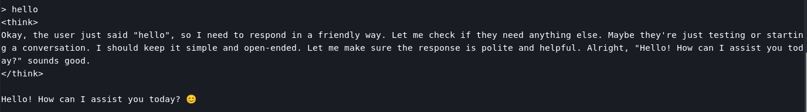
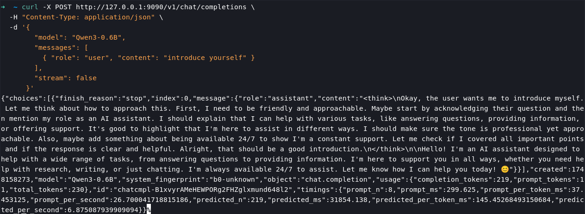

# llama.cpp

**llama.cpp** is an open-source inference framework written purely in C/C++, designed to efficiently run large language models like Llama in GGUF/GGML format locally on CPUs/GPUs (laptops, mobile devices, Raspberry Pi, or even browsers), without relying on heavyweight frameworks.

## Download

Download the compressed file `spacemit-llama.cpp` and unzip it

```bash
wget https://archive.spacemit.com/spacemit-ai/llama.cpp/spacemit-llama.cpp.riscv64.0.0.4.tar.gz -P ~/
tar -xzvf ~/spacemit-llama.cpp.riscv64.0.0.4.tar.gz -C ~/
```

## Download model

`spacemit-llama.cpp` currently supports accelerated models in the following quantization formats:
- Q4_K_M
- Q4_0
- Q4_1

The following example demonstrates how to download a model:

```bash
wget https://modelscope.cn/models/unsloth/Qwen3-0.6B-GGUF/resolve/master/Qwen3-0.6B-Q4_0.gguf -P ~/
```

Import environment

```bash
export LD_LIBRARY_PATH=/home/bianbu/spacemit-llama.cpp.riscv64.0.0.4/lib
```

## Usage

```bash
cd ~/spacemit-llama.cpp.riscv64.0.0.4/bin
./llama-cli -m ~/Qwen3-0.6B-Q4_0.gguf --threads 4
```



## API usage

Execute the command to start the llama.cpp service:
```bash
cd ~/spacemit-llama.cpp.riscv64.0.0.4/bin
./llama-server --port 9090 -m ~/Qwen3-0.6B-Q4_0.gguf --threads 4
```

### Browser usage

Open a browser and navigate to `http://localhost:9090` to access the llama server and interact with `llama.cpp` directly in the browser.


### Local API Requests

Example:
```bash
curl -X POST http://127.0.0.1:9090/v1/chat/completions \
  -H "Content-Type: application/json" \
  -d '{
        "model": "Qwen3-0.6B",
        "messages": [
          { "role": "user", "content": "introduce yourself" }
        ],
        "stream": false
      }'
```


