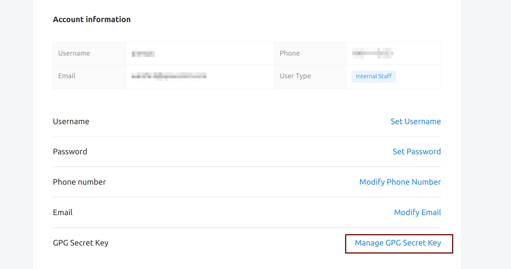
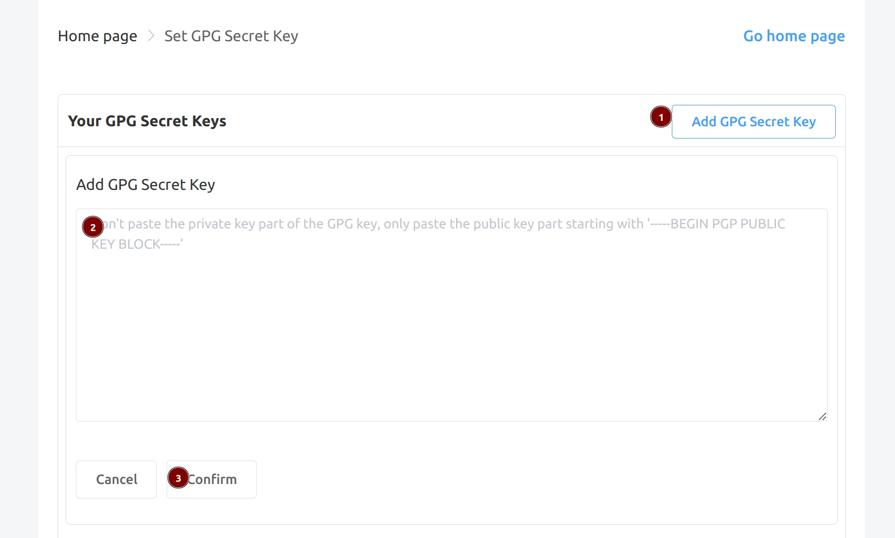

# Package Hosting Service

## Introduction

The package hosting service [http://archive.spacemit.com/bianbu-community/](http://archive.spacemit.com/bianbu-community/) is a supplement to the Bianbu repository, supporting community developers to upload packages and providing access services.

This document describes how to upload packages to the package hosting service. The entire process can be completed entirely on the development board, similar to the Debian upload process.

## Prerequisites

### Create GPG Key (Skip if already available)

Install signing tools:

```bash
apt install gpg devscripts
```

Generate OpenPGP key. Note: do not set a password during generation:

```bash
gpg --gen-key
```

The final output will look like this. Copy the key ID (the pub part), which will be needed when exporting the public key:

```bash
gpg (GnuPG) 2.2.27; Copyright (C) 2021 Free Software Foundation, Inc.
This is free software: you are free to change and redistribute it.
There is NO WARRANTY, to the extent permitted by law.

Note: Use "gpg --full-generate-key" for a full featured key generation dialog.

GnuPG needs to construct a user ID to identify your key.

Real name: test-user
Email address: test@spacemit.com
You selected this USER-ID:
    "test-user <test@spacemit.com>"

Change (N)ame, (C)omment, (E)mail or (O)kay/(Q)uit? O
We need to generate a lot of random bytes. It is a good idea to perform
some other action (type on the keyboard, move the mouse, utilize the
disks) during the prime generation; this gives the random number
generator a better chance to gain enough entropy.
We need to generate a lot of random bytes. It is a good idea to perform
some other action (type on the keyboard, move the mouse, utilize the
disks) during the prime generation; this gives the random number
generator a better chance to gain enough entropy.

# Here you will be prompted to enter a password, which can be set or not

# If executing this command on the board via ssh, a desktop popup may appear prompting for password

gpg: key 42D4AEAF977345E3 marked as ultimately trusted
gpg: revocation certificate stored as '/home/qiu/.gnupg/openpgp-revocs.d/9F9C52A13E434AB3DC45693A42D4AEAF977345E3.rev'
public and secret key created and signed.

pub   rsa3072 2024-11-04 [SC] [expires: 2026-11-04]
      9F9C52A13E434AB3DC45693A42D4AEAF977345E3
uid                      test-user <test@spacemit.com>
sub   rsa3072 2024-11-04 [E] [expires: 2026-11-04]
```

### Configure Upload Address

Add the following entry to `~/.dput.cf`:

```bash
[bianbu]
fqdn                    = ftp.upload.spacemit.com
incoming                = /UploadQueue/
login                   = anonymous
allow_dcut              = 1
method                  = ftp
allowed_distributions   = (experimental)
```

### Apply for Upload Permission

Export the signing public key.

Export the public key based on the public key ID prompted earlier:

```bash
gpg -a --export 9F9C52A13E434AB3DC45693A42D4AEAF977345E3
```

Click [https://developer.spacemit.com/auth/#/user/userInfo](https://developer.spacemit.com/auth/#/user/userInfo) and follow the illustrated steps to add the GPG public key:



Note: The pasted content should include the BEGIN and END lines at the beginning and end.



## Prepare Source Package and Deb Package

Here we use the hello package as an example. First download the source package:

```bash
apt source hello
```

Switch to the project directory:

```bash
cd ~/hello-2.10
```

Build:

```bash
dpkg-buildpackage -sa -uc -us -etest@spacemit.com -mtest@spacemit.com
```

- `-m`: The maintainer of this release, recorded in the Maintainer field of the changes file.
- `-e`: The maintainer of this build, recorded in the Changed-By field of the changes file.
- `-sa`: The changes file always records the orig archive.

For simplicity, you can fill in the email of the signer (the GPG key user created earlier).

## Check Changes File

1. Execute the following command to ensure the Distribution field in `../xx.changes` is `experimental`, so that it can be stored in the correct suite later:

```bash
sed -i 's/^Distribution: .*/Distribution: experimental/' ../hello_2.10-3build1_riscv64.changes
```

2. Ensure that the Maintainer and Changed-By fields in `../xx.changes` are in correct email format, otherwise they cannot be stored:

```bash
Maintainer: xxx@yyy
Changed-By: xxx@yyy
```

3. Note that the changes file generally needs to include both source packages and deb packages (except for binNMU, see FAQ1).

## Signing

Use the debsign command from the devscripts package to sign the changes file:

```bash
debsign ../hello_2.10-3build1_riscv64.changes -exxx@yyy
```

- `-e`: The email filled in when generating the OpenPGP key earlier

## Upload

Upload using the dput command:

```bash
dput bianbu ../hello_2.10-3build1_riscv64.changes
```

You will then receive email notifications about the upload status.

For first-time uploads:

| Order | Email Subject                              | Sending Time                  | Description                                    |
|-------|--------------------------------------------|-------------------------------|------------------------------------------------|
| 1     | Processing of xxx.changes                  | Within 5 minutes after upload | Notify whether package was successfully uploaded to FTP server |
| 2     | xxx.changes is NEW                         | 2nd, 17th, 32nd, 47th minute of each hour | Enter new queue, waiting for manual review by repository administrator |
| 3     | xxx.changes ACCEPTED into experimental     | 52nd minute of each hour      | Review passed and stored                       |

For subsequent uploads:

| Order | Email Subject                            | Sending Time                  | Description                                    |
|-------|------------------------------------------|-------------------------------|------------------------------------------------|
| 1     | Processing of xxx.changes                | Within 5 minutes after upload | Notify whether package was successfully uploaded to FTP server |
| 2     | xxx.changes ACCEPTED into experimental   | 2nd, 17th, 32nd, 47th minute of each hour | Review passed, stored once every hour at the 52nd minute |

## Installation

Ensure that `/etc/apt/sources.list.d/bianbu.sources` is configured with the experimental suite:

```bash
# Existing content...

# experimental suite

Types: deb
URIs: http://archive.spacemit.com/bianbu-community/
Suites: experimental
Components: main universe restricted multiverse
Signed-By: /usr/share/keyrings/bianbu-archive-keyring.gpg
```

Update the index list:

```bash
apt update
```

Install:

```bash
apt install xxx
```

## FAQ

1. How to use binNMU (Binary Non-Maintainer Upload)?

Prerequisites: A source package has already been uploaded and stored once.

Subsequent uploads can skip uploading the source package and only upload deb packages.

Simply execute the debchange command in the source directory to generate a bin-nmu entry in `debian/changelog`:

```bash
debchange --force-bad-version --bin-nmu 'description'
```

Then proceed with normal compilation, signing, and uploading.
