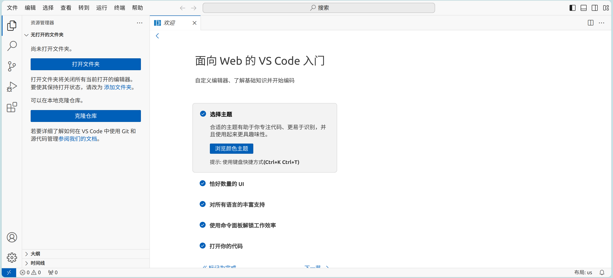

# IDE

## VScodium

[VSCodium](https://vscodium.com/) is the open-source version of VS Code and can be installed from the Bianbu repository (only for versions after 2.0.2).

```shell
sudo apt-get update
sudo apt-get install -y codium
```

Or download and install from the VSCodium [release page](https://github.com/VSCodium/vscodium/releases). For example, download `1.94.2.24286`:

```shell
wget https://github.com/VSCodium/vscodium/releases/download/1.94.2.24286/VSCodium-linux-riscv64-1.94.2.24286.tar.gz
```

Installation:

```shell
sudo mkdir /opt/vscodium
sudo tar xf VSCodium-linux-riscv64-1.94.2.24286.tar.gz -C /opt/vscodium
```

Create a desktop shortcut:

1. Create a file named `vscodium.desktop` in the desktop folder with the following content:

   ```
   [Desktop Entry]
   Name=VSCodium
   Exec=/opt/vscodium/bin/codium
   Terminal=false
   Icon=/opt/vscodium/resources/app/resources/linux/code.png
   Type=Application
   ```

   Note, the installation path from the Bianbu repository is `/usr/share/codium`, please replace `/opt/vscodium` above.

2. After saving, you will see a new VSCodium shortcut on the desktop. Right-click it and select `Allow Launching`.
3. Double-click to run.

Known issues:

- Interaction smoothness is suboptimal

## Remote Development

Remote development mode:


### Visual Studio Code Remote - SSH

Not supported yet.

## VS Code in the browser

Deploy [code-server](https://github.com/coder/code-server) to use VS Code remotely in a browser.

Install `code-server` on Bianbu v2.0rc1 or later：

```shell
sudo apt-get install code-server
```

Run `code-server`，replacing `IP` with your machine's IP address:

```shell
code-server --host IP --port PORT
```

Note that if `IP` is not specified, it defaults to localhost and can only be accessed from the local browser. `PORT`  is usually optional. When you see the following information, it means `code-server` has started successfully.

```
info HTTP server listening on http://IP:PORT/
info  Session server listening on ~/.local/share/code-server/code-server-ipc.sock
```

Open a browser on any computer or tablet and visit `http://IP:PORT` to open remote folders and files.



Known issues:

- Not all extensions work properly

## VSCodium Open Remote - SSH

[VSCodium](https://vscodium.com/) is an open-source version of VS Code. The extension [Open Remote - SSH](https://open-vsx.org/extension/jeanp413/open-remote-ssh) supports remote development.

1. Install VSCodium, refer to the [official guide](https://vscodium.com/#install)
2. Open VSCodium, go to the extensions page, search for `Open Remote - SSH`, and install it.
3. Open the remote explorer to connect to an SSH Target.
4. Once connected, you can open remote folders and files.
