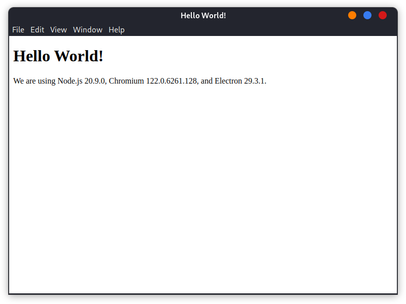

# JavaScript User Guide

## Node.js user guide

### Install Node.js with `apt`

```shell
sudo apt-get update
sudo apt-get install -y nodejs npm
```

Verify Node.js installation.

```shell
$ node -v
v18.13.0
$ npm -v
9.2.0
```

The default version of Node.js in Bianbu source is v18.13.0. Specific version has to be installed with NVM.

### Install specific version of Node.js with NVM

#### Install NVM

Download and run shell script according to from [https://github.com/nvm-sh/nvm](https://github.com/nvm-sh/nvm). Please replace the latest NVM version number based on the repository.


With curl：

```shell
sudo apt install curl
curl -o- https://raw.githubusercontent.com/nvm-sh/nvm/v0.40.1/install.sh | bash
```

or with wget：

```bash
sudo apt install wget
wget -qO- https://raw.githubusercontent.com/nvm-sh/nvm/v0.40.1/install.sh | bash
```

Verify NVM installation.

```shell
$ nvm -v
0.40.1
```

#### Install Node.js

The official source has not yet provided Node.js builds for RISC-V. Installing from there may cause errors. Instead, use the RISC-V compatible version from unofficial builds. For more details, refer to [https://github.com/nodejs/unofficial-builds/](https://github.com/nodejs/unofficial-builds/)

```shell
NVM_NODEJS_ORG_MIRROR=https://unofficial-builds.nodejs.org/download/release nvm install 20.16.0
```

Verify Node.js installation.

```shell
$ node -v
v20.16.0
```

### Example

#### clumsy-bird

Clone the demo project:

```shell
git clone https://github.com/ellisonleao/clumsy-bird
```

Install dependencies.

```shell
cd clumsy-bird
npm install
sudo apt install grunt
```

Run the service.

```shell
grunt connect
```

You should see output like the following. The service is deployed by default at `http://0.0.0.0:8001`. Open this URL in a browser to start.


```shell
$ grunt connect
Running "connect:root" (connect) task
Waiting forever...
Started connect web server on http://0.0.0.0:8001
```

## Electron user guide

### Preparation

Please install Node.js first.

### Quick start

Clone [electron-quick-start](https://github.com/electron/electron-quick-start.git)，

```shell
git clone https://github.com/electron/electron-quick-start.git ~/electron-quick-start
```

Install RISC-V adapted Electron from SpacemiT with `npm`.

```shell
cd ~/electron-quick-start
ELECTRON_MIRROR=http://archive.spacemit.com/electron/ electron_use_remote_checksums=1 npm install electron@29.3.1
```

Start the demo.

```shell
npm start
```

If you see the following window, it means the setup was successful:



## Electron-builder user guide

**Electron-builder** is a complete solution to package and build a ready for distribution Electron Native app for macOS, Windows and Linux with "auto update" support. The official electron-builder and related components have not been adapted to RISC-V. Therefore, we use RISC-V adapted electron-builder from SpacemiT. [Electron-quick-start](https://github.com/electron/electron-quick-start) is the project to be packaged.


### Prepare

Please install Node.js first.

### Clone project

```shell
git clone https://github.com/electron/electron-quick-start.git
cd electron-quick-start
```

### Configure `package.json`

```shell
vim package.json
```

Add package commands under `scripts`, we use RISC-V adapted Electron from SpacemiT here.

```json
  "scripts": {
    "pack-dir": "ELECTRON_MIRROR=http://archive.spacemit.com/electron/ electron-builder --linux --dir",
    "pack-tgz": "ELECTRON_MIRROR=http://archive.spacemit.com/electron/ electron-builder --linux tar.gz"
  }
```

Add packaging configurations.

```json
  "build": {
    "productName": "demo",
    "directories": {
      "output": "build"
    },
    "linux": {
      "category": "Utility"
    }
  },
```

Add development dependencies. Please indicate source repository with `@repository_name/package_name`. The following `@electron` is [SpacemiT Node.js package repository](https://git.spacemit.com/electron/electron-builder/-/packages).

```json
  "devDependencies": {
    "electron": "29.3.1",
    "@electron/electron-builder": "25.0.0-alpha.5"
  }
```

Your final `package.json` should look like this:

```json
{
  "name": "electron-quick-start",
  "version": "1.0.0",
  "description": "A minimal Electron application",
  "main": "main.js",
  "scripts": {
    "start": "electron .",
    "pack-dir": "ELECTRON_MIRROR=http://archive.spacemit.com/electron/ electron-builder --linux --dir",
    "pack-tgz": "ELECTRON_MIRROR=http://archive.spacemit.com/electron/ electron-builder --linux tar.gz"
  },
  "repository": "https://github.com/electron/electron-quick-start",
  "keywords": [
    "Electron",
    "quick",
    "start",
    "tutorial",
    "demo"
  ],
  "author": "GitHub",
  "license": "CC0-1.0",
  "build": {
    "productName": "demo",
    "directories": {
      "output": "build"
    },
    "linux": {
      "category": "Utility"
    }
  },
  "devDependencies": {
    "electron": "29.3.1",
    "@electron/electron-builder": "25.0.0-alpha.5"
  }
}
```

### Configure repository URL

```shell
npm config set @electron:registry https://git.spacemit.com/api/v4/projects/36/packages/npm/
```

### Install dependencies

We set `ELECTRON_MIRROR` for RISC-V adapted Electron. **Do not** set the Electron and electron-builder mirror URL via `npm config`, otherwise it will override the command-line mirror setting. Use `npm config list` to verify.

```shell
ELECTRON_MIRROR=http://archive.spacemit.com/electron/ electron_use_remote_checksums=1 npm install
```

### Start packaging

#### Distribute in dir

```shell
npm run pack-dir
```

This command will generate a `linux-riscv64-unpacked` folder under the output directory (in this case, `build`).

```shell
bianbu@k1:~/electron-quick-start$ tree build/linux-riscv64-unpacked/ -L 1
build/linux-riscv64-unpacked/
├── chrome_100_percent.pak
├── chrome_200_percent.pak
├── chrome_crashpad_handler
├── chrome_sandbox
├── electron-quick-start
├── icudtl.dat
├── libEGL.so
├── libffmpeg.so
├── libGLESv2.so
├── libvk_swiftshader.so
├── libvulkan.so.1
├── LICENSE.electron.txt
├── LICENSES.chromium.html
├── locales
├── resources
├── resources.pak
├── snapshot_blob.bin
├── v8_context_snapshot.bin
└── vk_swiftshader_icd.json

3 directories, 17 files
```

#### Distribute in tar.gz

```shell
npm run pack-tgz
```

This command generates a compressed package named `electron-quick-start-1.0.0-riscv64.tar.gz` in the output directory `build`.

```shell
bianbu@k1:~/electron-quick-start$ tar -ztf build/electron-quick-start-1.0.0-riscv64.tar.gz 
electron-quick-start-1.0.0-riscv64/
electron-quick-start-1.0.0-riscv64/LICENSE.electron.txt
electron-quick-start-1.0.0-riscv64/LICENSES.chromium.html
electron-quick-start-1.0.0-riscv64/chrome_100_percent.pak
electron-quick-start-1.0.0-riscv64/chrome_200_percent.pak
electron-quick-start-1.0.0-riscv64/chrome_crashpad_handler
electron-quick-start-1.0.0-riscv64/chrome_sandbox
electron-quick-start-1.0.0-riscv64/electron-quick-start
electron-quick-start-1.0.0-riscv64/icudtl.dat
electron-quick-start-1.0.0-riscv64/libEGL.so
electron-quick-start-1.0.0-riscv64/libGLESv2.so
electron-quick-start-1.0.0-riscv64/libffmpeg.so
electron-quick-start-1.0.0-riscv64/libvk_swiftshader.so
electron-quick-start-1.0.0-riscv64/libvulkan.so.1
electron-quick-start-1.0.0-riscv64/locales/
electron-quick-start-1.0.0-riscv64/resources/
electron-quick-start-1.0.0-riscv64/resources.pak
electron-quick-start-1.0.0-riscv64/snapshot_blob.bin
electron-quick-start-1.0.0-riscv64/v8_context_snapshot.bin
electron-quick-start-1.0.0-riscv64/vk_swiftshader_icd.json
electron-quick-start-1.0.0-riscv64/locales/......
electron-quick-start-1.0.0-riscv64/resources/app-update.yml
electron-quick-start-1.0.0-riscv64/resources/app.asar
```

#### Distribute in `.deb`

Deb packaging requires extra information, please add `author`, `email` and `homepage` in `package.json`.

```json
  "author": "lff <junzhao.liang@spacemit.com>",
  "email": "junzhao.liang@spacemit.com",
  "homepage": "www.google.com",
```

Install FPM.

```shell
sudo apt install ruby3.1
sudo gem install fpm
```

FPM packaging command. Parameters can be customized. It takes a while for compressing `.deb` package, please be patient.

```shell
mkdir tmp
fpm -s dir --force -t deb -d libgtk-3-0 -d libnotify4 -d libnss3 -d libxss1 -d libxtst6 -d xdg-utils -d libatspi2.0-0 -d libuuid1 -d libsecret-1-0 --deb-recommends libappindicator3-1 \
--deb-compression xz \
--architecture riscv64 \
--description 'A minimal Electron application' \
--version 1.0.0 \
--package /home/bianbu/electron-quick-start/build/electron-quick-start_1.0.0_riscv64.deb \
--name electron-quick-start \
--maintainer 'lff <junzhao.liang@spacemit.com>' \
--url https://www.google.com \
--vendor 'lff <junzhao.liang@spacemit.com>' \
--deb-priority optional \
--license CC0-1.0 \
/home/bianbu/electron-quick-start/build/linux-riscv64-unpacked/=/opt/demo \
./tmp=/usr/share/applications/electron-quick-start.desktop
```

Add the following parameters to the packaging command of `fpm` to set the application icon.

```shell
/home/bianbu/electron-quick-start/node_modules/@electron/app-builder-lib/templates/icons/electron-linux/16x16.png=/usr/share/icons/hicolor/16x16/apps/electron-quick-start.png
```

This command makes `.deb` package `electron-quick-start-1.0.0-riscv64.deb` in output dir `build`.

### Run app

#### Distribute in dir

Run `electron-quick-start`.

```shell
cd build/linux-riscv64-unpacked/
./electron-quick-start
```

#### Distribute in tar.gz

Uncompress and run `electron-quick-start`.

```shell
cd build
tar -zxf electron-quick-start-1.0.0-riscv64.tar.gz
cd electron-quick-start-1.0.0-riscv64
./electron-quick-start
```

#### Distribute in deb

Install `.deb` and run the application.

```shell
cd build
sudo dpkg -i electron-quick-start_1.0.0_riscv64.deb
/opt/demo/electron-quick-start
```
