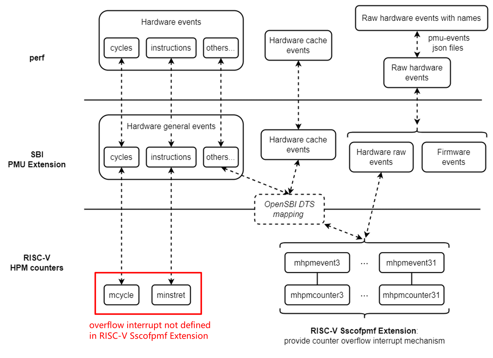
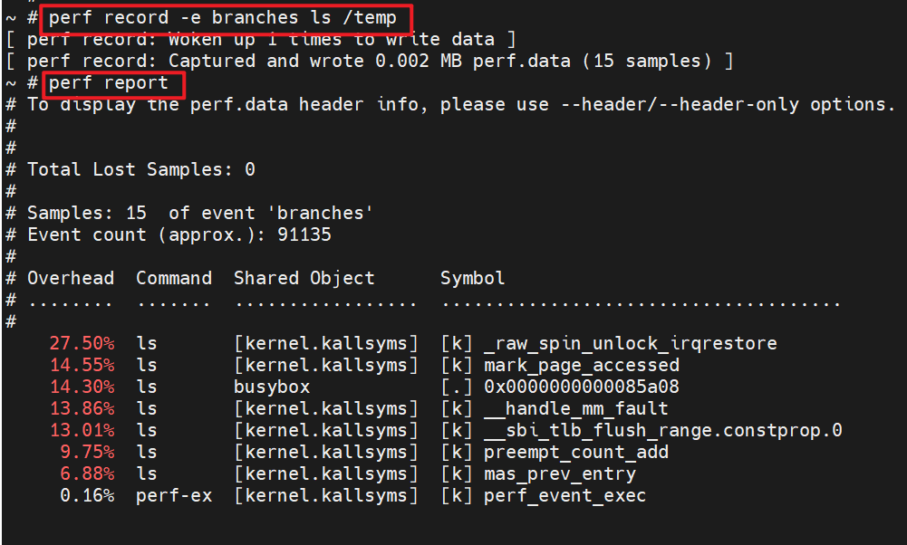
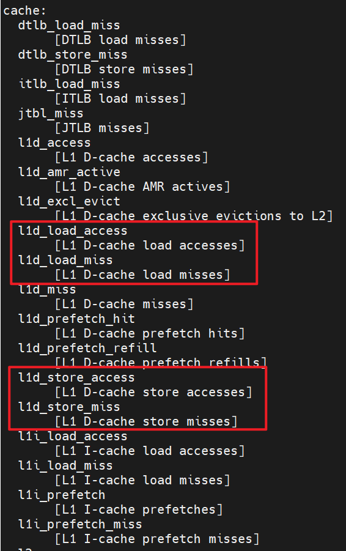

# Perf Usage Note

(For basic usage of the perf tool, please refer to the [official tutorial](https://perf.wiki.kernel.org/index.php/Tutorial). This will be not mentioned in this article.)

The current support for perf on RISC-V is related to the following software/hardware frameworks/specifications:

- Linux perf framework
  - The main framework of perf
  - The pmu-events json files in perf (which allow perf to specify specific hardware events by name rather than raw encoding)
- SBI PMU Extension
- RISC-V hardware specifications
  - HPM (Hardware Performance Monitor) defined in RISC-V ISA Privileged Specification
  - Sscofpmf Extension

Their relationship is as follows:


However, even if all the above are supported in software/hardware, perf users still need to pay attention to:

## Not Every Hardware Events in `perf list` is Available

**Symptoms:**

The hardware events listed in `perf list` do not mean that this hardware platform supports all of them.

For example, the output of `perf list` is:

```shell
$ perf list | grep Hardware
  branch-instructions OR branches                    [Hardware event]
  branch-misses                                      [Hardware event]
  bus-cycles                                         [Hardware event]
  cache-misses                                       [Hardware event]
  cache-references                                   [Hardware event]
  cpu-cycles OR cycles                               [Hardware event]
  instructions                                       [Hardware event]
  ref-cycles                                         [Hardware event]
  stalled-cycles-backend OR idle-cycles-backend      [Hardware event]
  stalled-cycles-frontend OR idle-cycles-frontend    [Hardware event]
  L1-dcache-load-misses                              [Hardware cache event]
  L1-dcache-loads                                    [Hardware cache event]
  L1-dcache-prefetch-misses                          [Hardware cache event]
  L1-dcache-prefetches                               [Hardware cache event]
  L1-dcache-store-misses                             [Hardware cache event]
  L1-dcache-stores                                   [Hardware cache event]
  L1-icache-load-misses                              [Hardware cache event]
  L1-icache-loads                                    [Hardware cache event]
  L1-icache-prefetch-misses                          [Hardware cache event]
  L1-icache-prefetches                               [Hardware cache event]
  LLC-load-misses                                    [Hardware cache event]
  LLC-loads                                          [Hardware cache event]
  LLC-prefetch-misses                                [Hardware cache event]
  LLC-prefetches                                     [Hardware cache event]
  LLC-store-misses                                   [Hardware cache event]
  LLC-stores                                         [Hardware cache event]
  branch-load-misses                                 [Hardware cache event]
  branch-loads                                       [Hardware cache event]
  dTLB-load-misses                                   [Hardware cache event]
  dTLB-loads                                         [Hardware cache event]
  dTLB-prefetch-misses                               [Hardware cache event]
  dTLB-prefetches                                    [Hardware cache event]
  dTLB-store-misses                                  [Hardware cache event]
  dTLB-stores                                        [Hardware cache event]
  iTLB-load-misses                                   [Hardware cache event]
  iTLB-loads                                         [Hardware cache event]
  node-load-misses                                   [Hardware cache event]
  node-loads                                         [Hardware cache event]
  node-prefetch-misses                               [Hardware cache event]
  node-prefetches                                    [Hardware cache event]
  node-store-misses                                  [Hardware cache event]
  node-stores                                        [Hardware cache event]
```

But the counting results of some of them will be `<not counted>`. It could be caused by that these events are not supported in this hardware, or supoorted but just didn't occur during this counting:

```shell
$ perf stat -e cycles,branches,bus-cycles,ref-cycles ls

 Performance counter stats for 'ls':

           1719370      cycles
             94325      branches
     <not counted>      bus-cycles                                (0.00%)
     <not counted>      ref-cycles                                (0.00%)

       0.002556584 seconds time elapsed

       0.002900000 seconds user
       0.000000000 seconds sys
```

**Causes:**

The "Hardware event" and "Hardware cache event" in `perf list` are names pre-defined by Linux perf framework. On RISC-V, they are connected to the actual HPM hardware counters through the SBI PMU Extension. In the PMU Extension implementation of OpenSBI, this mapping is described in the node with `compatible = "riscv,pmu"`.

This is an example of Device Tree:

```dts
pmu {
    compatible = "riscv,pmu";

    riscv,event-to-mhpmevent =
    /* BRANCH_INSTRUCTIONS */
    <0x00005 0x0 0x01>,
    /* BRANCH_MISSES */
    <0x00006 0x0 0x02>,
    /* STALLED_CYCLES_FRONTEND */
    <0x00008 0x0 0x03>,
    /* STALLED_CYCLES_BACKEND */
    <0x00009 0x0 0x04>,
    /* L1D_READ_ACCESS */
    <0x10000 0x0 0x06>,
    /* L1D_READ_MISS */
    <0x10001 0x0 0x05>,
    /* L1D_WRITE_ACCESS */
    <0x10002 0x0 0x0a>,
    /* L1D_WRITE_MISS */
    <0x10003 0x0 0x09>,
    /* L1I_READ_ACCESS */
    <0x10008 0x0 0x0c>,
    /* L1I_READ_MISS */
    <0x10009 0x0 0x0b>,
    /* L1I_PREFETCH_ACCESS */
    <0x1000c 0x0 0x0e>,
    /* L1I_PREFETCH_MISS */
    <0x1000d 0x0 0x0d>,
    /* DTLB_READ_MISS */
    <0x10019 0x0 0x15>,
    /* DTLB_WRITE_MISS */
    <0x1001b 0x0 0x19>,
    /* ITLB_READ_MISS */
    <0x10021 0x0 0x1b>;

    /* 16 valid counters: mhpmcounter3 ~ mhpmcounter18 */
    riscv,event-to-mhpmcounters =
     <0x00005 0x00006 0x0007fff8>,
     <0x00008 0x00009 0x0007fff8>,
     <0x10000 0x10003 0x0007fff8>,
     <0x10008 0x10009 0x0007fff8>,
     <0x1000c 0x1000d 0x0007fff8>,
     <0x10019 0x10019 0x0007fff8>,
     <0x1001b 0x1001b 0x0007fff8>,
     <0x10021 0x10021 0x0007fff8>;

    riscv,raw-event-to-mhpmcounters =
     /*
      * For convenience, we treat 0x1~0xff as valid indexes,
      * but actually in hardware the valid indexes are 0x1~0xbd.
      */
     <0x0 0x0 0xffffffff 0xffffff00 0x0007fff8>;
};
```

For detailed description of the format, please refer to the document [docs/pmu_support.md](https://github.com/riscv-software-src/opensbi/blob/master/docs/pmu_support.md) in OpenSBI sources.

**These contents in Device Tree are parsed by OpenSBI, and cannot be noticed by Linux perf framework** (no relevant specifications are defined). Therefore, not every hardware event listed in `perf list` corresponds to an actual HPM event.

## Sampling (such as `perf record`) for `cycles` or `instructions` Event are Invalid on X60

**Symptoms:**

On X60, the sampling functions in perf (including but not limited to `record`, `top`, etc.), are invalid for `cycles` or `instructions` event. The possible issues include but are not limited to:

- After running `perf record`, executing `perf report` for the generated `perf.data`, the error "The perf.data data has no samples!" occurs:

  

- There is no output when executing `perf top`.

- ...

**Causes:**

The sampling functions in perf rely on the counters to provide overflow interrupts. On RISC-V, the Sscofpmf Extension defines how the `mhpmevent` counters in hardware provide overflow interrupts.

But for the counter CSRs, `mcycle` and `minstret`, used by `cycles` and `instructions` events, neither of their overflow interrupts is defined in Sscofpmf Extension. X60 doesn't have any additional processing for this. So sampling for the two events doesn't work.



In most cases, if without `-e` option to specify events, perf will use `cycles` event by default. **Therefore, it is expected that there is no output or result samples are 0 by default when using perf sampling on X60. We can use `-e` option to specify other events and then we will find it works**. For example:



Consider to use the following events as an alternative to `cycles` and `instructions` events when using perf sampling to analyse performance on X60:

- Software events such as `cpu-clock`, `task-clock`, etc.
- Specific events supported on X60 hardware, such as U/S/M mode cycles, various intructions, etc. (Please refer to the hardware user manual for more details about these events. For how to use them in perf, please refer to the following section "How to Use Raw Hardware Events".)

## How to Use Raw Hardware Events

For those events that are supported on hardware but not have pre-defined names in Linux perf framework (called "raw hardware event"), we can use `-e` option with the following two ways to specify them:

- By `rNNN` encoding
- By name (Requires the SDK of this platform to have implemented the pmu-events json files)

### By `rNNN` encoding

`-e rNNN` can be used to specify a event by the code defined in hardware, where `NNN` is a hexadecimal number (excluding `0x`), and its format is determined by the Linux perf framework, hardware-defined code and related middleware.

For RISC-V platforms that support SBI PMU Extension, the meaning of each bit in `NNN` is:

```plain
  [63]      固定为 0，表示 raw type
  [52:56]   固定为 4，表示 type 为 PERF_TYPE_RAW
  [55:48]   未使用，全为 0 即可
  [47:0]    对应的 mhpmevent CSR 值
```

For example, `r0400000000000008` represents an event with the `mhpmevent` value of 0x8.

### By Name

perf allows vendors to add some json files to its source code, to define names for their specific raw hardware events. Then the users can specify events by name rather than `rNNN` encoding.

If implemented, the json files can be found in the Linux source code of the SDK in the directory `tools/perf/pmu-events/arch/riscv`. For example, for X60, there are:

```shell
user@host:~/linux/tools/perf/pmu-events/arch/riscv$ tree spacemit/x60
spacemit/x60
|-- branch.json
|-- cache.json
|-- instruction.json
`-- microarch.json
```

When **using the perf tool complied from this source code**, users can use the names defined in the json files instead of the `rNNN` encodings.

Take the following content in X60 `cache.json` as an example:


- `EventName` is the name can be used in perf `-e` option.
- `EventCode` corresponds to the HPM event code (usually described in the hardware user manual).

We can find these names in `perf list` (If the result of `perf list` is too long, we can only list the events related to the keyword, such as `perf list l1`):



This name can be used directly in `-e` option. For example:


