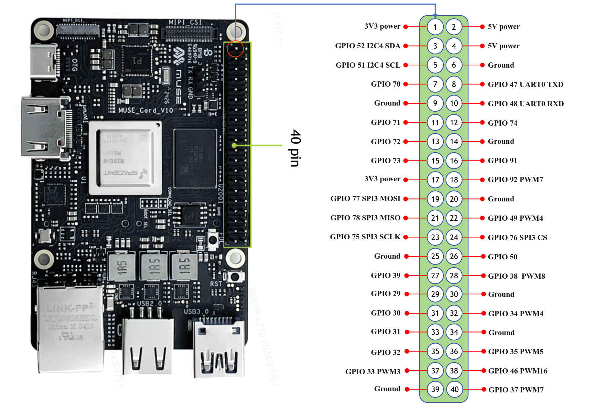

# Python User Guide

Python 3 is preinstalled on the Bianbu OS. You are advised to use a correct package management tool when installing third-party Python libraries. Otherwise, the dependence on software packages may be damaged.

In Bianbu OS, you can install python dependencies in two ways：

* Install preconfigured system Python packages using apt。
* Create a virtual environment and install the packages using the pip package manager。

## Install Python packages using apt

In Bianbu OS, it is recommended to install Python3 packages via apt. These packages are usually pre-compiled and therefore faster to install. apt manages the dependencies of all packages and includes all the sub-dependencies needed to run the package when installed. Also, apt makes sure you don't break other packages when you uninstall them。
For example, to install scipy, the scientific computing library for Python, run the following command：

```shell
sudo apt install python3-scipy
```

To find Python packages published with apt, use apt search. In most cases, Python packages use the prefix python3- : for example, python3-numpy corresponds to Python's numpy package。

## Install Python packages using pip

### Changes to the pip installation

In Bianbu OS, users cannot use pip to install libraries directly into the system version of Python. Trying to install a Python package system-wide using pip will output an error similar to the following：

```shell
➜  ~ pip install numpy
error: externally-managed-environment

× This environment is externally managed
╰─> To install Python packages system-wide, try apt install
    python3-xyz, where xyz is the package you are trying to
    install.

    If you wish to install a non-Debian-packaged Python package,
    create a virtual environment using python3 -m venv path/to/venv.
    Then use path/to/venv/bin/python and path/to/venv/bin/pip. Make
    sure you have python3-full installed.

    If you wish to install a non-Debian packaged Python application,
    it may be easiest to use pipx install xyz, which will manage a
    virtual environment for you. Make sure you have pipx installed.

    See /usr/share/doc/python3.12/README.venv for more information.

note: If you believe this is a mistake, please contact your Python installation or OS distribution provider. You can override this, at the risk of breaking your Python installation or OS, by passing --break-system-packages.
hint: See PEP 668 for the detailed specification.
```

Packages installed via pip must be installed into the Python virtual environment (venv). A virtual environment is a container where you can securely install third-party modules so that they don't interfere with your system Python environment。

### Using pip in a virtual environment

To use a virtual environment, create a container to store your Python environment. You can do this in a number of ways, depending on how you want to use Python. Let's take the virtualenv tool as an example.First install virtualenv on your system's python environment：

```shell
sudo apt install python3-virtualenv
```

Run the following command to create the virtual environment configuration folder (myenv can be replaced with any name you like)：

```shell
virtualenv myenv
```

Then, run the bin/activate script in the virtualenv configuration folder to enter the virtualenv:

```shell
source myenv/bin/activate
```

Then you should see a prompt similar to the following:

```shell
(myenv) ➜  ~
```

The pyenv command prompt prefix indicates that the current terminal session is in a virtual environment named pyenv.

To check if you are in a virtual environment, use pip list to see a list of installed packages：

```shell
(myenv) ➜  ~ pip list
Package Version
------- -------
pip     24.0
```

The list should be much shorter than the list of packages installed in your system Python. You can now install packages securely using pip. Any package installed using pip in a virtual environment will only be installed in that virtual environment. In a virtual environment, the python or python3 command will automatically use the virtual Python package instead of the system Python package.

For example, install the wheel package using pip：

```shell
(myenv) ➜  ~ pip install wheel
Collecting wheel
  Downloading wheel-0.44.0-py3-none-any.whl.metadata (2.3 kB)
Downloading wheel-0.44.0-py3-none-any.whl (67 kB)
   ━━━━━━━━━━━━━━━━━━━━━━━━━━━━━━━━━━━━━━━━ 67.1/67.1 kB 27.9 kB/s eta 0:00:00
Installing collected packages: wheel
Successfully installed wheel-0.44.0
```

You can verify that the installation was successful by running python3 and then importing the installed module。

```shell
(myenv) ➜  ~ python3
Python 3.12.3 (main, Apr 10 2024, 05:33:47) [GCC 13.2.0] on linux
Type "help", "copyright", "credits" or "license" for more information.
>>> import wheel
```

You can use the sys module to verify that the current interpreter path works as expected：

```shell
>>> import sys
>>> print("The current Python interpreter path:", sys.executable)
The current Python interpreter path: /home/zq-card/myenv/bin/python3
```

Use exit() to exit interactive mode：

```shell
>>> exit()
(myenv) ➜  ~
```

To leave the virtual environment, run the following command：

```shell
(myenv) ➜  ~ deactivate
```

### Use pyenv to manage Python versions

pyenv is a very popular Python version management tool that allows you to easily install, manage, and switch between multiple versions of Python. You are free to switch between different versions of Python depending on your project's needs. Here's how to configure multiple versions of Python using pyenv。

See also for more information[The official pyenv tutorial](https://github.com/pyenv/pyenv)

#### Installing pyenv

```shell
git clone https://github.com/pyenv/pyenv.git ~/.pyenv
```

#### Configuring the shell environment

For Zsh:

```shell
echo 'export PYENV_ROOT="$HOME/.pyenv"' >> ~/.zshrc
echo '[[ -d $PYENV_ROOT/bin ]] && export PATH="$PYENV_ROOT/bin:$PATH"' >> ~/.zshrc
echo 'eval "$(pyenv init -)"' >> ~/.zshrc
source ~/.zshrc
```

For Bash：

```shell
echo 'export PYENV_ROOT="$HOME/.pyenv"' >> ~/.bashrc
echo 'command -v pyenv >/dev/null || export PATH="$PYENV_ROOT/bin:$PATH"' >> ~/.bashrc
echo 'eval "$(pyenv init -)"' >> ~/.bashrc
source ~/.bashrc
```

#### Install multiple versions of Python

You can install multiple versions of python by running the following command, in this case 3.10.0, but you can also specify a Python version such as 3.8.5.

```shell
pyenv install 3.10.0
```

If the installation is successful, the following display will appear:

```shell
Downloading Python-3.10.0.tar.xz...
-> https://www.python.org/ftp/python/3.10.0/Python-3.10.0.tar.xz
Installing Python-3.10.0...
patching file aclocal.m4
patching file configure
Hunk #5 succeeded at 10537 (offset -15 lines).
patching file Misc/NEWS.d/next/Build/2021-10-11-16-27-38.bpo-45405.iSfdW5.rst
patching file configure
patching file configure.ac
Installed Python-3.10.0 to /home/zq/.pyenv/versions/3.10.0
```

Type pyenv versions to see if the version of Python you installed appears:

```shell
➜  ~ pyenv versions
* system (set by /home/zq/.pyenv/version)
  3.10.0
```

#### Set the global Python version

You can use pyenv global to set the default Python version. This affects the version of Python used on all terminals in the system.

If you're using Bash, replace.zshrc with.bashrc.

```shell
➜  ~ pyenv global 3.10.0
➜  ~ source ~/.zshrc
➜  ~ python3
Python 3.10.0 (default, Sep 13 2024, 20:53:06) [GCC 13.2.0] on linux
Type "help", "copyright", "credits" or "license" for more information.
>>>
```

Type pyenv versions again and you'll see that the python version has switched from system to 3.10.0

```shell
➜  ~ pyenv versions
  system
* 3.10.0 (set by /home/zq/.pyenv/version)
```

If you want to switch back to your system's python, execute pyenv global system

```shell
➜  ~ pyenv global system
➜  ~ source ~/.zshrc
➜  ~ python3
Python 3.12.3 (main, Apr 10 2024, 05:33:47) [GCC 13.2.0] on linux
Type "help", "copyright", "credits" or "license" for more information.
>>>
```

When you manage multiple python versions, you can easily view them and switch to the corresponding python version via pyenv versions.

#### Set the local Python version for your project

You can use different versions of Python in a specific directory or project. Go to your project directory (myproject in this case), and run pyenv local:

pyenv will generate a file in that directory called.python-version that specifies the version of Python being used in that directory. When working in this directory, Python will default to 3.10.0 instead of using the global version.

```shell
➜  myproject pyenv local 3.10.0
➜  myproject ls -a
.  ..  .python-version
➜  myproject
➜  myproject python3
Python 3.10.0 (default, Sep 13 2024, 20:53:06) [GCC 13.2.0] on linux
Type "help", "copyright", "credits" or "license" for more information.
>>>
>>> exit()
➜  myproject cd ..
➜  ~ python3
Python 3.12.3 (main, Apr 10 2024, 05:33:47) [GCC 13.2.0] on linux
Type "help", "copyright", "credits" or "license" for more information.
>>>
```

pyenv local sets the Python version only for the project folder from which the command is executed, and when you switch to a different folder, Python will default back to the system version.

#### Set the Python version only for the current terminal

The pyenv shell command allows you to use the specified Python version in the current terminal session without affecting global Settings:

```shell
➜  ~ pyenv shell 3.10.0
➜  ~ python3
Python 3.10.0 (default, Sep 13 2024, 20:53:06) [GCC 13.2.0] on linux
Type "help", "copyright", "credits" or "license" for more information.
>>>
>>> exit()
➜  ~ pyenv shell system
➜  ~ python3
Python 3.12.3 (main, Apr 10 2024, 05:33:47) [GCC 13.2.0] on linux
Type "help", "copyright", "credits" or "license" for more information.
>>>
```

This way, you can quickly switch versions without worrying about affecting the global environment.

#### Uninstall the Python version

If you no longer need a version of Python, you can uninstall it using the pyenv uninstall command:

Verify the version of Python you're using with the pyenv versions command

```shell
➜  ~ pyenv uninstall 3.10.0
pyenv: remove /home/zq/.pyenv/versions/3.10.0? [y|N] y
pyenv: 3.10.0 uninstalled
➜  ~ pyenv versions
* system (set by PYENV_VERSION environment variable)
```

### Using the pypi source from SpacemiT

When you use pip to install some Python packages in a virtual environment, if the packages do not provide a precompiled whl installation file suitable for RISC-V architecture, pip will pull the source code of the package and build it locally. For python packages that rely on C/C++ at the bottom, This process is usually very time-consuming and prone to compile-time dependency issues.

To improve development efficiency, SpaceMIT has built some commonly used Python packages (such as numpy) for the RISC-V architecture, which have been packaged as.whl files for developers to use on the RISC-V platform. This tutorial will guide you through how to install and use these Python packages in the RISC-V environment.

1. Install the PyPI package

`<package_name>` is the package name.

```shell
pip install --index-url https://git.spacemit.com/api/v4/projects/33/packages/pypi/simple <package_name>
```

2. Configure as an additional source

pip supports one main index-url by default, but you can add additional sources by configuring multiple extra-index-urls.

```shell
pip config set global.extra-index-url https://git.spacemit.com/api/v4/projects/33/packages/pypi/simple
```

You can check this with pip config list, and if it was successful, you should see the following:

```shell
global.extra-index-url='https://git.spacemit.com/api/v4/projects/33/packages/pypi/simple'
```

If you want to upload your own compiled whl package, please refer to:[How to upload a Python precompiled package](https://git.spacemit.com/archive/pypi/-/blob/main/README.md?ref_type=heads)

## Use the Thonny editor

We recommend using [Thonny](https://thonny.org/)to edit Python code on Bianbu.

Install：

```shell
sudo apt install python3-tk thonny
```

Once the installation is complete, enter thonny to launch the IDE interface:

```shell
thonny
```

By default, Thonny uses system Python. However, you can switch to using a Python virtual environment by clicking the Interpreter menu in the bottom-right corner of the Thonny window. You can choose a configured environment or use the Configure interpreter... Create a new virtual environment.

## Using GPIO from Python

We adapted the gpiozero library for the following devices

* BPI-F3
* MUSE Book
* MUSE Pi
* MUSE Card

With this library, you can easily control GPIO devices using Python scripts and the full documentation of the library is located at [gpiozero.readthedocs.io](https://gpiozero.readthedocs.io/)。

In the actual usage, you should pay special attention to the GPIO pin number and the special function of the pin, the pin number of these devices is different from the Raspberry PI tutorial.

Let's take a 26-pin SpacemiT development board, SpacemiT MUSE-Pi, as an example of how to use gpiozero.

### Device pin layout

### MUSE Pi


### BPI-F3


### MUSE BOOK


### MUSE Card



### Install and configure the environment

Run the following command to install the library:

```shell
sudo apt install python3-gpiozero
```

Run pinout from the command line, and you should see the following output:

```shell
➜  pinout
Description        : spacemit k1-x MUSE-Pi board
Revision           : deb002
SoC                : M1-8571
RAM                : 7GB
Storage            : MicroSD/SSD
USB ports          : 2 (of which 2 USB3)
Ethernet ports     : 2 (1000Mbps max. speed)
Wi-fi              : True
Bluetooth          : True
Camera ports (CSI) : 1
Display ports (DSI): 1

,---------------------------------------------------------------.
| ooooooooooooo                                  J24  :
| 1oooooooooooo                                       : |Ethernet1
|     MUSE Pi                                      : |Ethernet2
,--------------------------------------------------------------.

MUSE_Pi:
   3V3  (1) (2)  5V
GPIO52  (3) (4)  5V
GPIO51  (5) (6)  GND
GPIO70  (7) (8)  GPIO47
   GND  (9) (10) GPIO48
GPIO71 (11) (12) GPIO74
GPIO72 (13) (14) GND
GPIO73 (15) (16) GPIO91
   3V3 (17) (18) GPIO92
GPIO77 (19) (20) GND
GPIO78 (21) (22) GPIO49
GPIO75 (23) (24) GPIO76
   GND (25) (26) GPIO50


```

### LED control

The following example code controls the LED connected to GPIO70:

```python
from gpiozero.pins.lgpio import LGPIOFactory
from gpiozero import Device
Device.pin_factory = LGPIOFactory(chip=0)

from gpiozero import LED
import time

pin_number = 70

led1 = LED(pin_number)

try:
    while True:
        # Set GPIO 70 to high
        led1.on()
        print(f"GPIO {pin_number} ON")
        time.sleep(1)  # Wait 1 second

        # Set GPIO 70 to low
        led1.off()
        print(f"GPIO {pin_number} OFF")
        time.sleep(1)  # Wait 1 second

except KeyboardInterrupt:
    # Capture Ctrl+C and exit
    print("Exiting")

led1.close()
```

Run it in an IDE like Thonny and the LED will blink repeatedly.

LED methods include on(), off(), toggle(), and blink().

**Tips**

> The GPIO on the development board is usually weak in driving ability, so it is not recommended to connect power devices such as leds directly to the pins. It is recommended that you add a pull-up resistor greater than 10 KHZ to the GPIO pin, and then use a triode or MOS transistor to turn devices such as leds on and off.

### Code Explanation

When using the gpiozero library on SpacemiT's development board, it's recommended to include the following at the beginning of your program:

```python
from gpiozero.pins.lgpio import LGPIOFactory
from gpiozero import Device
Device.pin_factory = LGPIOFactory(chip=0) # Explicitly specify /dev/gpiochip0
```

This code explicitly specifies the gpiozero library to use lgpio library as the underlying pin factory, which is the low-level GPIO control library for linux. Although gpiozero uses lgpio by default, in order to ensure the normal work of gpiozero on SpacemiT development board, It is recommended to specify the pin factory explicitly.

When you try to port the official Raspberry PI routine, it is recommended that you add the above three lines of code at the beginning of its sample code, while paying attention to the difference in pin numbering.

You can also use the Python lgpio library to control a GPIO device, see: [lgpio Tutorials](http://abyz.me.uk/lg/py_lgpio.html)

Install Python lgpio:

```shell
sudo apt install python3-lgpio
```

### PWMLED

The following example code controls the LED connected to GPIO73 and outputs a PWM implementation of a breathing light:

```python
from gpiozero.pins.lgpio import LGPIOFactory
from gpiozero import Device
Device.pin_factory = LGPIOFactory(chip=0)
from gpiozero import PWMLED
from signal import pause

pin_number = 73

print(f"PWM {pin_number}")
led = PWMLED(pin_number)

led.pulse()

pause()
```

Run the above python script through your IDE or terminal. You should see the LED gradually change from bright to dark and then from dark to bright.

### Reading the button state

The following example code reads the status of a button connected to GPIO77:

```python
from gpiozero.pins.lgpio import LGPIOFactory
from gpiozero import Device
Device.pin_factory = LGPIOFactory(chip=0)

from gpiozero import Button
from signal import pause

pin_number = 77

print(f"Button {pin_number}")

def say_hello():
    print("Hello! Pressed")

def say_goodbye():
    print("Goodbye! Released")

button = Button(pin_number)

button.when_pressed = say_hello
button.when_released = say_goodbye

pause()
```

Execute the above python script through your IDE or terminal and press the key repeatedly. You should see the following output:

```shell
➜  testmy python3 testbutton.py
Button 77
Hello! Pressed
Goodbye! Released
Hello! Pressed
Goodbye! Released
```
