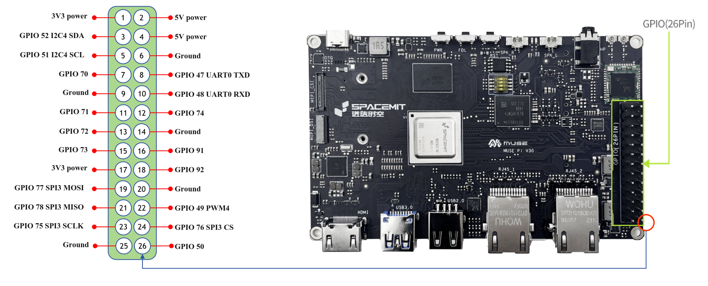
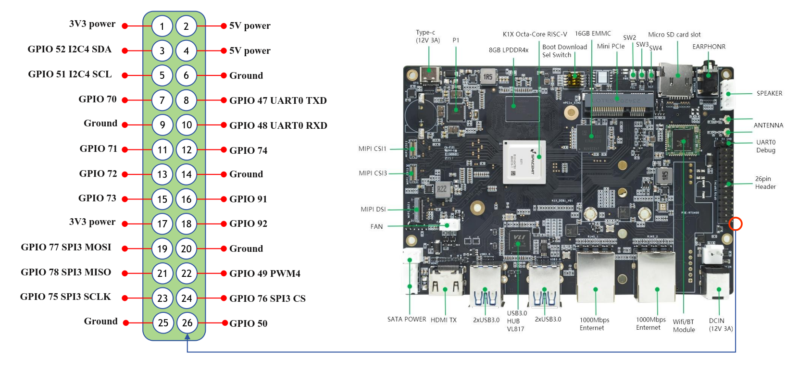
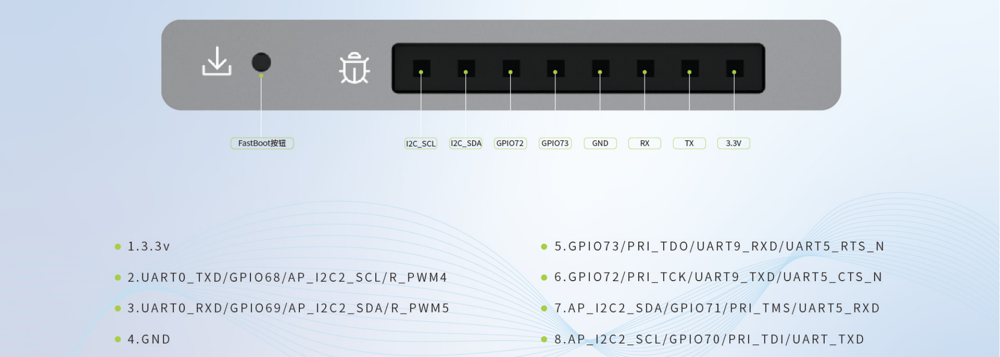
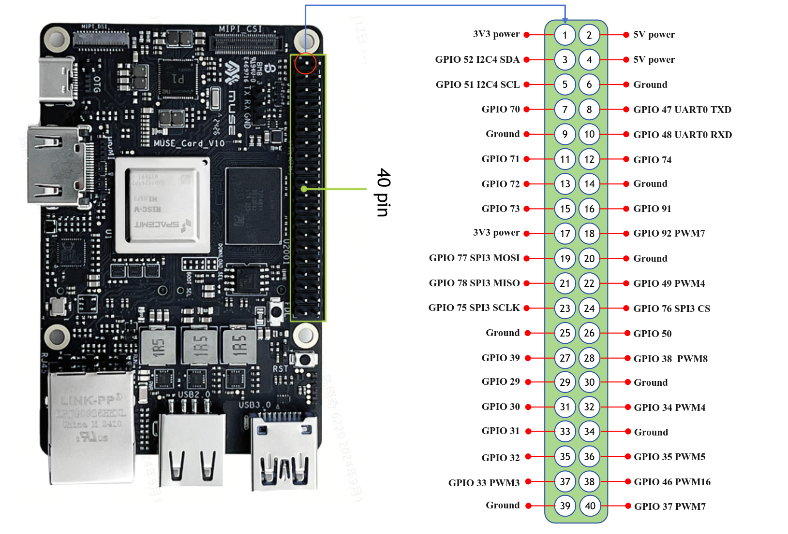

# Python User Guide

Python 3 is preinstalled on Bianbu OS. Use an appropriate package management tool when installing third-party Python libraries; otherwise, you may break system package dependencies.

In Bianbu OS, you can install python dependencies in two ways:

- Install preconfigured system Python packages using apt.
- Create a virtual environment and install the packages using the pip package manager.

## Install Python packages using apt

In Bianbu OS, it is recommended to install Python3 packages via `apt`. These packages are usually pre-compiled and therefore faster to install. `apt` manages the dependencies of all packages and includes all the sub-dependencies needed to run the package when installed. Also, `apt` makes sure you don't break other packages when you uninstall them.
For example, to install `scipy`, the scientific computing library for Python, run the following command:

```shell
sudo apt install python3-scipy
```

To find Python packages published with `apt`, use `apt search`. In most cases, Python packages use the prefix `python3-`: for example, `python3-numpy` corresponds to Python's numpy package.

## Install Python packages using `pip`

### Changes to the `pip` installation

In Bianbu OS, users cannot use `pip` to install libraries directly into the system version of Python. Trying to install a Python package system-wide using `pip` will output an error similar to the following:

```shell
➜  ~ pip install numpy
error: externally-managed-environment

× This environment is externally managed
╰─> To install Python packages system-wide, try apt install
    python3-xyz, where xyz is the package you are trying to
    install.

    If you wish to install a non-Debian-packaged Python package,
    create a virtual environment using python3 -m venv path/to/venv.
    Then use path/to/venv/bin/python and path/to/venv/bin/pip. Make
    sure you have python3-full installed.

    If you wish to install a non-Debian packaged Python application,
    it may be easiest to use pipx install xyz, which will manage a
    virtual environment for you. Make sure you have pipx installed.

    See /usr/share/doc/python3.12/README.venv for more information.

note: If you believe this is a mistake, please contact your Python installation or OS distribution provider. You can override this, at the risk of breaking your Python installation or OS, by passing --break-system-packages.
hint: See PEP 668 for the detailed specification.
```

Packages installed via pip must be installed into the Python virtual environment (`venv`). A virtual environment is a container where you can securely install third-party modules so that they don't interfere with your system Python environment.

### Using `pip` in a virtual environment

To use a virtual environment, create a container to store your Python environment. You can do this in a number of ways, depending on how you want to use Python. Let's take the virtualenv tool as an example. First install virtualenv on your system's python environment:

```shell
sudo apt install python3-virtualenv
```

Run the following command to create the virtual environment configuration folder (myenv can be replaced with any name you like):

```shell
virtualenv myenv
```

Then, run the `bin/activate` script in the virtualenv configuration folder to enter the virtualenv:

```shell
source myenv/bin/activate
```

Then you should see a prompt similar to the following:

```shell
(myenv) ➜  ~
```

The `(myenv)` prefix in the command prompt indicates that the current terminal session is using the virtual environment named `myenv`.

To check if you are in a virtual environment, use pip list to see a list of installed packages:

```shell
(myenv) ➜  ~ pip list
Package Version
------- -------
pip     24.0
```

The list should be much shorter than the list of packages installed in your system Python. You can now install packages securely using `pip`.

For improved compatibility, it is strongly recommended that you upgrade `pip` in the virtual environment to the latest version to avoid installation failures.

```shell
pip install --upgrade pip
```

Any package installed with `pip` in a virtual environment is installed only in that environment. Within a virtual environment, the `python` or `python3` command automatically uses the virtual environment's Python packages instead of the system Python packages.

For example, install the `wheel` package using `pip`:

```shell
(myenv) ➜  ~ pip install wheel
Collecting wheel
  Downloading wheel-0.44.0-py3-none-any.whl.metadata (2.3 kB)
Downloading wheel-0.44.0-py3-none-any.whl (67 kB)
   ━━━━━━━━━━━━━━━━━━━━━━━━━━━━━━━━━━━━━━━━ 67.1/67.1 kB 27.9 kB/s eta 0:00:00
Installing collected packages: wheel
Successfully installed wheel-0.44.0
```

You can verify that the installation was successful by running python3 and then importing the installed module.

```shell
(myenv) ➜  ~ python3
Python 3.12.3 (main, Apr 10 2024, 05:33:47) [GCC 13.2.0] on linux
Type "help", "copyright", "credits" or "license" for more information.
>>> import wheel
```

You can use the sys module to verify that the current interpreter path is as expected:

```shell
>>> import sys
>>> print("Current Python interpreter path:", sys.executable)
Current Python interpreter path: /home/zq-card/myenv/bin/python3
```

Use `exit()` to leave interactive mode:

```shell
>>> exit()
(myenv) ➜  ~
```

To leave the virtual environment, run the following command:

```shell
(myenv) ➜  ~ deactivate
```

### Python Version Support

| Python Interpreter Version | Support Status |
| :------------------------: | :------------: |
| Python 3.12 | Long-Term Support |
| Python 3.13 | Long-Term Support |
| Python 3.14 | Long-Term Support |

Users are strongly advised to use Python 3.12 or later. In general, following the Python version provided by the operating system is recommended.

### Use uv to manage Python interpreter versions

When managing Python interpreter versions, uv is recommended instead of conda. uv can install specified Python versions on demand, create virtual environments, and install Python packages with commands compatible with pip.

For more information, see the [official uv documentation](https://docs.astral.sh/uv/).

#### Install uv

Run the following command to install uv:

```shell
curl -LsSf https://astral.sh/uv/install.sh | sh
```

After installation, open a new terminal session to refresh the environment.

#### Create a virtual environment

Run the following command to create a virtual environment named `myvenv` with Python 3.14. Python 3.14 is recommended for K3, while Python 3.12 is recommended for K1.

```shell
uv venv myvenv --python 3.14
```

If a suitable Python interpreter is not available locally, uv downloads and installs it automatically.

#### Install packages with `uv pip`

Set the Alibaba Cloud PyPI mirror as the primary package source and the SpacemiT PyPI source as an additional package source. Then activate the virtual environment and install a package:

```shell
export UV_INDEX_URL=https://mirrors.aliyun.com/pypi/simple
export UV_EXTRA_INDEX_URL=https://git.spacemit.com/api/v4/projects/33/packages/pypi/simple
source myvenv/bin/activate
uv pip install pkg_name
```

Replace `pkg_name` with the package name. These environment variables apply only to the current terminal session.

#### Fall back to pip installation

If a tool or workflow requires pip, install `pip` in the virtual environment first:

```shell
source myvenv/bin/activate
uv pip install pip -U
deactivate
source myvenv/bin/activate
pip install pkg_name
```

After reactivating the virtual environment, you can use pip to install packages.

### Using the pypi source from SpacemiT

When you use pip to install some Python packages in a virtual environment, if the packages do not provide a precompiled whl installation file suitable for RISC-V architecture, pip will pull the source code of the package and build it locally. For python packages that rely on C/C++ at the bottom, This process is usually very time-consuming and prone to compile-time dependency issues.

To improve development efficiency, SpacemiT has built some commonly used Python packages (such as numpy) for the RISC-V architecture, which have been packaged as `.whl` files for developers to use on the RISC-V platform. This tutorial will guide you through how to install and use these Python packages in the RISC-V environment.

1. Install the PyPI package

   `<package_name>` is the package name.

   ```shell
   pip install --index-url https://git.spacemit.com/api/v4/projects/33/packages/pypi/simple <package_name>
   ```

2. Configure as an additional source

   `pip` supports one main index-url by default, but you can add additional sources by configuring multiple extra-index-urls.

   ```shell
   pip config set global.extra-index-url https://git.spacemit.com/api/v4/projects/33/packages/pypi/simple
   ```

   You can check this with pip config list, and if it was successful, you should see the following:

   ```shell
   global.extra-index-url='https://git.spacemit.com/api/v4/projects/33/packages/pypi/simple'
    ```

If you want to upload your own compiled `.whl` package, see [How to upload a Python precompiled package](https://git.spacemit.com/archive/pypi/-/blob/main/README.md?ref_type=heads).

## Use the Thonny editor

You can use [Thonny](https://thonny.org/) to edit Python code on Bianbu. For a better experience, JupyterLab is recommended.

Install:

```shell
sudo apt install python3-tk thonny
```

Once the installation is complete, enter thonny to launch the IDE interface:

```shell
thonny
```

By default, Thonny uses system Python. However, you can switch to a Python virtual environment from the Interpreter menu in the bottom-right corner of the Thonny window. You can select an existing environment or use **Configure interpreter...** to create a new virtual environment.

## Using JupyterLab (with VS Code)

### Introduction to JupyterLab

**JupyterLab** is a web-based **interactive development environment (IDE)** primarily used for **data science, machine learning, scientific computing, and education**. It is the next-generation interface for **Jupyter Notebook**, offering enhanced functionality and a more flexible user interface.

#### Key Features

1. **Multi-Document Interface**
   - Open multiple notebooks, terminals, text files, Markdown files, CSVs, images, and code editors simultaneously.
   - Tabbed views and split layouts make it easy to organize complex workflows.

2. **Interactive Computing**
   - Supports multiple programming languages via Jupyter kernels (most commonly Python).
   - Execute code cells interactively and view outputs such as charts, tables, and mathematical formulas.

3. **Rich Visualization Support**
   - Seamless integration with libraries such as **Matplotlib, Plotly, Bokeh, and Altair**.
   - Supports interactive and real-time visualizations.

4. **Extensible Architecture**
   - Supports extensions to enhance functionality, including Git integration, code formatting, and debugging tools.

5. **Built-in Terminal and File Management**
   - Integrated Linux shell terminal.
   - File browser for direct access to files on the server.

#### Typical Use Cases

- **Data exploration and visualization**: Rapid inspection and analysis of datasets.
- **Machine learning development**: Model training, debugging, and visualization.
- **Education and research**: Teaching and experimentation with LaTeX math support and interactive demos.
- **Rapid prototyping**: Combine code, documentation, and visual results in a single workspace.

### JupyterLab Installation

- **Install system dependencies**

   ```bash
   sudo apt install python3-pip python3-venv libxrender1 libgl1 libglib2.0-0t64
   ```

- **Configure pip package sources**

   ```bash
   pip config set global.index-url https://mirrors.aliyun.com/pypi/simple/
   pip config set global.extra-index-url https://git.spacemit.com/api/v4/projects/33/packages/pypi/simple
   ```

- **Install JupyterLab**

   ```bash
   python3 -m venv ~/jupter-env
   source ~/jupter-env/bin/activate
   pip install pip -U
   pip install ipykernel jupyterlab opencv-python matplotlib scipy
   ```

### Launching JupyterLab

```bash
source ~/jupter-env/bin/activate
jupyter lab --ip=0.0.0.0 --port=8888 --no-browser --notebook-dir=~/
```

You should see output similar to the following:


Copy and save the URL that looks like:

```text
http://127.0.0.1:8888/lab?token=1e41eaf84a91a47b00d1c0c2ed3a43632c3999f79d36803c
```

> **Note:** The token value is generated dynamically. Always copy the URL printed in your own terminal.

Open a new terminal and use the following command to find the board’s IP address:

```bash
ip addr
```


In this example, the board IP address is `10.0.91.183`. In your environment, it may be a different address such as `192.168.x.x`.

Replace `127.0.0.1` in the copied URL with the board IP address:

```text
http://10.0.91.183:8888/lab?token=1e41eaf84a91a47b00d1c0c2ed3a43632c3999f79d36803c
```

### Accessing JupyterLab from a Browser

On your x86 host machine, open a browser and paste the updated URL into the address bar:

```text
http://10.0.91.183:8888/lab?token=1e41eaf84a91a47b00d1c0c2ed3a43632c3999f79d36803c
```

You should see the JupyterLab interface:


You can now:

- Use **Notebooks** for interactive code execution and debugging.
- Open **Terminal** sessions. The terminal automatically activates the virtual environment, allowing you to install additional packages via `pip`. Restart the kernel to apply newly installed packages.

For more advanced usage, refer to the official documentation:
[Jupyter Documentation](https://docs.jupyter.org/en/latest/)

### Using JupyterLab with VS Code

1. Open VS Code and open an empty folder, then create a new file named `demo.ipynb`.

   

2. Click **Select Kernel** → **Existing Jupyter Server**, and paste the previously saved JupyterLab URL.

   

3. Press **Enter**

   

4. Press **Enter** again

   

5. Click to select **Python 3 (ipykernel)**

Once configured, any newly created notebook can directly reuse this kernel without additional setup.

You may run sample code to verify that everything is working correctly:


When new packages are installed in the virtual environment, simply restart the kernel to refresh the environment.

## Using GPIO from Python

The `gpiozero` library has been adapted for the following devices:

- BPI-F3
- MUSE Book
- MUSE Pi
- MUSE Card

With this library, you can easily control GPIO devices using Python scripts and the full documentation of the library is located at [gpiozero.readthedocs.io](https://gpiozero.readthedocs.io/)。

In the actual usage, you should pay special attention to the GPIO pin number and the special function of the pin, the pin number of these devices is different from the Raspberry PI tutorial.

Let's take a 26-pin SpacemiT development board, SpacemiT MUSE-Pi, as an example of how to use gpiozero.

### Device pin layout

#### MUSE Pi



#### BPI-F3



#### MUSE BOOK



#### MUSE Card



#### MUSE Pi Pro


#### RV4B


Input pins can detect changes in signal level and are commonly used by gpiozero to read button states.

Output pins can drive their output level to 0 V or 3.3 V and are commonly used by gpiozero to control LEDs.

PWM pins can output pulse-width modulation signals, which gpiozero can use to create breathing LEDs and control servos.

### Install and Configure the Environment

Follow the steps below to install the required libraries

**System environment:**

```shell
sudo apt install python3-gpiozero
```

**Virtual environment:**

```shell
pip install --index-url https://git.spacemit.com/api/v4/projects/33/packages/pypi/simple gpiozero
```

#### Grant Device Permissions

```shell
sudo chmod a+rw /dev/gpiochip0
```

Run pinout from the command line, and you should see the following output:

```shell
➜  pinout
Description        : spacemit k1-x MUSE-Pi board
Revision           : deb002
SoC                : M1-8571
RAM                : 7GB
Storage            : MicroSD/SSD
USB ports          : 2 (of which 2 USB3)
Ethernet ports     : 2 (1000Mbps max. speed)
Wi-fi              : True
Bluetooth          : True
Camera ports (CSI) : 1
Display ports (DSI): 1

,---------------------------------------------------------------.
| ooooooooooooo                                  J24  :
| 1oooooooooooo                                       : |Ethernet1
|     MUSE Pi                                      : |Ethernet2
,--------------------------------------------------------------.

MUSE_Pi:
   3V3  (1) (2)  5V
GPIO52  (3) (4)  5V
GPIO51  (5) (6)  GND
GPIO70  (7) (8)  GPIO47
   GND  (9) (10) GPIO48
GPIO71 (11) (12) GPIO74
GPIO72 (13) (14) GND
GPIO73 (15) (16) GPIO91
   3V3 (17) (18) GPIO92
GPIO77 (19) (20) GND
GPIO78 (21) (22) GPIO49
GPIO75 (23) (24) GPIO76
   GND (25) (26) GPIO50


```

### LED control

The following example code controls the LED connected to GPIO70:

```python
from gpiozero.pins.lgpio import LGPIOFactory
from gpiozero import Device
Device.pin_factory = LGPIOFactory(chip=0)

from gpiozero import LED
import time

pin_number = 70

led1 = LED(pin_number)

try:
    while True:
        # Set GPIO 70 to high
        led1.on()
        print(f"GPIO {pin_number} ON")
        time.sleep(1)  # Wait 1 second

        # Set GPIO 70 to low
        led1.off()
        print(f"GPIO {pin_number} OFF")
        time.sleep(1)  # Wait 1 second

except KeyboardInterrupt:
    # Capture Ctrl+C and exit
    print("Exiting")

led1.close()
```

Run it in an IDE like Thonny and the LED will blink repeatedly.

LED methods include on(), off(), toggle(), and blink().

Tip:

> GPIO pins on the development board have limited drive capability, so do not connect power-consuming devices such as LEDs directly to them. Add a pull-up resistor greater than 10 kOhm to the GPIO pin, then use a transistor or MOSFET to switch devices such as LEDs on and off.

### Code Explanation

When using the gpiozero library on SpacemiT's development board, it's recommended to include the following at the beginning of your program:

```python
from gpiozero.pins.lgpio import LGPIOFactory
from gpiozero import Device
Device.pin_factory = LGPIOFactory(chip=0) # Explicitly specify /dev/gpiochip0
```

This code explicitly specifies the gpiozero library to use lgpio library as the underlying pin factory, which is the low-level GPIO control library for linux. Although gpiozero uses lgpio by default, in order to ensure the normal work of gpiozero on SpacemiT development board, It is recommended to specify the pin factory explicitly.

When you try to port the official Raspberry PI routine, it is recommended that you add the above three lines of code at the beginning of its sample code, while paying attention to the difference in pin numbering.

You can also use the Python lgpio library to control a GPIO device, see: [lgpio Tutorials](http://abyz.me.uk/lg/py_lgpio.html)

Install Python lgpio:

```shell
sudo apt install python3-lgpio
```

### PWMLED

The following example code controls the LED connected to GPIO73 and outputs a PWM implementation of a breathing light:

```python
from gpiozero.pins.lgpio import LGPIOFactory
from gpiozero import Device
Device.pin_factory = LGPIOFactory(chip=0)
from gpiozero import PWMLED
from signal import pause

pin_number = 73

print(f"PWM {pin_number}")
led = PWMLED(pin_number)

led.pulse()

pause()
```

Run the above python script through your IDE or terminal. You should see the LED gradually change from bright to dark and then from dark to bright.

### Reading the button state

The following example code reads the status of a button connected to GPIO77:

```python
from gpiozero.pins.lgpio import LGPIOFactory
from gpiozero import Device
Device.pin_factory = LGPIOFactory(chip=0)

from gpiozero import Button
from signal import pause

pin_number = 77

print(f"Button {pin_number}")

def say_hello():
    print("Hello! Pressed")

def say_goodbye():
    print("Goodbye! Released")

button = Button(pin_number)

button.when_pressed = say_hello
button.when_released = say_goodbye

pause()
```

Execute the above python script through your IDE or terminal and press the key repeatedly. You should see the following output:

```shell
➜  testmy python3 testbutton.py
Button 77
Hello! Pressed
Goodbye! Released
Hello! Pressed
Goodbye! Released
```
