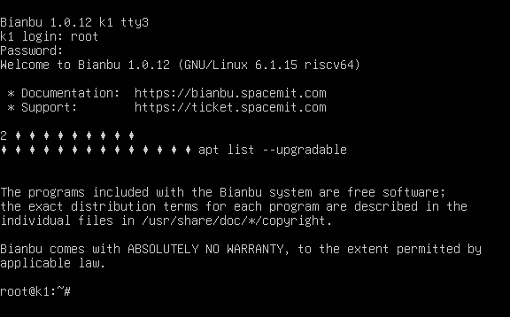
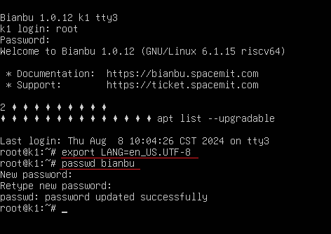

# FAQs

## Login

### What to do if a regular user forgets their password?

If a regular user forgets their password, it can be reset using the `root` account. Follow these steps:

1. Boot into the login screen, as shown below

   

2. Press **Ctrl + Alt + F3** (make sure to unlock the Fn key first) to switch to the `tty3` terminal, as shown below:

   

3. Log in with the username `root` and password. The default password is `bianbu`, as shown below:

   

4. Run `export LANG=en_US.UTF-8` to temporarily switch the terminal language to English and avoid character encoding issues:

5. Run the command `passwd username` to change the user's password, for example, to reset the password for user `bianbu`, as shown below

   

6. Press **Ctrl + Alt + F1** to return to the login screen. You can now log in with the new password..

## System Update

### Error when running `apt update` on Bianbu 1.0:

```text
invalid: EXPKEYSIG 0C1C275F85F3A22A Bianbu Repo Signing Key
```

**Cause:**
Bianbu V1.0 has reached **End of Life (EOL)**. Updates and maintenance have been discontinued.

**Recommendation:**
It is strongly recommended to upgrade to **Bianbu V2.0**.

**Upgrade Instructions:**
Please refer to the following resources:

* [Spacemit Forum Guide](https://forum.spacemit.com/t/topic/250)
* [System Upgrade Guide](./user_guide/GNOME/upgrade.md)

### Issues You May Encounter During Bianbu 2.0.x Upgrade

#### Prompt: `Please install all available updates for your release before upgrading`

**Cause:**
Some installed packages are not consistent with the versions in the current software repository.

**Solution:**

1. Run the command `sudo apt upgrade` to reinstall the versions from the source.

2. Re-run the upgrade command `do-release-upgrade -f DistUpgradeViewGtk3`.

If the prompt `Please install all available updates for your release before upgrading` still appears, run `apt list --upgradable` to check for available updates. The possible package list and handling methods are as follows:

| Package Name                 | Handling Method                                      |
| :--------------------------- | :--------------------------------------------------- |
| thunderbird-local-zh-cn      | Temporarily uninstall with `sudo apt remove thunderbird-local-zh-cn` |
| thunderbird-local-zh-cn-hans | Temporarily uninstall with `sudo apt remove thunderbird-local-zh-cn-hans` |

## Feedback

If your issue is not resolved, you can report it through the following channels:

1. [Submit issues on Gitee](https://gitee.com/bianbu/bianbu-docs/issues)
2. [Developer Forum](https://forum.spacemit.com/)
