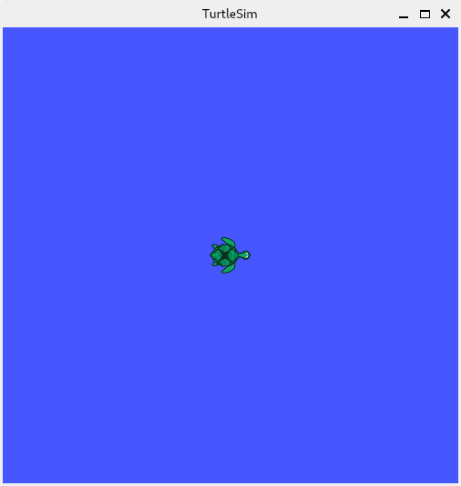

# ROS User Guide

## Introduction

Currently, SpacemiT only provide prebuilt packages for ROS Noetic.

## Using ROS Prebuilt Packages

SpacemiT's supported ROS Noetic is built on Bianbu 2.0. To avoid unnecessary environment issues, please use Bianbu 2.0 for development and usage. The prebuilt package includes all packages in `ros-noetic-desktop-full`.

### Environment Preparation

#### Setting Up the Locale

Ensure to have a locale that supports UTF-8.

```shell
locale  # check for UTF-8

sudo apt update && sudo apt install locales
sudo locale-gen en_US en_US.UTF-8
sudo update-locale LC_ALL=en_US.UTF-8 LANG=en_US.UTF-8
export LANG=en_US.UTF-8

locale  # verify settings
```

#### Installing Prerequisites

Install dependencies for ROS Noetic:

```shell
sudo apt-get install -y \
    python-is-python3 \
    cmake \
    python3-mock \
    python3-nose \
    google-mock \
    libgtest-dev \
    python3-catkin-pkg \
    python3-empy \
    libboost-dev \
    python3-pygraphviz \
    python3-pydot \
    qtbase5-dev \
    python3-rospkg \
    libconsole-bridge-dev \
    python3-defusedxml \
    libapr1-dev \
    libaprutil1-dev \
    libboost-regex-dev \
    liblog4cxx-dev \
    libboost-system-dev \
    libboost-thread-dev \
    libbz2-dev \
    libboost-filesystem-dev \
    libgpgme-dev \
    libssl-dev \
    libopencv-dev \
    libboost-all-dev \
    python3-opencv \
    uuid-dev \
    graphviz \
    libpyside2-dev \
    libshiboken2-dev \
    pyqt5-dev \
    python3-pyqt5 \
    python3-pyqt5.qtsvg \
    python3-pyside2.qtsvg \
    python3-sip-dev \
    shiboken2 \
    qt5-qmake \
    liburdfdom-headers-dev \
    liborocos-kdl-dev \
    libtinyxml-dev \
    libtinyxml2-dev \
    python3-coverage \
    libboost-program-options-dev \
    libboost-chrono-dev \
    libpoco-dev \
    libboost-date-time-dev \
    python3-gnupg \
    libeigen3-dev \
    liblz4-dev \
    liborocos-kdl1.5 \
    python3-matplotlib \
    python3-opengl \
    python3-pykdl \
    python3-pyqt5.qtopengl \
    liburdfdom-dev \
    libogre-1.9-dev \
    libassimp-dev \
    libyaml-cpp-dev \
    libgl1-mesa-dev \
    libglu1-mesa-dev \
    libqt5opengl5-dev \
    lm-sensors \
    libcurl4-openssl-dev \
    tango-icon-theme \
    libpcl-dev \
    libbullet-dev \
    libsdl1.2-dev \
    libsdl-image1.2-dev
```

Install dependencies for system Python:

```shell
sudo apt-get install -y \
    python3-argcomplete \
    python3-babeltrace \
    python3-catkin-pkg \
    python3-empy \
    python3-flake8 \
    python3-flake8-builtins \
    python3-flake8-comprehensions \
    python3-flake8-docstrings \
    python3-flake8-import-order \
    python3-flake8-quotes \
    python3-jsonschema \
    python3-lark \
    python3-matplotlib \
    python3-mypy \
    python3-psutil \
    python3-pycodestyle \
    python3-pydot \
    python3-pygraphviz \
    python3-pykdl \
    python3-pyqt5 \
    python3-pyqt5.qtsvg \
    python3-pyside2.qtsvg \
    python3-pytest \
    python3-pytest-cov \
    python3-pytest-mock \
    python3-pytest-timeout \
    python3-sip-dev
```

If planning to use rviz, set the environment variable:

```shell
export QT_QPA_PLATFORM=xcb
```

### Downloading the Prebuilt Package

- Go to the [release page](https://archive.spacemit.com/ros/prebuilt)

- Download the latest Bianbu OS ROS package. In this example, it is located at: `~/ros-noetic-desktop-full-linux-riscv64-20240930.tar.gz`

**Note:** As versions are iterated, there may be multiple prebuilt package download options, which may result in different filenames.

### Installing the Prebuilt Package

Extract the package

```shell
sudo mkdir -p /opt/ros/noetic
cd /opt/ros/noetic
sudo tar -xzvf ~/ros-noetic-desktop-full-linux-riscv64-20240930.tar.gz
```

This will install the prebuilt package files to `/opt/ros/noetic`. It is recommended to install it under `/opt/ros/noetic`, as using other paths may cause issues.

After extraction, the directory should look like this:

```shell
➜  ~ ls /opt/ros/noetic
bin  env.sh  etc  include  lib  local_setup.bash  local_setup.sh  local_setup.zsh  setup.bash  setup.sh  _setup_util.py  setup.zsh  share
```

## Trying Some Examples

Use `echo $0` to determine whether using `zsh` or `bash`. In this example, `zsh` is used.

If using bash, replace all occurrences of `zsh` in the following examples with `bash`, otherwise runtime errors might occur.

```shell
echo $0
-zsh # This is the output, do not execute
```

When opening a terminal in any location, use the `source /opt/ros/noetic/setup.zsh` command to update the ROS environment variables. Alternatively, append it to the end of the `~/.zshrc` file.

```shell
echo "source /opt/ros/noetic/setup.zsh" >> ~/.zshrc
```

The following examples assume this statement has been executed.

### TurtleSim

This example should be run in a terminal on the desktop. Terminals connected via SSH will not be able to launch the TurtleSim GUI.

To start TurtleSim, enter the following command in the terminal:

```shell
rosrun turtlesim turtlesim_node
```

User should see a simulator window pop up with a random turtle in the middle.



In the terminal, user will see messages from the node:

```shell
QSocketNotifier: Can only be used with threads started with QThread
[INFO] [1727264504.878540498]: Starting turtlesim with node name /turtlesim
[INFO] [1727264504.918640500]: Spawning turtle [turtle1] at x=[5.544445], y=[5.544445], theta=[0.000000]
```

In another terminal, run a new node to control the turtle in the first node:

```shell
rosrun turtlesim turtle_teleop_key
```

Use the arrow keys on your keyboard to control the turtle. It will move on the screen and draw its path with the attached "pen".

### Building user's package - Basic topic communication

#### 1. Creating & initializing user's workspace

```shell
mkdir -p ~/catkin_ws/src
cd ~/catkin_ws/src
catkin_init_workspace
```

User should see output similar to the following:

```shell
Creating symlink "/home/zq-pi2/catkin_ws/src/CMakeLists.txt" pointing to "/opt/ros/noetic/share/catkin/cmake/toplevel.cmake"
```

Run `catkin_make` once to verify:

```shell
cd ~/catkin_ws
catkin_make
```

After completion, the contents of the `~/catkin_ws` directory should be:

```shell
➜  catkin_ws ls
build  devel  src
```

#### 2. Creating a sample package

```shell
cd ~/catkin_ws/src
catkin_create_pkg beginner_tutorials std_msgs rospy roscpp
```

`std_msgs`, `rospy`, and `roscpp` are the dependencies of `beginner_tutorials`.

This will create a standard ROS package named `beginner_tutorials` under `src`, with the initial contents:

```shell
➜  beginner_tutorials ls
CMakeLists.txt  include  package.xml  src
```

For more information about packages, refer to [Creating a ROS Package](https://wiki.ros.org/ROS/Tutorials/CreatingPackage).

#### 3. Building the Package

First, make sure that the environment variables are set:

```shell
source /opt/ros/noetic/setup.zsh
```

Build the package using `catkin_make`:

```shell
cd ~/catkin_ws
catkin_make
```

User should see a lot of output from `cmake` and `make`:

```shell
➜  catkin_ws catkin_make
Base path: /home/zq-pi2/catkin_ws
Source space: /home/zq-pi2/catkin_ws/src
Build space: /home/zq-pi2/catkin_ws/build
Devel space: /home/zq-pi2/catkin_ws/devel
Install space: /home/zq-pi2/catkin_ws/install
####
#### Running command: "cmake /home/zq-pi2/catkin_ws/src -DCATKIN_DEVEL_PREFIX=/home/zq-pi2/catkin_ws/devel -DCMAKE_INSTALL_PREFIX=/home/zq-pi2/catkin_ws/install -G Unix Makefiles" in "/home/zq-pi2/catkin_ws/build"
####
CMake Deprecation Warning at CMakeLists.txt:4 (cmake_minimum_required):
  Compatibility with CMake < 3.5 will be removed from a future version of
  CMake.

  Update the VERSION argument <min> value or use a ...<max> suffix to tell
  CMake that the project does not need compatibility with older versions.


-- Using CATKIN_DEVEL_PREFIX: /home/zq-pi2/catkin_ws/devel
-- Using CMAKE_PREFIX_PATH: /opt/ros/noetic
-- This workspace overlays: /opt/ros/noetic
CMake Warning (dev) at /opt/ros/noetic/share/catkin/cmake/python.cmake:4 (find_package):
  Policy CMP0148 is not set: The FindPythonInterp and FindPythonLibs modules
  are removed.  Run "cmake --help-policy CMP0148" for policy details.  Use
  the cmake_policy command to set the policy and suppress this warning.

Call Stack (most recent call first):
  /opt/ros/noetic/share/catkin/cmake/all.cmake:164 (include)
  /opt/ros/noetic/share/catkin/cmake/catkinConfig.cmake:20 (include)
  CMakeLists.txt:58 (find_package)
This warning is for project developers.  Use -Wno-dev to suppress it.

-- Using PYTHON_EXECUTABLE: /usr/bin/python3
-- Using Debian Python package layout
-- Using empy: /usr/bin/empy
-- Using CATKIN_ENABLE_TESTING: ON
-- Call enable_testing()
-- Using CATKIN_TEST_RESULTS_DIR: /home/zq-pi2/catkin_ws/build/test_results
-- gtest not found, C++ tests can not be built. Please install the gtest headers globally in your system or checkout gtest (by running 'git clone  https://github.com/google/googletest.git -b release-1.8.0' in the source space '/home/zq-pi2/catkin_ws/src' of your workspace) to enable gtests
-- Using Python nosetests: /usr/bin/nosetests3
-- catkin 0.8.10
-- BUILD_SHARED_LIBS is on
-- BUILD_SHARED_LIBS is on
-- ~~~~~~~~~~~~~~~~~~~~~~~~~~~~~~~~~~~~~~~~~~~~~~~~~
-- ~~  traversing 1 packages in topological order:
-- ~~  - beginner_tutorials
-- ~~~~~~~~~~~~~~~~~~~~~~~~~~~~~~~~~~~~~~~~~~~~~~~~~
-- +++ processing catkin package: 'beginner_tutorials'
-- ==> add_subdirectory(beginner_tutorials)
CMake Deprecation Warning at beginner_tutorials/CMakeLists.txt:1 (cmake_minimum_required):
  Compatibility with CMake < 3.5 will be removed from a future version of
  CMake.

  Update the VERSION argument <min> value or use a ...<max> suffix to tell
  CMake that the project does not need compatibility with older versions.


-- Configuring done (10.0s)
-- Generating done (0.1s)
-- Build files have been written to: /home/zq-pi2/catkin_ws/build
####
#### Running command: "make -j8 -l8" in "/home/zq-pi2/catkin_ws/build"
####
```

To learn more about package building, please refer to [ROS Package Building](https://wiki.ros.org/ROS/Tutorials/BuildingPackages).

#### 4. Writing a Python Publisher

```shell
cd ~/catkin_ws/src/beginner_tutorials
mkdir scripts
cd scripts
```

```shell
vim talker.py
```

Paste the following content:

```python
#!/usr/bin/env python3

import rospy  # Import the ROS Python client library
from std_msgs.msg import String  # Import the String message type from the standard message library

def talker():  # Define the talker function
    pub = rospy.Publisher('chatter', String, queue_size=10)  # Create a publisher that publishes to the 'chatter' topic with a message type of String and a queue size of 10
    rospy.init_node('talker', anonymous=True)  # Initialize the ROS node with the name 'talker'. anonymous=True allows ROS to automatically append a unique suffix to the node name.
    rate = rospy.Rate(10) # 10hz  # Set the publishing frequency to 10 Hz, i.e., 10 times per second
    while not rospy.is_shutdown():  # Continue executing while the ROS node is not shut down
        hello_str = f"Publishing hello world ! {rospy.get_time()}"  # Create a string containing the current time
        rospy.loginfo(hello_str)  # Print the log information to the console with the content of hello_str
        pub.publish(hello_str)  # Publish the hello_str message to the 'chatter' topic
        rate.sleep()  # Pause according to the set frequency to ensure a publishing rate of 10 Hz

if __name__ == '__main__':
    try:
        talker()  # Call the talker function
    except rospy.ROSInterruptException:  # Catch the ROS interrupt exception
        pass  # If an interrupt exception occurs, simply ignore it and exit
```

For nodes written in Python, make sure to grant executable permissions; otherwise issues might occur where `rosrun` cannot find the executable.

```shell
chmod +x talker.py
```

#### 5. Writing a Python Subscriber

```shell
cd ~/catkin_ws/src/beginner_tutorials
mkdir scripts
cd scripts
```

```shell
vim listener.py
```

Paste the following content:

```python
#!/usr/bin/env python3
import rospy  # Import the ROS Python client library
from std_msgs.msg import String  # Import the String message type from the std_msgs message library

def callback(data):  # Define a callback function to process received messages
    rospy.loginfo(f"{rospy.get_caller_id()} I heard {data.data}")  # Use f-string to print log information, including the node ID and the content of the received message

def listener():  # Define the listener function to set up the node and subscribe to the topic

    # In ROS, nodes must have unique names. If two nodes with the same name are started, the first one will be kicked offline.
    # anonymous=True allows rospy to choose a unique name for this node, enabling multiple listener nodes to run simultaneously.
    rospy.init_node('listener', anonymous=True)  # Initialize a node named 'listener' with anonymous=True to ensure its name is unique

    rospy.Subscriber("chatter", String, callback)  # Subscribe to the 'chatter' topic with a message type of String and call the callback function to process messages

    # The spin() function keeps the Python program from exiting until the node is shut down.
    rospy.spin()  # Enter a loop and wait until the node is closed

if __name__ == '__main__':
    listener()  # Call the listener function to start the listener
```

```shell
chmod +x listener.py
```

#### 6. Building the Nodes

```shell
cd ~/catkin_ws
catkin_make
```

#### 7. Demonstrating the Publisher & Subscriber

First, ensure that `roscore` is running. The following examples assume that `source /opt/ros/noetic/setup.zsh` has been executed to load the ROS environment.

Open a terminal and run:

```shell
source ~/catkin_ws/devel/setup.zsh
rosrun beginner_tutorials talker.py
```

Open another terminal and run:

```shell
source ~/catkin_ws/devel/setup.zsh
rosrun beginner_tutorials listener.py
```

User should see the `talker` node publishing messages and the `listener` node receiving and logging these messages "I heard ...". This confirms that the Python API is working correctly.

For writing simple C++ publishers and subscribers, refer to [Creating a Simple Publisher and Subscriber in C++](https://wiki.ros.org/ROS/Tutorials/WritingPublisherSubscriber%28c%2B%2B%29).

### Summary

For more examples and tutorials on ROS Noetic, refer to the [official tutorials](https://wiki.ros.org/ROS/Tutorials).

Since user is using precompiled ROS, when encountering the steps to install ROS packages in the official tutorials, please skip them first.

If user encounter missing packages, please consider building from source or contacting SpacemiT.