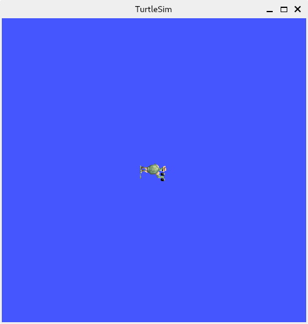

# ROS2 User Guide

Bianbu OS supports ROS2 **Humble** and **Jazzy** via `.deb` packages. Currently, **ROS2 Humble** is better supported and actively maintained. We recommend using **Humble** as your primary version.

> **Note:** Please avoid installing both **Humble** and **Jazzy** on the same system to prevent potential conflicts.

## Install Humble deb package

### Supported Firmware Versions

- Firmware list: [Bianbu Firmware](https://archive.spacemit.com/image/k1/version/bianbu/)
- Both **Desktop** and **Minimal** images **version 2.0.4 and above** are supported.
- It is recommended to use **Desktop v2.1+**.

### Environment preparation

#### Set locale

Make sure you have a locale that supports UTF-8

```shell
locale  # check for UTF-8

sudo apt update && sudo apt install locales
sudo locale-gen en_US en_US.UTF-8
sudo update-locale LC_ALL=en_US.UTF-8 LANG=en_US.UTF-8
export LANG=en_US.UTF-8

locale  # verify settings
```

#### Enable Required Repositories

Add the ROS2 `apt` repository to your system:

```shell
sudo sed -i '/^Suites:/s/$/ noble-ros/' /etc/apt/sources.list.d/bianbu.sources
```

#### Install Development Tools (Recommended)

If you plan to build ROS packages or do further development, install the dev tools:

```shell
sudo apt update && sudo apt install ros-dev-tools
```

### Install ROS2

1. Update the `apt` cache after setting up the repository:

    ```shell
    sudo apt update
    ```

   It is recommended keeping your system is up-to-date before installing new packages:

    ```shell
    sudo apt upgrade
    ```

2. Install (the recommended) desktop version (includes ROS, RViz, demos, and tutorials):

    ```shell
    sudo apt install ros-humble-desktop
    ```

   Or install the minimal ROS base (CLI tools, libraries, and messages — no GUI tools):

   ```shell
   sudo apt install ros-humble-ros-base
   ```

3. （Optional）Install additional RMW implementations
   ROS2 uses **Fast DDS** by default. You can switch to other RMW implementations at runtime. See the [multi-RMW guide](https://docs.ros.org/en/humble/How-To-Guides/Working-with-multiple-RMW-implementations.html) for more details.

### Setup the ROS2 Environment

Set up ROS2 environment by sourcing the following file:

```shell
source /opt/ros/humble/setup.zsh
```

> If you use **bash**, replace `setup.zsh` with `setup.bash`.

### Try out some examples

#### Identify Your Shell

Use `echo $0` to check whether your shell is `zsh` or `bash`. 
`zsh` is used for all the examples here.

```shell
echo $0
-zsh # This line is output, please do not execute it
```

If you're using `bash`, replace `zsh` with `bash` in all source commands, or some runtime errors might occur.

#### Example 1: Basic topic communication

Open **Terminal 1**， update ROS2's environment variables using the source command, and run the C++ talker:

```shell
source /opt/ros2/jazzy_prebuild/setup.zsh
ros2 run demo_nodes_cpp talker
```

Open **Terminal 2**， update ROS2's environment variables using the source command, and then run Python listener:

```shell
source /opt/ros2/jazzy_prebuild/setup.zsh
ros2 run demo_nodes_py listener
```

You should see messages indicating that

- the talker is *publishing*
- and, the listener is saying *I heard*.

This confirms that both the C++ and Python APIs are working.

> **Tip**: If you've already sourced the environment in a terminal with `source /opt/ros2/jazzy_prebuild/setup.zsh`, no need to re-source unless openning a new one.

#### Example 2: Turtlesim

If you're using a new terminal, don't forget to:

```shell
source /opt/ros/humble/setup.zsh
```

This example needs to run in a graphical desktop terminal. It will not work via SSH.

To launch turtlesim, enter the following command into the terminal:

```shell
ros2 run turtlesim turtlesim_node
```

You should see a simulator window with a turtle in the center.



You’ll also see log messages (under the command) in the terminal:

```shell
[INFO] [1726820259.299762059] [turtlesim]: Starting turtlesim with node name /turtlesim
[INFO] [1726820259.366410375] [turtlesim]: Spawning turtle [turtle1] at x=[5.544445], y=[5.544445], theta=[0.000000]
```

Open another terminal, and source ROS2 environment again.

Now, you will run a new node to control the turtle in the first node:

```shell
ros2 run turtlesim turtle_teleop_key
```

Use the arrow keys on your keyboard to move the turtle. As it moves, it draws a trail with its virtual "pen".

### Summary (For Humble)

You're now ready to explore more [official tutorials and demos](https://docs.ros.org/en/humble/Tutorials.html), set up your own workspace, create packages, and understand core ROS2 concepts.

To install additional packages when needed:

```shell
sudo apt install ros-humble-package_name
```

This ensures your system stays lean without installing unnecessary tools.

## Installing Jazzy deb Package

### Supported Firmware Versions

- Firmware list: [Bianbu Firmware](https://archive.spacemit.com/image/k1/version/bianbu/)
- Both **Desktop** and **Minimal** images **version 2.0.4 and above** are supported.
- It is recommended to use **Desktop V2.1+**.

### Environment Setup

#### Set Locale

Make sure your system supports UTF-8 locale:

```shell
locale  # check for UTF-8

sudo apt update && sudo apt install locales
sudo locale-gen en_US en_US.UTF-8
sudo update-locale LC_ALL=en_US.UTF-8 LANG=en_US.UTF-8
export LANG=en_US.UTF-8

locale  # verify settings
```

#### Enable Required Repositories

Add the ROS2 `apt` repository to your system:

```shell
sudo sed -i '/^Suites:/s/$/ noble-ros/' /etc/apt/sources.list.d/bianbu.sources
```

#### Install Development Tools (Optional)

If you plan to build ROS packages or do further development, install the dev tools:

```shell
sudo apt update && sudo apt install ros-dev-tools
```

### Install ROS2

1. Update the `apt` cache after setting up the repository:

   ```shell
   sudo apt update
   ```

   It is recommended keeping your system is up-to-date before installing new packages:

   ```shell
   sudo apt upgrade
   ```

2. Install (the recommended) desktop version (includes ROS, RViz, demos, and tutorials):

   ```shell
   sudo apt install ros-jazzy-desktop
   ```

   Or install the minimal ROS base (CLI tools, libraries, and messages — no GUI tools):

   ```shell
   sudo apt install ros-jazzy-ros-base
   ```

3. (Optional) Install additional RMW implementations
ROS2 uses **Fast DDS** by default. You can switch to other RMW implementations at runtime. See the [multi-RMW guide](https://docs.ros.org/en/humble/How-To-Guides/Working-with-multiple-RMW-implementations.html) for more details.

### Set the ROS2 Environment

Set up your ROS2 environment by sourcing the following file:

```shell
source /opt/ros/jazzy/setup.zsh
```

> If you use **bash**, replace `setup.zsh` with `setup.bash`.

### Try out some examples

If you've installed `ros-jazzy-desktop`, you can try out the example below.

**Terminal 1** (C++ talker):

```shell
source /opt/ros/jazzy/setup.zsh
ros2 run demo_nodes_cpp talker
```

**Terminal 2** (Python listener):

```shell
source /opt/ros/jazzy/setup.zsh
ros2 run demo_nodes_py listener
```

You should see messages indicating that

- the talker is *publishing*
- and, the listener is saying *I heard*.

This confirms that both the C++ and Python APIs are working. Hooray!

### What’s Next?

Continue learning with the [official tutorials and demos](https://docs.ros.org/en/jazzy/Tutorials.html) to set up your environment, create workspaces and packages, and explore ROS2 fundamentals.
