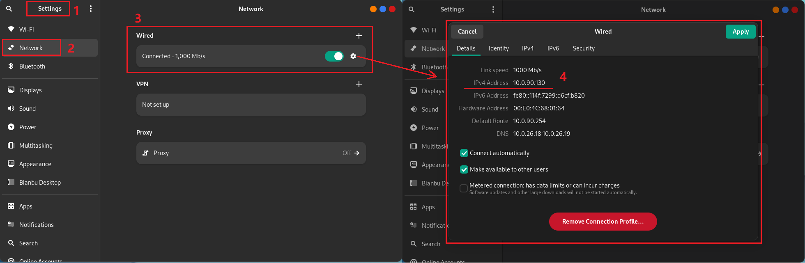
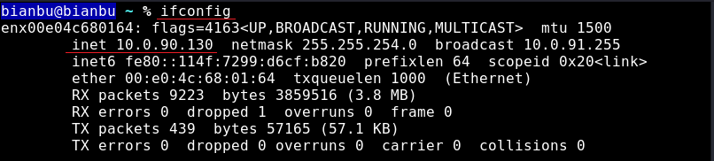
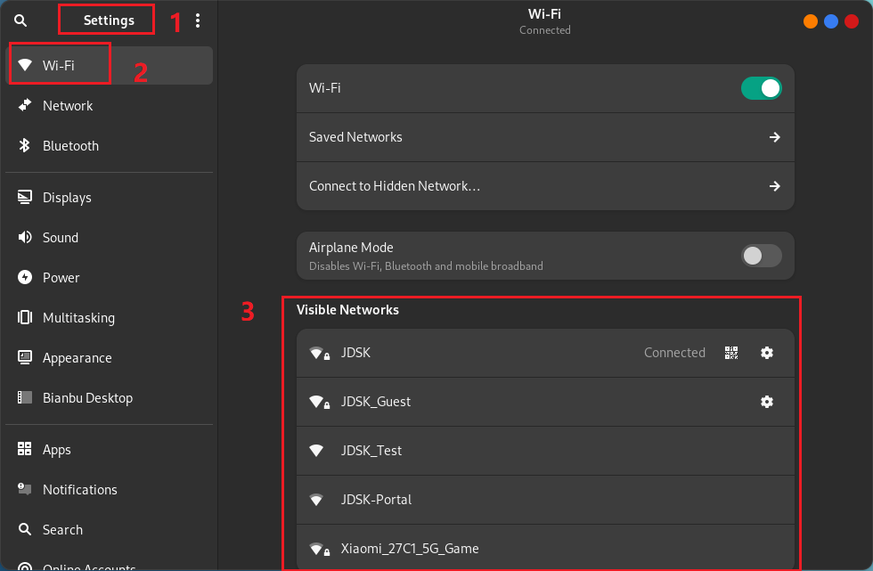

# Network Connection

This section provides instructions on how to connect to both wired and wireless networks using the Bianbu GNOME system as example.

## Connecting to a Wired Network

After plugging in the Ethernet cable, the system will attempt to obtain an IP address automatically via DHCP. If both the network and the device are properly configured, a LAN connection should be established successfully.

### Method 1: Check via Graphical Interface

1. Open **Settings**.
2. Navigate to the **Network** menu.
3. Locate the connected wired interface and click the **Settings** button.
4. A dialog will appear showing the IP address.


### Method 2: Use Terminal Command

1. Open the terminal.

2. Run the following command:

   ```bash
   ifconfig
   ```

3. Look for the `inet` field in the output; the corresponding value is the IPv4 address.
   

## Connecting to a Wireless Network

1. Open **Settings**.
2. Go to the **Wi-Fi** menu.
3. Select the network you wish to connect to.

4. If the network is password-protected, enter the password when prompted and click **Connect**.
5. The network icon will change as the computer connects to the network.
6. If the connection is successful, the icon will show a dot with arc-like lines. More lines indicate a stronger connection, while fewer suggest weaker and potentially unstable connectivity.
