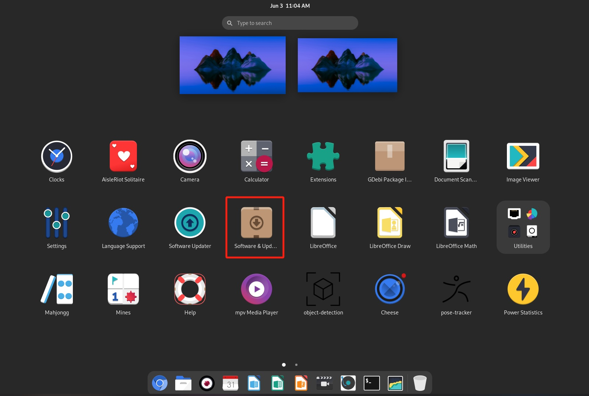
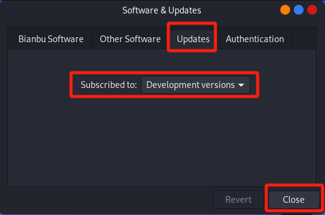
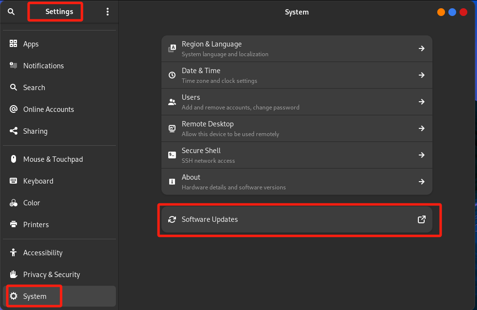
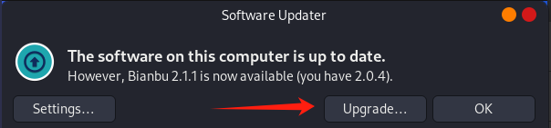

# System Upgrade

Both **Bianbu GNOME Desktop Version** and **Bianbu NAS** support online upgrades.

## Select the Subscription Version

**Note:** To upgrade from **Bianbu 1.0.x** to **Bianbu 2.0**, you must first upgrade to **version 1.0.15 or later**, then subscribe to the Bianbu 2.0 release and proceed with the upgrade.

1. Open the **Software & Updates** application

    - If the application cannot be launched, ensure the system is running **version 1.0.15 or above**.
   

2. **Configure the subscription version:**

   - Switch to the **Updates** tab.
   - In the **Subscribed to** drop-down menu, select the target version (e.g., Development versions).
   - Click **Close** to save the changes and exit.
  

## Upgrade Process

> **Mind below before upgrading**
>
> Upgrading across major versions (e.g., 1.0.15 → 2.0.x) may take up to **2 hours** to complete.
>
> - The final configuration stage (approximately 30 minutes) requires multiple user confirmations.
> - Recommended actions:
>   - Select **Next** or keep default values when prompted for unknown options
>   - Choose **Remove** when prompted to delete obsolete packages
>
> **Note:**
> - **Do not interrupt or force-close** the update process, as this may lead to system inconsistencies or corrupted packages.
> - If you encounter any issues during the upgrade, please refer to the [FAQs](../../faqs.md#update).

### Method 1: Launch GUI Upgrade via Terminal (Recommended)

**Available for Bianbu GNOME only**

To perform the upgrade with a graphical interface, run:

```bash
do-release-upgrade -f DistUpgradeViewGtk3
```

Follow the on-screen instructions. Once complete, reboot the system.

### Method 2: Full Command-Line Upgrade

**Available for all Bianbu systems**

If you prefer using the command line, execute:

```bash
do-release-upgrade
```

Follow the terminal prompts to complete the upgrade. Reboot after the process finishes.

### Method 3: Upgrade via Software Updater

**Available for Bianbu GNOME only**

1. Ensure the device is connected to the internet.

2. Launch the **Software Updater** application.

   
  Alternatively, you can launch Software Updater via **Settings** → **System** → **Software Updates**.
  
1. Wait for update checking to complete.

2. If a new version is detected, click **Upgrade...** to begin.

   

   > To cancel the upgrade, click **OK**.

3. Follow the upgrade wizard step by step.

4. Reboot the system to apply changes.
