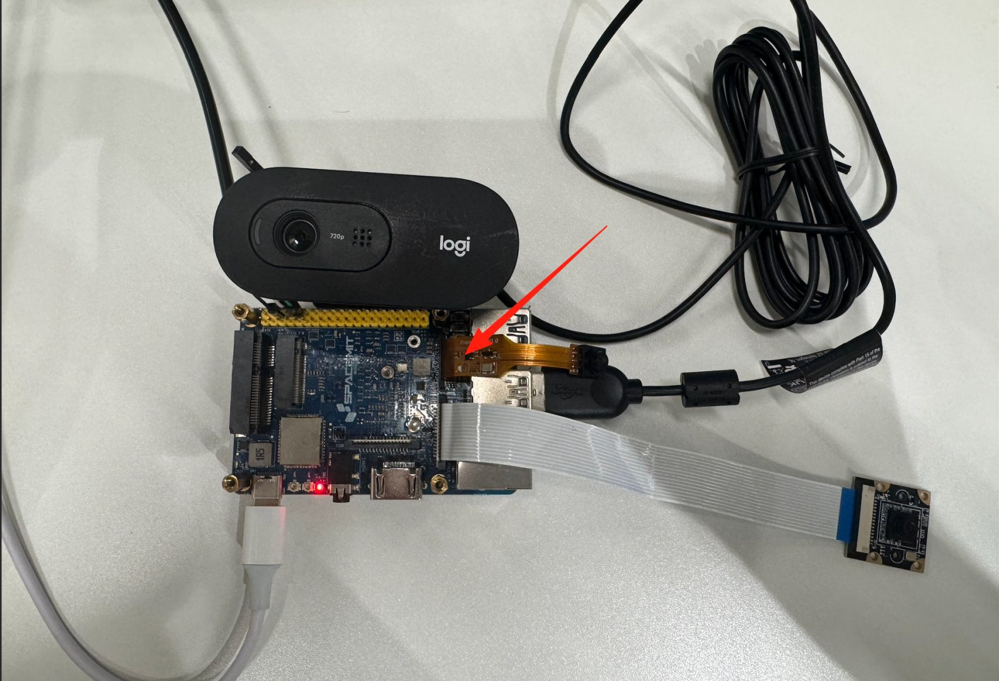
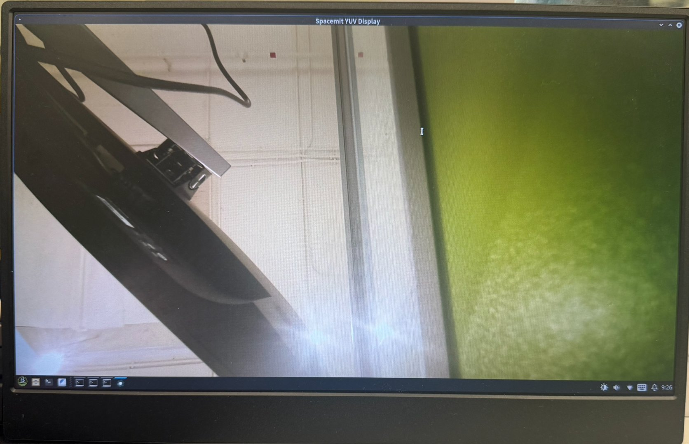
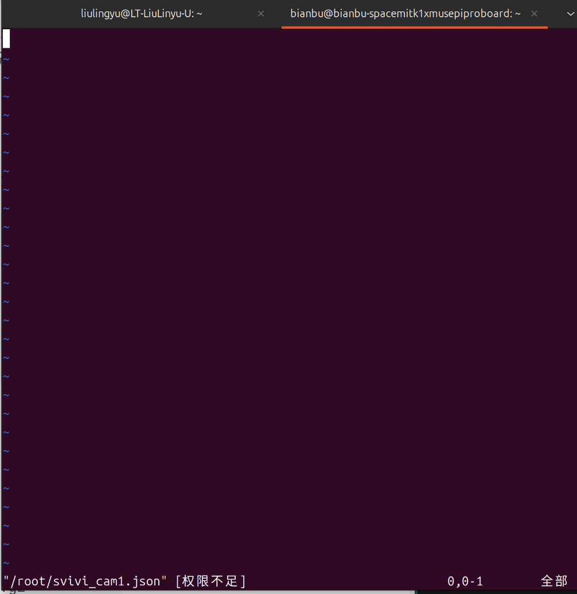
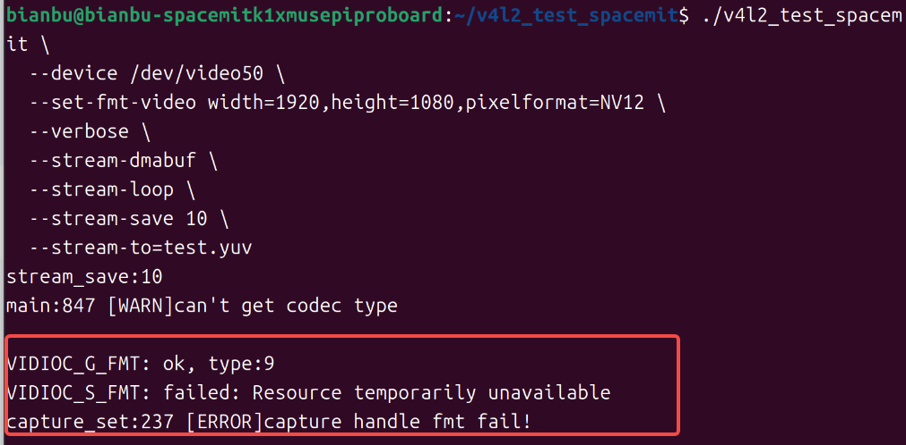
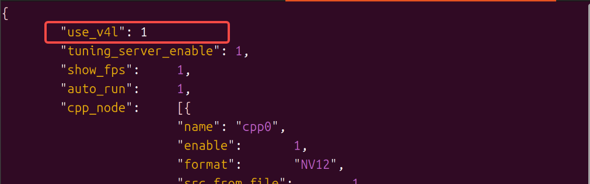

# MIPI Camera Usage and FAQ

This document describes the complete workflow for connecting a MIPI camera, such as IMX219 or OV5647, to the MUSE Pi Pro development board. It also summarizes common issues encountered during setup and their solutions, including hardware connection, automatic camera detection, Virtual Camera configuration, V4L2 image-capture testing, and JDK Camera SDK integration.

---

## Usage Guide

### Hardware Connection

Connect the MIPI camera module to the corresponding MIPI CSI interface on the development board. The board generally provides multiple CSI slots; confirm the exact location and cable orientation using the board silkscreen and user manual. Connect the board to a display with an HDMI cable to view the captured image. IMX219 uses the white ribbon cable connection shown in the image, whereas OV5647 uses the copper-colored ribbon cable connection indicated by the red arrow.



> For notes on cable insertion and orientation, see the "reversed cable" and "folded cable" items in the FAQ section below.

### Identifying the CSI Channel and Auto-Detecting the Camera

The board provides the `cam-test` tool, which can automatically probe a specified CSI channel. Confirm the CSI interface to which the camera is connected, then run the detection script with the corresponding number. For example, if the camera is connected to CSI3, run the following command in a terminal:

```bash
cam-test /usr/share/camera_json/csi3_camera_detect.json
```

If this camera model has already been supported by the driver, detection will succeed and the terminal will print output similar to the following (this example shows CSI3 detecting an `imx219_spm` sensor):

```bash
I: ./sensors/cam_sensors_module.c(239): "detect imx219_spm sensors in csi3: success, set 1920x1080 to 1920x1080"
I: auto_detect_camera(1430): "auto detect sensor ===================== finish "
I: update_json_file(723): "save json to /tmp/csi3_camera_auto.json success"
```

After successful detection, the tool automatically generates a usable configuration file for the camera under `/tmp/`, with a filename such as `csiN_camera_auto.json`. This file is used in the next step.

> The correspondence between the number N in `csiN_camera_detect.json` and the physical CSI interface number may vary between board and driver batches. If the correspondence is uncertain, run the detection scripts for CSI1 through CSI3 one at a time to identify the correct interface. If the camera is not detected by any of them, the cable may be loose or making poor contact, or the camera model may not yet be supported by the driver. For unsupported models, refer to the official camera driver adaptation documentation.

### Configuring Virtual Camera Mode

Copy the configuration file generated in the previous step to the fixed path used by the system for the Virtual Camera configuration, and rename it `svivi_cam1.json`:

```bash
sudo cp /tmp/csi3_camera_auto.json /root/svivi_cam1.json
```

> In `csi3_camera_auto.json`, replace `csi3` with the actual valid channel number used in the previous step.

Then run the following command:

```bash
sudo grep -q '"use_v4l"' /root/svivi_cam1.json || sudo sed -i '1a\    "use_v4l": 1,' /root/svivi_cam1.json
```

### Verifying Image Capture with the V4L2 Tool

`v4l2_test_spacemit` is an image-capture test tool based on the standard V4L2 interface. It verifies whether the camera pipeline can produce images correctly.

First download the source and compile it (**Note**: be sure to `cd` into the newly created directory before downloading and compiling, otherwise the build will fail due to a name collision between the directory and the compiled executable — see the corresponding FAQ item below for details):

```bash
mkdir v4l2_test_spacemit
cd v4l2_test_spacemit
wget https://archive.spacemit.com/ros2/code/v4l2_test_spacemit.tar.gz
tar xvzf v4l2_test_spacemit.tar.gz
gcc v4l2_capture.c v4l2_main.c v4l2_output.c v4l2_stream.c v4l2_common.c -o v4l2_test_spacemit --static
```

Once compiled, run the capture test:

```bash
./v4l2_test_spacemit \
  --device /dev/video50 \
  --set-fmt-video width=1920,height=1080,pixelformat=NV12 \
  --verbose \
  --stream-dmabuf \
  --stream-loop \
  --stream-save 10 \
  --stream-to=test.yuv
```

If the pipeline is operating correctly, the terminal continuously displays capture logs similar to the following:

```bash
VIDIOC_DQBUF: ok, type:9
VIDIOC_QBUF: ok, type:9
do_handle_cap:723 [INFO]m2m capture dequeue----------------: 15
```

Capture can be interrupted at any time with `Ctrl+C`.

> **Limitations**
>
> - The maximum supported resolution is currently 1920×1080.
> - Only the NV12 image format is supported.
> - The buffer memory type must be dmabuf.

Continuous output of this type indicates that the complete pipeline, from the hardware through V4L2, is operating correctly and that advanced development can proceed.

### Advanced Development: C++ SDK Usage Example

For higher-level control and image-processing capabilities, use the SDK provided by JDK:

##### C++ Sample Code

```cpp
auto camera = JdkCamera::create("/dev/video50", 1920, 1080, V4L2_PIX_FMT_NV12);
auto jdkvo = std::make_shared<JdkVo>(1920, 1080, PIXEL_FORMAT_NV12);
auto frame = camera->getFrame();
auto ret = jdkvo->sendFrame(frame);
```

### Quick Integration: JDK Camera Capture SDK

#### Downloading and Installing the JDK SDK

```bash
wget https://archive.spacemit.com/ros2/code/jdk_sdk.tar.gz
sudo tar xvf jdk_sdk.tar.gz -C /opt/
sudo mv /opt/jdk_sdk /opt/jdk
```

The directory structure after installation is as follows:

#### Downloading and Extracting jdk_cam

```bash
wget https://archive.spacemit.com/ros2/code/jdk_cam.tar
tar xvf jdk_cam.tar
```

#### Building and Running

```bash
cd jdk_cam
make all
sudo insmod /opt/jdk/ko/jdk_dma.ko
./workspace/jdk_cam /dev/video50
```

If initialization is successful, startup produces logs similar to the following, indicating that both the capture pipeline and the VO (video output) module initialized successfully:

```text
start buffer preprocessing
start buffer queue
VIDIOC_STREAMON succeeded
[MPP-DEBUG] 10419:VO_CreateChannel:43 create VO Channel success!
[MPP-DEBUG] 10419:module_init:159 +++++++++++++++ module init, module type = 101
[MPP-DEBUG] 10419:check_vo_sdl2:121 yeah! have vo_sdl2---------------
[MPP-DEBUG] 10419:find_vo_sdl2_plugin:86 yeah! we have vo_sdl2_plugin plugin---------------
[MPP-DEBUG] 10419:module_init:207 ++++++++++ VO_SDL2 (/usr/lib/libvo_sdl2_plugin.so)
[MPP-DEBUG] 10419:module_init:207 ++++++++++ open (/usr/lib/libvo_sdl2_plugin.so) success !
[MPP-ERROR] 10419:al_vo_init:93 SDL could not initialize! SDL_Error: wayland not available
[MPP-ERROR] 10419:al_vo_init:128 k1 vo_sdl2 init fail
[MPP-DEBUG] 10419:VO_Init:66 init VO Channel, ret = -400
[MPP-ERROR] 10419:JdkVo:32 VO_init failed, please check!
[MPP-DEBUG] 10419:VO_Process:82 vo one packet, ret = 0
index:0,dma_fd:12 width:1920,height:1080,size:3110400
```

After startup, the captured camera image is displayed in real time on the connected monitor.



> Errors such as `SDL_Error: wayland not available` or `VO_Init ... ret = -400` indicate that the image was not displayed correctly. This is usually related to the execution environment, such as running from an SSH remote terminal instead of the local desktop terminal. See the FAQ section below for the specific cause and solution.

---

## FAQ

### Q: When configuring the Virtual Camera model, why does the generated JSON file appear empty when opened?

As shown below, the file appears empty when opened directly:



**Cause**

This file is located under the root user's directory (`/root/svivi_cam1.json`). Opening it without sudo privileges means you don't have read permission, so the actual content is not visible.

**Solution**

Open the file with sudo privileges:

```bash
sudo vim /root/svivi_cam1.json
```

---

### Q: Why does compiling v4l2_test_spacemit according to the documentation result in an error?

As shown below, copying and running the documented commands in order results in a compilation failure:


**Cause**

After running `mkdir v4l2_test_spacemit` to create the directory, the download, extraction, and compilation commands were run directly without first changing into that directory. This causes the compiler's output executable name `v4l2_test_spacemit` to collide with the empty directory just created, resulting in an error.

**Solution**

After creating the directory, change into it before running the subsequent download, extraction, and compilation commands:

```bash
mkdir v4l2_test_spacemit
cd v4l2_test_spacemit
```

---

### Q: Why is there no normal image output after the capture command is run, and why is an error displayed instead?

As shown below:



**Cause**

In the generated json configuration file, a field is missing a trailing comma `,`, for example:



The correct format should be:


```json
"use_v4l": 1,
```

**Solution**

Check whether every field in the JSON file, except the last one, ends with a comma `,`; correct the format and try again. JSON syntax can also be validated with the following command:

```bash
sudo python3 -m json.tool /root/svivi_cam1.json
```

If the full json content is printed out normally, the format has been fixed correctly.

---

### Q: Why do operations on files under /opt, as described in the documentation, report insufficient permissions?

The following commands report an error:

```bash
mv /opt/jdk_sdk /opt/jdk
insmod /opt/jdk/ko/jdk_dma.ko
```

**Cause**

`/opt` is a system-level directory, and loading a kernel module with `insmod` also requires administrator privileges. These operations cannot be performed with regular user privileges.

**Solution**

Prefix the commands with `sudo`:

```bash
sudo mv /opt/jdk_sdk /opt/jdk
sudo insmod /opt/jdk/ko/jdk_dma.ko
```

---

### Q: Why does nothing appear on the screen after the final startup command is run even though the logs appear normal?

After running the following command, the terminal logs show no errors, but no camera image appears on the HDMI display/screen:

```bash
./workspace/jdk_cam /dev/video50
```

**Cause**

This command relies on the desktop environment's Wayland display service to open the preview window. If this command is run over a remote terminal connection such as SSH, the remote terminal does not carry the desktop session's display environment variables (such as `WAYLAND_DISPLAY`), so no image can be output to the screen — although the capture and logging pipeline itself is unaffected.

**Solution**

Run this command directly from a terminal on the desktop, using the display and keyboard/mouse connected locally to the board, rather than through a remote SSH terminal.

---

### Q: What happens if the camera ribbon cable is connected backwards? Can it damage the hardware?

**Possible consequences**

A MIPI camera ribbon cable carries power, ground, I2C control lines (SCL/SDA), and MIPI differential signal lines (clock pair/data pair) together. If the cable is connected backwards, the actual wiring of each pin becomes misaligned as a whole, which may result in:

- The camera not being recognized by the system at all (I2C communication failure).
- A scrambled or noisy image, with no normal image output.
- Noticeable color shifts in the image (e.g., a purple or green tint).
- **In more serious cases, permanent damage to the camera module or the board's receiving circuitry**: if a power pin is misconnected to a signal pin that should not carry power (such as an I2C control line or a MIPI data line), the voltage may exceed the normal operating range of that pin and burn out the corresponding circuit.

> **Note**
>
> Hardware damage caused by a reversed ribbon cable is usually irreversible. Always confirm the cable orientation before powering on the board.

**Solution**

- Before connecting, carefully check the cable's insertion direction against the gold-finger side, the keying notch, and the connector's silkscreen markings.
- Double-check that both ends of the cable are fully and correctly inserted before powering on for the first time.
- If you suspect the cable was previously connected backwards and powered on, first power off the board and check the camera module and the board's connector for any obvious heat damage or scorch marks. After reconnecting the cable correctly and testing again, if you observe new abnormalities in functions that previously worked normally, contact customer support to confirm whether the hardware has been damaged.

---

### Q: What causes recognition errors or intermittent failures after the camera ribbon cable is bent or folded?

**Cause**

The differential signal lines (clock pair and data pair) inside a MIPI CSI ribbon cable are sensitive to physical deformation. Excessive bending, folding in half, or leaving the cable creased for a long time may cause:

- Broken or loosely connected internal wires, resulting in intermittent signal loss and sporadic recognition failures.
- Disruption of the differential pair's impedance matching, increasing high-speed signal attenuation or interference, which shows up as a scrambled image, dropped frames, or unstable recognition.
- Repeated bending at the same spot over time accelerates wire fatigue and breakage, so the problem tends to progress from "occasional glitches" to "complete failure to recognize."

**Solution**

- Route the cable so it lies naturally with a gentle bend radius, avoiding sharp creases or folding it in half.
- Avoid repeatedly bending the cable at the same spot.
- If you suspect the cable has been damaged by bending, try testing with a replacement cable to rule out a cable fault before continuing to troubleshoot other parts of the system.

---
