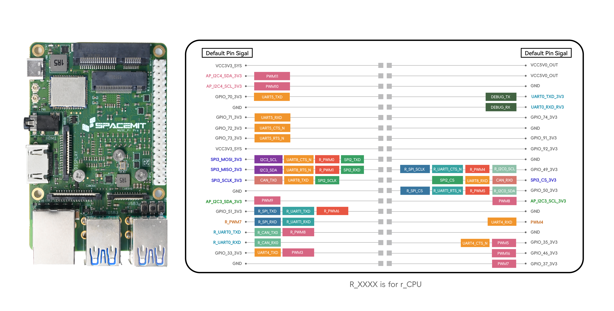

# MUSE Pi / MUSE Pi Pro Expansion I/O Definitions

Both the **MUSE Pi** and **MUSE Pi Pro** mainboards provide external expansion I/O headers, allowing users to connect additional peripherals such as **GPIO**, **I²C**, and **SPI** devices.

Starting from **Bianbu Star V2.1.5**, these expansion I/O interfaces are **pre-initialized with default definitions**. In most use cases, users can directly access the expansion I/O without modifying the device tree (`.dts`) files.

## MUSE Pi Pro

The **MUSE Pi Pro** features a **40-pin expansion header**.  
The functional pin definitions are shown below:

## MUSE Pi

The **MUSE Pi** provides a **26-pin expansion header**.  
The functional pin definitions are shown below:

