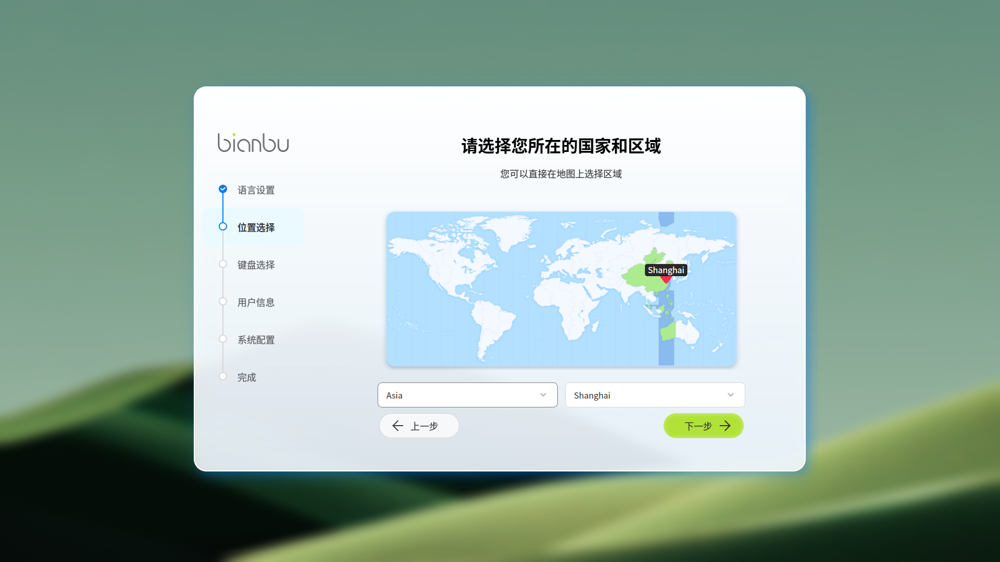
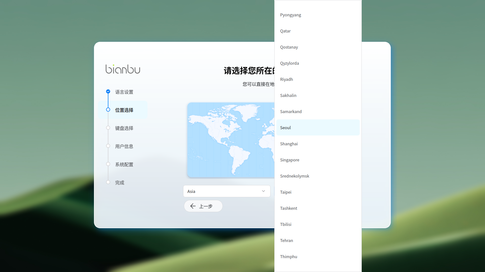
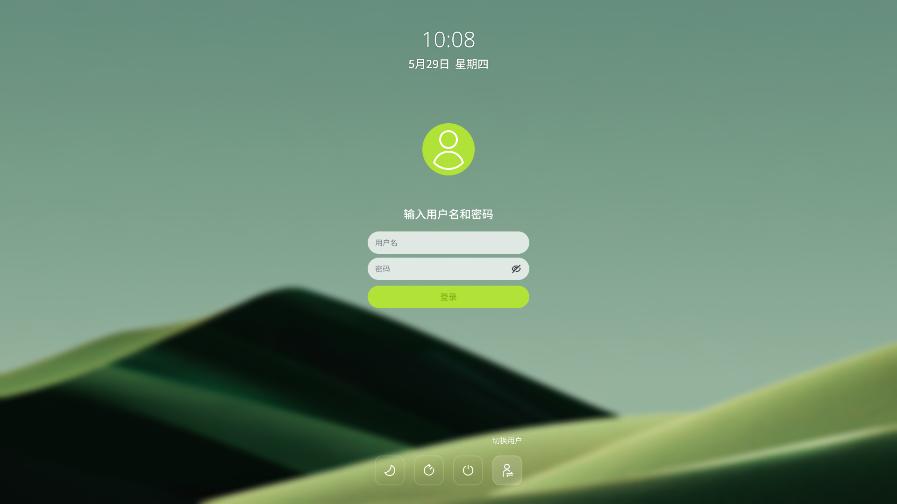

# Initial Startup and Sessions

This section explains what happens the first time you power on the system and how user sessions work. The startup wizard guides you through basic configuration, including language, location, keyboard layout, and user account setup. After completing the wizard, the system reboots and displays the login screen.

## Startup Wizard (Initial Setup)

The startup wizard runs automatically on first boot and walks you through the required configuration steps in order.

### Step 1: Language Settings

The startup wizard is displayed in **Simplified Chinese** by default. You can change the language on the **Language Settings** page.

Open the **Language List** to see the available options. Currently, the system supports:

- **Simplified Chinese**
- **American English**

After you select a language, the wizard reloads and immediately applies the new language. The selected language will also be used as the system language after setup is complete.

### Step 2: Location and Time Zone

On the **Location Selection** page, choose your region and city.

- If the system is connected to the network, the time zone is detected automatically.
- If no network is available, the default region is **Asia/Shanghai**.

The selected location affects regional formats such as **time, numbers, and currency**.

You can select your location in two ways:

- Choose from the **Region List**
- Click directly on the **Time Zone Map**

### Step 3: Keyboard Layout

Select a keyboard layout that matches your physical keyboard.

- By default, the system uses the standard layout for the selected language.
- If you need a specific variant, expand the keyboard list and choose the appropriate option.

### Step 4: User Account Information

On the **User Information** page, enter the following details:

- **Full Name**
- **Username**
- **Computer Name**
- **Password**

Please review all information carefully before continuing.

**Recommendations:**

- Use only lowercase letters and numbers for the username.
- The password must be at least **6 characters** long.

You can proceed only after all fields pass validation.

Use **Show Password** to confirm that your password is entered correctly.

### Step 5: Apply Configuration

Before applying the settings, the system displays a confirmation dialog. Once you continue, the configuration process **cannot be interrupted**.

The system writes the configuration and prepares the environment. Keep the device powered on to avoid incomplete setup.

## Completing the Setup

When the setup is finished, select **Restart System**. After reboot, the following settings take effect:

- **Language**: System and application interface language
- **Location / Time Zone**: Regional settings for time, numbers, and currency
- **Keyboard Layout**: Correct input mapping for your keyboard
- **User Account**: Created user account and computer name

## User Sessions

After the system restarts, the login screen appears. Log in using the username and password created during setup.

On the first login, the system may take a short time to initialize user-specific settings. This is normal.

The login screen provides the following actions:

- **Suspend**
- **Restart**
- **Power Off**
- **Switch User**

Click the corresponding button to perform the desired action.

### Logging In as a Specific User

If multiple user accounts exist, multiple user avatars are shown. Click an avatar to select a user, then enter the corresponding password.

You can also log in by manually specifying a username. Select **Switch User**, then enter the username and password on the login page.

