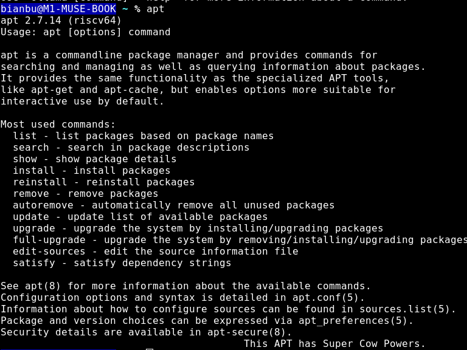

# 应用及软件管理

## 常用应用简介

| 应用名称 | 软件包名 | 应用图标 | 简要说明 |
|---|---|---|---|
| 网页浏览器 | chromium-browser-stable |  | 开源网页浏览器（Chromium） |
| TigerVNC 查看器 | tigervnc-viewer |  | VNC 远程桌面客户端 |
| LibreOffice | libreoffice |  | LibreOffice 启动中心（办公套件入口） |
| LibreOffice Calc | libreoffice-calc |  | 电子表格编辑器 |
| LibreOffice Draw | libreoffice-draw |  | 矢量绘图与流程图工具 |
| LibreOffice Impress | libreoffice-impress |  | 演示文稿制作工具 |
| LibreOffice Math | libreoffice-math |  | 数学公式编辑器 |
| LibreOffice Writer | libreoffice-writer |  | 文档与排版处理器 |
| Okular 文档查看器 | okular |  | 多格式文档阅读器（PDF/EPUB/DjVu 等） |
| Skanlite 扫描工具 | skanlite |  | 简洁的图像扫描工具 |
| 2048-Qt | 2048-qt |  | 经典 2048 益智游戏（Qt 版） |
| Audacious | audacious |  | 轻量级音频播放器，支持多种格式与插件 |
| Cheese | cheese |  | 摄像头拍照与录制工具，支持多种特效 |
| FeatherPad | featherpad |  | 轻量纯文本编辑器，支持标签与会话恢复 |
| LXImage-Qt | lximage-qt |  | LXQt 默认图像查看器，支持常见图片格式 |
| mpv 媒体播放器 | mpv |  | 高性能视频播放器，支持硬件加速与脚本 |
| PulseAudio音量控制 | pavucontrol-qt |  | PulseAudio/PipeWire 音量与设备管理（Qt） |
| Fcitx 5 | fcitx |  | 下一代输入法框架 |
| QTerminal | qterminal |  | 轻量级多标签终端 |
| 下拉式 QTerminal | qterminal |  | 顶部下拉终端（快捷唤出） |
| qps | qps |  | 进程查看与管理工具（Qt） |
| Disks | gnome-disk-utility |  | 磁盘与分区管理工具（格式化、挂载等） |
| KCalc 计算器 | kcalc |  | 功能完善的科学计算器 |
| LXQt 归档管理器 | lxqt-archiver |  | 压缩/解压归档工具（LXQt） |
| PCManFM-Qt 文件管理器 | pcmanfm-qt |  | LXQt 默认文件管理器 |
| QtPass | qtpass |  | 基于 pass/GPG 的密码管理器 |
| Vim | vim-common |  | 高度可定制的文本编辑器 |
| nobleNote | noblenote |  | 轻量级笔记与清单应用 |
| 键盘布局查看器 | fcitx5-config-qt |  | 查看与切换键盘布局 |

## 软件包管理器：APT

`APT`（Advanced Package Tool）是本系统的默认软件包管理器，用于管理 Debian 及其衍生发行版的软件包。`APT` 主要提供以下功能：

- **安装软件**：从官方软件源获取并安装所需软件包。
- **更新系统**：同步索引并升级已安装的软件包。
- **卸载软件**：移除不需要的软件包及其不再使用的依赖。
- **依赖管理**：自动解析并处理软件包之间的依赖关系，避免冲突。

`APT` 工具的帮助信息如下图所示，`apt` 命令详情请参考 `Debian` 的 [官方手册页](https://manpages.debian.org/bookworm/apt/apt-get.8.en.html) 。

