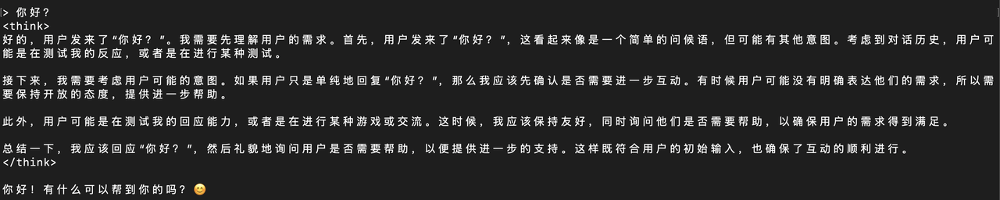
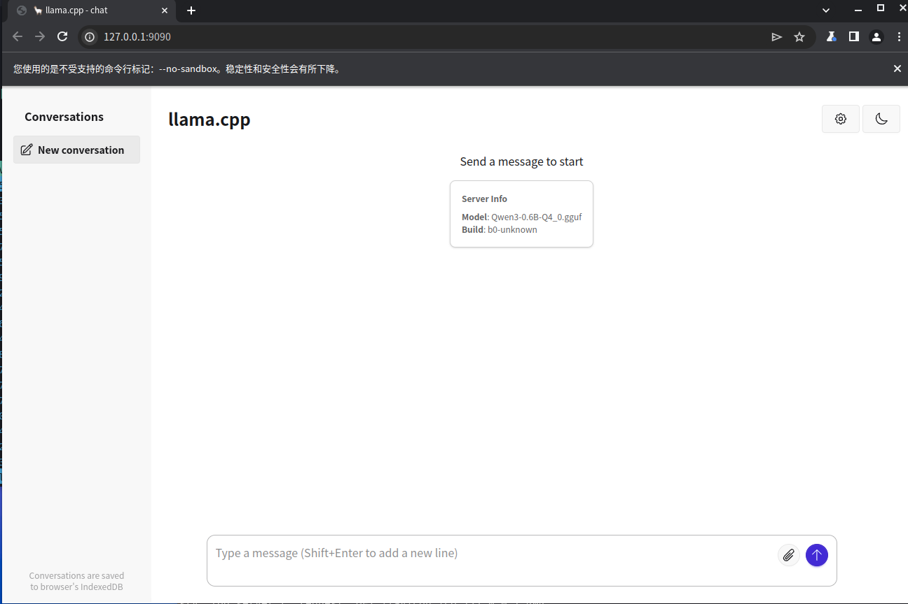

# llama.cpp

**llama.cpp** 是一个用纯 C/C++ 写的开源推理框架，专门让 Llama 等 GGUF/GGML 格式的大语言模型能在本地 CPU/GPU（笔记本、手机、树莓派甚至浏览器）快速运行，而无需依赖重量级框架。

## 下载

下载压缩文件 `spacemit-llama.cpp` 并解压

```bash
wget https://archive.spacemit.com/spacemit-ai/llama.cpp/spacemit-llama.cpp.riscv64.0.0.4.tar.gz -P ~/
tar -xzvf ~/spacemit-llama.cpp.riscv64.0.0.4.tar.gz -C ~/
```

## 下载模型

spacemit-llama.cpp 目前支持三种量化格式的加速模型：
- Q4_K_M
- Q4_0 
- Q4_1

以下示例可快速说明如何使用它：

```bash
wget https://modelscope.cn/models/unsloth/Qwen3-0.6B-GGUF/resolve/master/Qwen3-0.6B-Q4_0.gguf -P ~/
```

导入环境

```bash
export LD_LIBRARY_PATH=/home/bianbu/spacemit-llama.cpp.riscv64.0.0.4/lib
```

## 使用

```bash
cd ~/spacemit-llama.cpp.riscv64.0.0.4/bin
./llama-cli -m ~/Qwen3-0.6B-Q4_0.gguf --threads 4
```



## API 使用

执行命令启动 llama.cpp 服务：
```bash
cd ~/spacemit-llama.cpp.riscv64.0.0.4/bin
./llama-server --port 9090 -m ~/Qwen3-0.6B-Q4_0.gguf --threads 4
```

### 浏览器使用

在浏览器中搜索 `http://localhost:9090` 打开 llama 服务器，直接在浏览器中使用 llama.cpp



### 本地 API 请求

举个例子：
```bash
curl -X POST http://127.0.0.1:9090/v1/chat/completions \
  -H "Content-Type: application/json" \
  -d '{
        "model": "Qwen3-0.6B",
        "messages": [
          { "role": "user", "content": "介绍一下自己" }
        ],
        "stream": false
      }'
```


