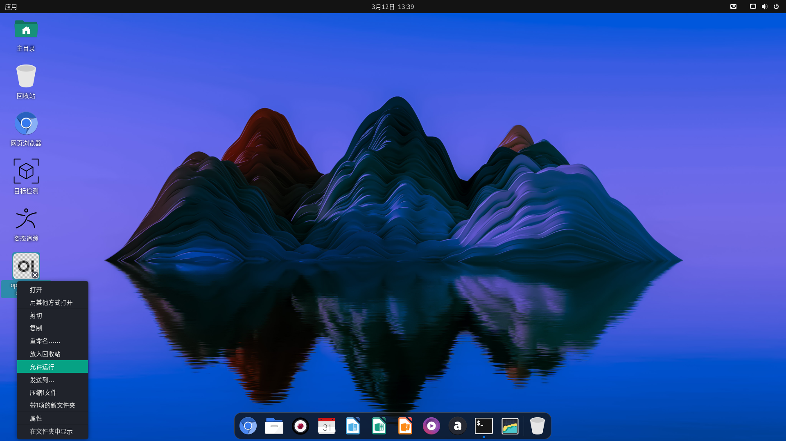

# Open-WebUI

**Open-WebUI**（原 Ollama WebUI）是一个开源、可自托管的 Web 管理工具，专为本地或私有化部署的大型语言模型（LLM）设计。其核心目标是提供与 ChatGPT 类似的交互体验，同时支持离线运行和高度定制化功能。

## 安装

为了简化您在 K1 上使用大语言模型的流程，我们在 K1 上制作了 Open-WebUI deb 软件包，可一键安装使用：
> **注意：** 系统版本需 **2.1.1** 及以上。
```shell
sudo apt update
sudo apt install openwebui
```
等待安装完成

## 使用

右键点击 openwebui 桌面图标，点击允许运行，即可使用。


具体的使用指南，请参考 [OpenWebUI 使用指南](https://forum.spacemit.com/t/topic/185)

## 制作模型（可选）

该deb包由 openwebui 和 ollama 容器镜像组成。只需要进入 ollama 容器下载制作模型即可，下面是制作模型的一个示例，首先进入容器：
```shell
sudo docker exec -it ollama bash
```
```shell
apt update
apt install wget vim
cd /root
wget https://modelscope.cn/models/second-state/Qwen2.5-0.5B-Instruct-GGUF/resolve/master/Qwen2.5-0.5B-Instruct-Q4_0.gguf
wget https://archive.spacemit.com/spacemit-ai/modelfile/qwen2.5:0.5b.modelfile
ollama create qwen2.5:0.5b -f qwen2.5:0.5b.modelfile
```
然后重启 ollama 容器，重新进入 openwebui 即可使用加速模型
```shell
sudo docker restart ollama
```
