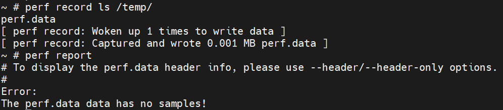
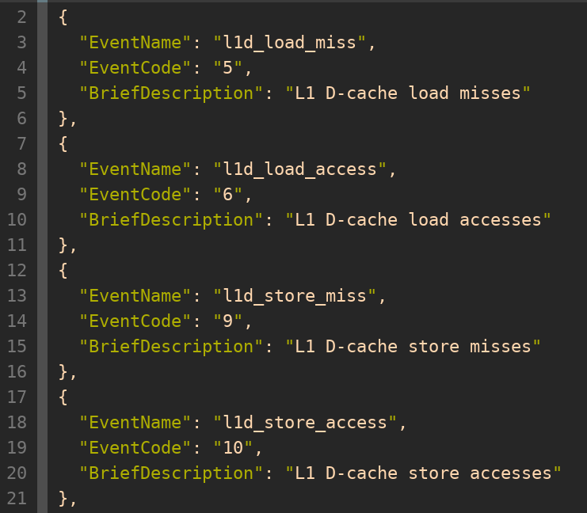
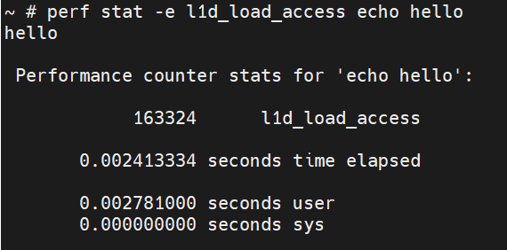

# Perf 使用注意事项

（perf 工具的基本用法可参考[官方教程](https://perf.wiki.kernel.org/index.php/Tutorial)，本文不再涉及。）

当前 RISC-V 对 perf 的支持涉及以下软/硬件的框架/规范：

- Linux perf 框架
  - perf 框架主体
  - perf 工具的 pmu-events json 文件（允许 perf 工具以名字而非 raw 编码指定硬件平台所支持的特定事件）
- SBI PMU Extension
- RISC-V 硬件规范
  - RISC-V ISA Privileged Specification 中定义的 HPM（Hardware Performance Monitor）内容
  - Sscofpmf Extension

它们的关系如下：


但即使软/硬件上全都支持了以上内容，仍存在以下事项需 perf 的使用者关注：

## `perf list` 所列出的硬件事件不一定全都可用

**现象：**

`perf list` 列出的硬件事件，并不表示当前硬件平台就全都支持这些事件。

例如，`perf list` 列出的硬件事件如下：

```shell
$ perf list | grep Hardware
  branch-instructions OR branches                    [Hardware event]
  branch-misses                                      [Hardware event]
  bus-cycles                                         [Hardware event]
  cache-misses                                       [Hardware event]
  cache-references                                   [Hardware event]
  cpu-cycles OR cycles                               [Hardware event]
  instructions                                       [Hardware event]
  ref-cycles                                         [Hardware event]
  stalled-cycles-backend OR idle-cycles-backend      [Hardware event]
  stalled-cycles-frontend OR idle-cycles-frontend    [Hardware event]
  L1-dcache-load-misses                              [Hardware cache event]
  L1-dcache-loads                                    [Hardware cache event]
  L1-dcache-prefetch-misses                          [Hardware cache event]
  L1-dcache-prefetches                               [Hardware cache event]
  L1-dcache-store-misses                             [Hardware cache event]
  L1-dcache-stores                                   [Hardware cache event]
  L1-icache-load-misses                              [Hardware cache event]
  L1-icache-loads                                    [Hardware cache event]
  L1-icache-prefetch-misses                          [Hardware cache event]
  L1-icache-prefetches                               [Hardware cache event]
  LLC-load-misses                                    [Hardware cache event]
  LLC-loads                                          [Hardware cache event]
  LLC-prefetch-misses                                [Hardware cache event]
  LLC-prefetches                                     [Hardware cache event]
  LLC-store-misses                                   [Hardware cache event]
  LLC-stores                                         [Hardware cache event]
  branch-load-misses                                 [Hardware cache event]
  branch-loads                                       [Hardware cache event]
  dTLB-load-misses                                   [Hardware cache event]
  dTLB-loads                                         [Hardware cache event]
  dTLB-prefetch-misses                               [Hardware cache event]
  dTLB-prefetches                                    [Hardware cache event]
  dTLB-store-misses                                  [Hardware cache event]
  dTLB-stores                                        [Hardware cache event]
  iTLB-load-misses                                   [Hardware cache event]
  iTLB-loads                                         [Hardware cache event]
  node-load-misses                                   [Hardware cache event]
  node-loads                                         [Hardware cache event]
  node-prefetch-misses                               [Hardware cache event]
  node-prefetches                                    [Hardware cache event]
  node-store-misses                                  [Hardware cache event]
  node-stores                                        [Hardware cache event]
```

但对某些事件的计数结果会显示 `<not counted>` ，有可能当前硬件平台不支持该事件（但也有可能是支持该事件但没统计到计数）：

```shell
$ perf stat -e cycles,branches,bus-cycles,ref-cycles ls

 Performance counter stats for 'ls':

           1719370      cycles
             94325      branches
     <not counted>      bus-cycles                                (0.00%)
     <not counted>      ref-cycles                                (0.00%)

       0.002556584 seconds time elapsed

       0.002900000 seconds user
       0.000000000 seconds sys
```

**原因：**

`perf list` 列出的 “Hardware event” 和 “Hardware cache event” 是 Linux perf 框架中预设好的硬件事件名字，在 RISC-V 平台中它们是通过 SBI PMU Extension 与实际的 HPM 硬件计数器建立起联系。而在 OpenSBI 的 PMU Extension 实现中，这种映射关系是描述在 Device Tree 中 `compatible = "riscv,pmu"` 的字段中。

以下是一个 Device Tree 的例子：

```dts
pmu {
    compatible = "riscv,pmu";

    riscv,event-to-mhpmevent =
    /* BRANCH_INSTRUCTIONS */
    <0x00005 0x0 0x01>,
    /* BRANCH_MISSES */
    <0x00006 0x0 0x02>,
    /* STALLED_CYCLES_FRONTEND */
    <0x00008 0x0 0x03>,
    /* STALLED_CYCLES_BACKEND */
    <0x00009 0x0 0x04>,
    /* L1D_READ_ACCESS */
    <0x10000 0x0 0x06>,
    /* L1D_READ_MISS */
    <0x10001 0x0 0x05>,
    /* L1D_WRITE_ACCESS */
    <0x10002 0x0 0x0a>,
    /* L1D_WRITE_MISS */
    <0x10003 0x0 0x09>,
    /* L1I_READ_ACCESS */
    <0x10008 0x0 0x0c>,
    /* L1I_READ_MISS */
    <0x10009 0x0 0x0b>,
    /* L1I_PREFETCH_ACCESS */
    <0x1000c 0x0 0x0e>,
    /* L1I_PREFETCH_MISS */
    <0x1000d 0x0 0x0d>,
    /* DTLB_READ_MISS */
    <0x10019 0x0 0x15>,
    /* DTLB_WRITE_MISS */
    <0x1001b 0x0 0x19>,
    /* ITLB_READ_MISS */
    <0x10021 0x0 0x1b>;

    /* 16 valid counters: mhpmcounter3 ~ mhpmcounter18 */
    riscv,event-to-mhpmcounters =
     <0x00005 0x00006 0x0007fff8>,
     <0x00008 0x00009 0x0007fff8>,
     <0x10000 0x10003 0x0007fff8>,
     <0x10008 0x10009 0x0007fff8>,
     <0x1000c 0x1000d 0x0007fff8>,
     <0x10019 0x10019 0x0007fff8>,
     <0x1001b 0x1001b 0x0007fff8>,
     <0x10021 0x10021 0x0007fff8>;

    riscv,raw-event-to-mhpmcounters =
     /*
      * For convenience, we treat 0x1~0xff as valid indexes,
      * but actually in hardware the valid indexes are 0x1~0xbd.
      */
     <0x0 0x0 0xffffffff 0xffffff00 0x0007fff8>;
};
```

具体的格式说明可参考 OpenSBI 源码中的文档 [docs/pmu_support.md](https://github.com/riscv-software-src/opensbi/blob/master/docs/pmu_support.md) 。

**Device Tree 的这些内容，是由 OpenSBI 解析，Linux perf 框架无法得知**（目前没有定义相关的规范）。因此，`perf list`  所列出的硬件事件，并非每一个都对应硬件上实际的 HPM 事件。

## X60 中 `perf record` 等采样统计的功能对 `cycles` 和 `instructions` 事件无效

**现象：**

在 X60 中，perf 中某些对硬件事件进行采样统计的功能（包括但不限于 `perf record` 、 `perf top` 等），对 `cycles` 和 `instructions` 事件无法生效。可能出现的现象包括但不限于：

- 执行 `perf record` 后，对生成的 `perf.data` 使用 `perf report` 时，报错 “The perf.data data has no samples!”。如下图：

  

- 执行 `perf top` 无输出。

- ...

**原因：**

perf 的 `record` 、 `top` 等采样功能，若要统计硬件事件，需要该事件对应的硬件 counter 支持 overflow interrupt。RISC-V 的 Sscofpmf 扩展就是定义了硬件上 `mhpmevent` 的 counter 如何提供 overflow interrupt。

但对于 `cycles` 和 `instructions` 这两个事件所用的 counter CSR —— `mcycle` 和 `minstret` ，Sscofpmf 没有定义它们的 overflow interrupt，而 X60 也没有对此额外处理，因此这些需要采样的 perf 功能对这两个事件无效：


大多数情况下，若不使用 `-e` 参数手动指定事件，perf 会默认统计 `cycles` 事件。 **因此在 X60 中，需要采样的 perf 功能默认无输出或统计结果的 samples 为 0 是正常的，并非表示 perf 不可用，只需用 `-e` 参数指定其他事件即可。** 例如：


在 X60 中使用采样功能统计性能时，可考虑使用以下事件作为 `cycles` 和 `instructions` 的替代：

- `cpu-clock` / `task-clock` 等软件事件。
- X60 硬件支持的一些特定事件，如 U/S/M mode cycles、不同指令的计数等（具体事件请参考相关硬件手册；如何在 perf 中使用这些事件请参考后面章节 “如何使用 raw hardware event”）。

## 如何使用 raw hardware event

Linux perf 框架只预设了一部分硬件事件的名字，对于那些在硬件上支持、但不存在预设名字的事件（称为 raw hardware event），可在使用 `-e` 参数时通过以下两种方法指定：

- 通过 `rNNN` 编码指定。
- 通过名字指定（需要该平台的 SDK 已实现 pmu-events json 文件）。

### 通过 `rNNN` 编码指定

`-e rNNN` 可直接通过硬件定义的编号来指定使用哪个事件，其中 `NNN` 为 16 进制数字（不包含 `0x` ），其格式由 perf 框架、硬件定义的编码、以及相关中间层软件共同决定。

对于支持 SBI PMU Extension 的 RISC-V 平台，`NNN` 编码各 bit 的含义为：

```plain
  [63]      固定为 0，表示 raw type
  [52:56]   固定为 4，表示 type 为 PERF_TYPE_RAW
  [55:48]   未使用，全为 0 即可
  [47:0]    对应的 mhpmevent CSR 值
```

例如，`r0400000000000008` 表示 `mhpmevent` 值为 0x8 的事件。

### 通过名字指定

perf 工具支持一个功能，可允许在其源码目录中增加一些 json 文件，为不同硬件厂商的 raw hardware event 定义名字。如此一来，使用时可通过名字而非 `rNNN` 编码来指定事件。

若某一平台实现了该功能，可在其 SDK 的 Linux 源码的 `tools/perf/pmu-events/arch/riscv/` 目录下找到这些 json 文件。例如 x60 的有：

```shell
user@host:~/linux/tools/perf/pmu-events/arch/riscv$ tree spacemit/x60
spacemit/x60
|-- branch.json
|-- cache.json
|-- instruction.json
`-- microarch.json
```

当 **使用该源码编译出来的 perf** 时，可以用 json 文件中定义的这些名字替换掉 `rNNN` 编码。

以 X60 `cache.json` 中的部分内容为例：



- `EventName` 是可在 perf `-e` 参数中使用的名字。
- `EventCode` 对应于硬件手册中该 HPM 事件的编号。

在 `perf list` 中可看到对应的名字（若 `perf list` 结果太长，可只列出与关键字相关的事件，例如 `perf list l1` ）：


该名字可直接用在 `-e` 参数中，如：


