# Python 用户指南

Bianbu OS 预装了 Python 3，安装第三方 Python 库时，推荐使用正确的包管理工具，否则可能会破坏系统软件包依赖。

在 Bianbu OS中，您可以通过两种方式安装python依赖项：

* 使用apt安装预先配置的系统Python软件包。
* 创建虚拟环境，使用pip包管理工具安装软件包。

## 使用apt安装Python包

Bianbu OS中建议通过apt安装Python3的软件包，这些包通常是预编译的，因此安装速度更快。apt会管理所有软件包的依赖关系，安装时会包括运行该软件包所需的所有子依赖项。此外，apt确保在你卸载软件包时不会破坏其他软件包。
例如，要安装Python的科学计算库scipy，请运行以下命令：

```shell
sudo apt install python3-scipy
```

要查找使用apt发布的 Python 包，请使用apt search 。在大多数情况下，Python 包使用前缀python3- ：例如，python3-numpy对应于Python的numpy包。

## 使用pip安装Python包

### 对pip安装的更改

在Bianbu OS 中，用户无法使用pip将库直接安装到系统版本的 Python 中。尝试在系统范围内使用pip安装 Python 包会输出类似于以下内容的错误：

```shell
➜  ~ pip install numpy
error: externally-managed-environment

× This environment is externally managed
╰─> To install Python packages system-wide, try apt install
    python3-xyz, where xyz is the package you are trying to
    install.

    If you wish to install a non-Debian-packaged Python package,
    create a virtual environment using python3 -m venv path/to/venv.
    Then use path/to/venv/bin/python and path/to/venv/bin/pip. Make
    sure you have python3-full installed.

    If you wish to install a non-Debian packaged Python application,
    it may be easiest to use pipx install xyz, which will manage a
    virtual environment for you. Make sure you have pipx installed.

    See /usr/share/doc/python3.12/README.venv for more information.

note: If you believe this is a mistake, please contact your Python installation or OS distribution provider. You can override this, at the risk of breaking your Python installation or OS, by passing --break-system-packages.
hint: See PEP 668 for the detailed specification.
```

通过pip安装的软件包必须安装到 Python 虚拟环境( venv ) 中。虚拟环境是一个容器，您可以在其中安全地安装第三方模块，这样它们就不会干扰您的系统Python环境。

### 在虚拟环境中使用 pip

要使用虚拟环境，请创建一个容器来存储Python环境。您可以通过多种方法来完成此操作，具体取决于您想要使用 Python 的方式。这里以virtualenv工具为例，首先在系统的python环境安装virtualenv：

```shell
sudo apt install python3-virtualenv
```

运行以下命令创建虚拟环境配置文件夹（其中的 myenv 可以替换成任何您喜欢的名字）：

```shell
virtualenv myenv
```

然后，执行虚拟环境配置文件夹中的bin/activate脚本，进入虚拟环境：

```shell
source myenv/bin/activate
```

然后您应该会看到类似于以下内容的提示：

```shell
(myenv) ➜  ~
```

pyenv命令提示符前缀表示当前终端会话位于名为 pyenv 虚拟环境中。
要检查您是否处于虚拟环境中，请使用 pip list 查看已安装软件包的列表：

```shell
(myenv) ➜  ~ pip list
Package Version
------- -------
pip     24.0
```

该列表应该比系统 Python 中安装的包列表短得多。您现在可以使用pip安全地安装软件包。

为了更好的兼容性，强烈建议升级虚拟环境中的 pip 到最新版本以避免某些安装失败的问题。

```
pip install --upgrade pip
```

在虚拟环境中使用pip安装的任何软件包都只会安装到该虚拟环境中。在虚拟环境中， python或python3命令会自动使用虚拟环境下的 Python 软件包，而不是系统环境的 Python包。
例如使用pip安装wheel包：

```shell
(myenv) ➜  ~ pip install wheel
Collecting wheel
  Downloading wheel-0.44.0-py3-none-any.whl.metadata (2.3 kB)
Downloading wheel-0.44.0-py3-none-any.whl (67 kB)
   ━━━━━━━━━━━━━━━━━━━━━━━━━━━━━━━━━━━━━━━━ 67.1/67.1 kB 27.9 kB/s eta 0:00:00
Installing collected packages: wheel
Successfully installed wheel-0.44.0
```

您可以通过执行python3，然后import安装的模块来验证安装是否成功。

```shell
(myenv) ➜  ~ python3
Python 3.12.3 (main, Apr 10 2024, 05:33:47) [GCC 13.2.0] on linux
Type "help", "copyright", "credits" or "license" for more information.
>>> import wheel
```

您可以使用sys模块来验证当前的解释器路径是否符合预期：

```shell
>>> import sys
>>> print("当前Python解释器路径:", sys.executable)
当前Python解释器路径: /home/zq-card/myenv/bin/python3
```

使用 exit() 退出交互式模式：

```shell
>>> exit()
(myenv) ➜  ~
```

要离开虚拟环境，请运行以下命令：

```shell
(myenv) ➜  ~ deactivate
```


### Python 版本支持

| **Python解释器版本** | **支持情况** |
| :------------------: | :----------: |
|     Python 3.12      |   长期支持   |
|     Python 3.13      |   长期支持   |

强烈建议您使用 Python 3.12 及以上版本的 Python，通常，跟随系统的 Python 版本是较好的做法。


### 使用pyenv管理Python 版本

pyenv 是一个非常流行的 Python 版本管理工具，它允许您轻松地安装、管理和切换多个 Python 版本。您可以根据项目需要在不同的 Python 版本之间自由切换，下面介绍如何使用 pyenv 配置多个 Python 版本。

更多信息请参考[pyenv官方教程](https://github.com/pyenv/pyenv)


#### 安装pyenv

```shell
git clone https://github.com/pyenv/pyenv.git ~/.pyenv
```

#### 配置shell环境

对于Zsh：

```shell
echo 'export PYENV_ROOT="$HOME/.pyenv"' >> ~/.zshrc
echo '[[ -d $PYENV_ROOT/bin ]] && export PATH="$PYENV_ROOT/bin:$PATH"' >> ~/.zshrc
echo 'eval "$(pyenv init -)"' >> ~/.zshrc
source ~/.zshrc
```

对于Bash：

```shell
echo 'export PYENV_ROOT="$HOME/.pyenv"' >> ~/.bashrc
echo 'command -v pyenv >/dev/null || export PATH="$PYENV_ROOT/bin:$PATH"' >> ~/.bashrc
echo 'eval "$(pyenv init -)"' >> ~/.bashrc
source ~/.bashrc
```

#### 安装多个 Python 版本

您可以执行以下命令安装多个python版本，这里以3.10.0为例，也可以指定如3.8.5等 Python 版本。

```shell
pyenv install 3.10.0
```

安装成功会出现如下显示：

```shell
Downloading Python-3.10.0.tar.xz...
-> https://www.python.org/ftp/python/3.10.0/Python-3.10.0.tar.xz
Installing Python-3.10.0...
patching file aclocal.m4
patching file configure
Hunk #5 succeeded at 10537 (offset -15 lines).
patching file Misc/NEWS.d/next/Build/2021-10-11-16-27-38.bpo-45405.iSfdW5.rst
patching file configure
patching file configure.ac
Installed Python-3.10.0 to /home/zq/.pyenv/versions/3.10.0
```

输入pyenv versions 查看是否出现您安装的Python版本号：

```shell
➜  ~ pyenv versions
* system (set by /home/zq/.pyenv/version)
  3.10.0
```

#### 设置全局 Python 版本

您可以使用 pyenv global 来设置默认的 Python 版本。这会影响系统中所有终端使用的 Python 版本。
如果您使用的是Bash，请将.zshrc替换为.bashrc。

```shell
➜  ~ pyenv global 3.10.0
➜  ~ source ~/.zshrc
➜  ~ python3
Python 3.10.0 (default, Sep 13 2024, 20:53:06) [GCC 13.2.0] on linux
Type "help", "copyright", "credits" or "license" for more information.
>>>
```

再次输入 pyenv versions 您将看到python版本已经从system切换到3.10.0

```shell
➜  ~ pyenv versions
  system
* 3.10.0 (set by /home/zq/.pyenv/version)
```

如果您想要切回系统的python，执行 pyenv global system

```shell
➜  ~ pyenv global system
➜  ~ source ~/.zshrc
➜  ~ python3
Python 3.12.3 (main, Apr 10 2024, 05:33:47) [GCC 13.2.0] on linux
Type "help", "copyright", "credits" or "license" for more information.
>>>
```

当您管理多个python版本时，可以通过 pyenv versions 轻松地查看它们并切换到对应的python版本。

#### 针对项目设置本地 Python 版本

您可以在特定目录或项目中使用不同的 Python 版本。进入项目目录（这里为myproject），然后运行 pyenv local ：

pyenv 会在该目录下生成一个名为 .python-version 的文件，指定该目录使用的 Python 版本。这样，在这个目录中工作时，Python 将默认使用 3.10.0，而不是全局版本。

```shell
➜  myproject pyenv local 3.10.0
➜  myproject ls -a
.  ..  .python-version
➜  myproject
➜  myproject python3
Python 3.10.0 (default, Sep 13 2024, 20:53:06) [GCC 13.2.0] on linux
Type "help", "copyright", "credits" or "license" for more information.
>>>
>>> exit()
➜  myproject cd ..
➜  ~ python3
Python 3.12.3 (main, Apr 10 2024, 05:33:47) [GCC 13.2.0] on linux
Type "help", "copyright", "credits" or "license" for more information.
>>>
```

pyenv local 设置的Python版本只在执行该命令的项目文件夹生效，当您切换到其它文件夹时，Python会默认回到系统版本。

#### 只为当前终端设置 Python 版本

pyenv shell 命令允许您在当前的终端会话中使用指定的 Python 版本，而不影响全局设置：

```shell
➜  ~ pyenv shell 3.10.0
➜  ~ python3
Python 3.10.0 (default, Sep 13 2024, 20:53:06) [GCC 13.2.0] on linux
Type "help", "copyright", "credits" or "license" for more information.
>>>
>>> exit()
➜  ~ pyenv shell system
➜  ~ python3
Python 3.12.3 (main, Apr 10 2024, 05:33:47) [GCC 13.2.0] on linux
Type "help", "copyright", "credits" or "license" for more information.
>>>
```

通过这种方式，您可以快速切换版本而不用担心会对全局环境造成影响。

#### 卸载 Python 版本

如果您不再需要某个 Python 版本，可以使用 pyenv uninstall 命令卸载它：

通过 pyenv versions 命令验证你当前使用的 Python 版本

```shell
➜  ~ pyenv uninstall 3.10.0
pyenv: remove /home/zq/.pyenv/versions/3.10.0? [y|N] y
pyenv: 3.10.0 uninstalled
➜  ~ pyenv versions
* system (set by PYENV_VERSION environment variable)
```

### 使用SpacemiT的pypi源

当您在虚拟环境中使用pip安装某些Python包时，如果这些包未提供适配于RISC-V架构的预编译whl安装文件，则pip会拉取包的源码在本地进行构建，对于底层依赖于C/C++的python包而言，这个过程通常非常耗时且容易出现编译时的依赖问题。

为了提高开发效率，SpaceMIT为 RISC-V 架构构建了一些常用的 Python 包（如 numpy），这些包已经打包为 .whl 文件，供开发者在 RISC-V 平台上使用。本教程将指导您如何在 RISC-V 环境下安装并使用这些 Python 包。

1. 安装 PyPI 包

`<package_name>` 是包名。

```shell
pip install --index-url https://git.spacemit.com/api/v4/projects/33/packages/pypi/simple <package_name>
```

2. 配置成额外源

pip默认支持一个主要的index-url，但是您可以通过配置多个extra-index-url来添加额外的源。

```shell
pip config set global.extra-index-url https://git.spacemit.com/api/v4/projects/33/packages/pypi/simple
```

可以通过pip config list查看是否成功，如果成功，可以看到以下信息。

```shell
global.extra-index-url='https://git.spacemit.com/api/v4/projects/33/packages/pypi/simple'
```

如果您想上传自己编译好的whl包，请参考：[如何上传Python预编译包](https://git.spacemit.com/archive/pypi/-/blob/main/README.md?ref_type=heads)

## 使用 Thonny 编辑器

可以使用[Thonny](https://thonny.org/)在 Bianbu 上快速编辑 Python 代码。但为了更好的体验，推荐使用 JupyterLab 

安装：

```shell
sudo apt install python3-tk thonny
```

安装完成后，终端输入 thonny 即可启动IDE界面：

```shell
thonny
```

默认情况下，Thonny 使用系统 Python。但是，您可以通过单击 Thonny 窗口右下角的解释器菜单切换到使用 Python 虚拟环境。可以选择已配置的环境或使用Configure interpreter…创建一个新的虚拟环境​ ​。


## 使用 JupyterLab (with vscode)

### JupyterLab 简介

**JupyterLab** 是一个基于 Web 的 **交互式开发环境（IDE）**，主要用于 **数据科学、机器学习、科学计算和教育**。它是 **Jupyter Notebook** 的升级版和扩展版，提供了更强大的功能和更灵活的用户界面。

#### **核心特点**

1. **多文档界面**
   - 可以同时打开多个 Notebook、终端、文本文件、Markdown、CSV、图片、代码编辑器。
   - 采用 **标签页和分屏布局**，方便组织工作流。
2. **交互式计算**
   - 支持多种编程语言（通过 Jupyter 内核，最常见的是 Python）。
   - 可以直接运行代码块、查看结果（图表、表格、数学公式）。
3. **丰富的可视化支持**
   - 与 **Matplotlib、Plotly、Bokeh、Altair** 等库无缝集成。
   - 支持交互式图表和实时更新。
4. **强大的扩展机制**
   - 可以安装插件（Extensions），增强功能，比如 Git 集成、代码格式化、调试器等。
5. **终端与文件管理**
   - 内置 Linux Shell 终端。
   - 文件管理器可直接操作服务器文件。

#### **使用场景**

- **数据探索与可视化**：快速查看和分析数据集。
- **机器学习建模**：训练、调试、可视化模型。
- **教育与科研**：作为教学工具，支持数学公式 (LaTeX)、交互式演示。
- **原型开发**：结合代码、文档、图表快速迭代。

------

### 安装 JupyterLab 

安装依赖

```
sudo apt install python3-pip python3-venv libxrender1 libgl1 libglib2.0-0t64
```

设置 pip 源

```
pip config set global.index-url https://mirrors.aliyun.com/pypi/simple/
pip config set global.extra-index-url https://git.spacemit.com/api/v4/projects/33/packages/pypi/simple
```

安装

```
python3 -m venv ~/jupter-env
source ~/jupter-env/bin/activate
pip install pip -U
pip install ipykernel jupyterlab opencv-python matplotlib scipy
```

------

### 启动 JupyterLab

```
source ~/jupter-env/bin/activate
jupyter lab --ip=0.0.0.0 --port=8888 --no-browser --notebook-dir=~/
```

你可以看到如下输出

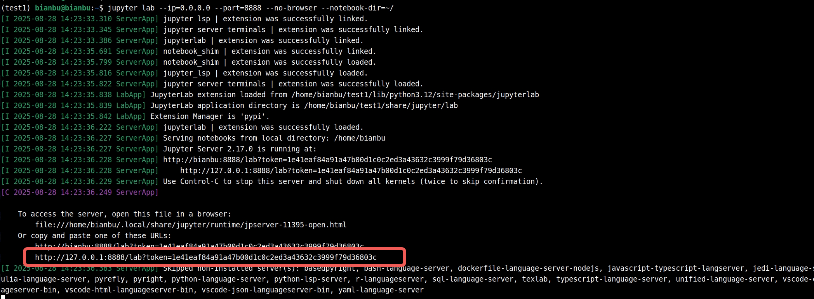

将 http://127.0.0.1:8888/lab?token=1e41eaf84a91a47b00d1c0c2ed3a43632c3999f79d36803c 这一段复制并保存到你的记事本。这里 token 后面的数字会有变化，请复制你自己终端打印的，而不是本文的。

新建一个终端，使用 ip addr 命令查看板子 ip 地址

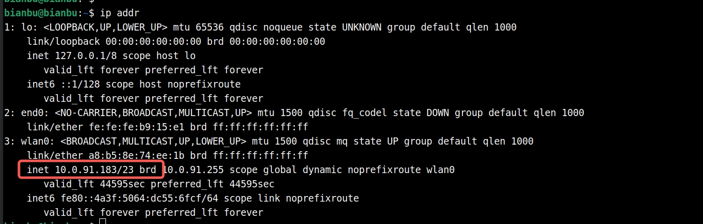

在本示例中，10.0.91.183 即为板子的 ip 地址，在你的场景中，这可能是如 192.168.... 的值

替换刚刚复制的链接里面的 127.0.0.1 为 板子ip (这里是 10.0.91.183)，如下：

http://10.0.91.183:8888/lab?token=1e41eaf84a91a47b00d1c0c2ed3a43632c3999f79d36803c

### 在浏览器使用 JupyterLab

打开你的 x86 主机上的浏览器，在地址栏粘贴刚刚得到的 http://10.0.91.183:8888/lab?token=1e41eaf84a91a47b00d1c0c2ed3a43632c3999f79d36803c 你将看到如下界面：

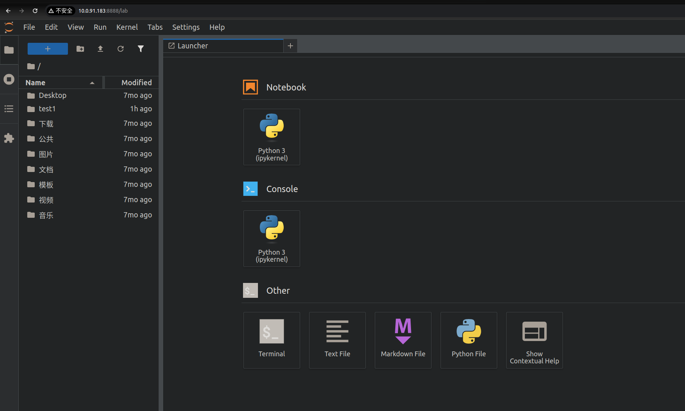

现在你可以使用 Notebook 来交互式执行和调试代码，也可以打开 Terminal，Terminal 默认激活了虚拟环境，因此你可以 pip 安装想要的包，随后刷新环境以使用它。

参考[Jupyter 官方教程](https://docs.jupyter.org/en/latest/) 获得完整的使用体验。

------

### 在 VSCode 使用 JupyterLab

使用 VSCode 打开一个空白文件夹，新建一个 demo.ipynb 文件，如下：

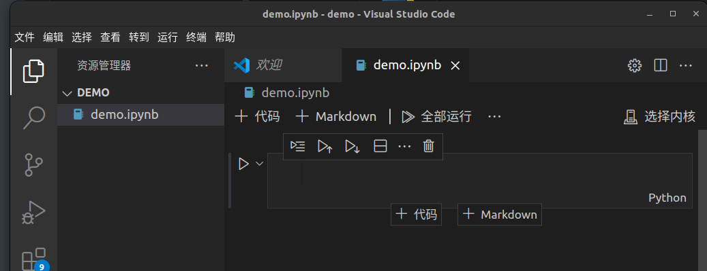

点击 “选择内核”，选择 “现有 Jupyter 服务器” 粘贴我们刚才保存的链接，如下

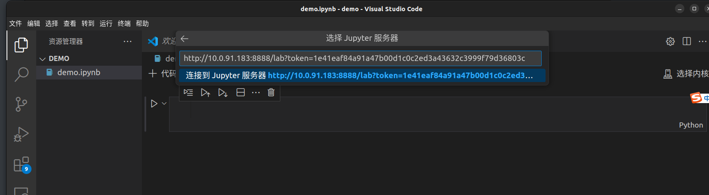

按下 enter 键，出现：

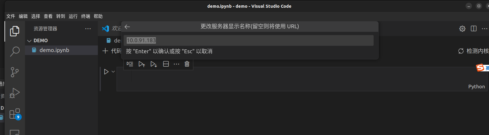

再次按下 enter 键

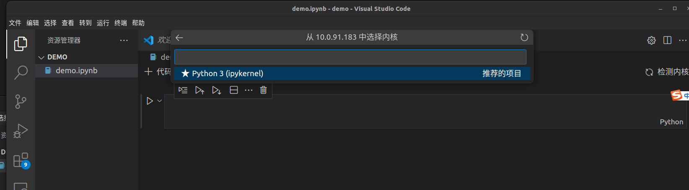

鼠标点击 Python 3 (ipykernel) 即可

当你新建另一个 Notebook 时，就可以直接选择该 kernel 了， 而无需较繁琐的配置。

你可以运行一些示例代码来检查一切是否正常工作

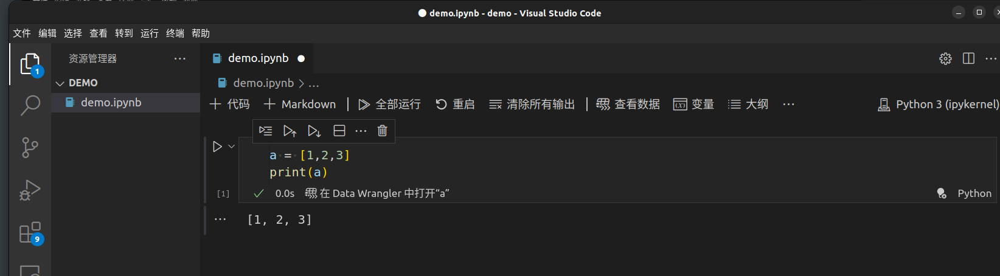

当你在虚拟环境中安装了新的包时，点击重启就可以刷新环境。


## 从 Python 使用 GPIO

我们为以下设备适配了gpiozero库

* BPI-F3
* MUSE Book
* MUSE Pi
* MUSE Card

通过该库，您可以使用Python脚本方便地控制GPIO设备，该库的完整文档位于[gpiozero.readthedocs.io](https://gpiozero.readthedocs.io/)。

在实际的使用中，您应该特别注意GPIO引脚的编号和引脚的特殊功能，这些设备的引脚编号与树莓派的教程有所不同。

接下来以拥有26 pin的SpacemiT开发板 SpacemiT MUSE-Pi 为例引导您如何使用gpiozero库。

### 设备引脚布局

#### MUSE Pi

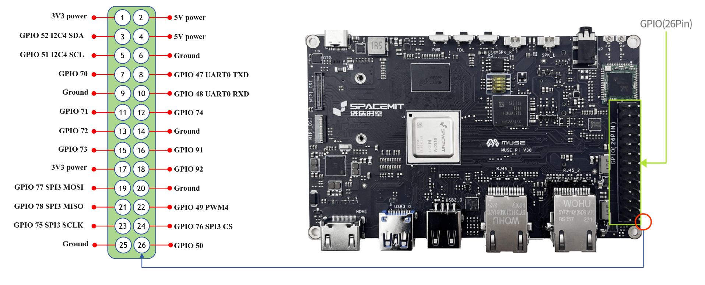

#### BPI-F3

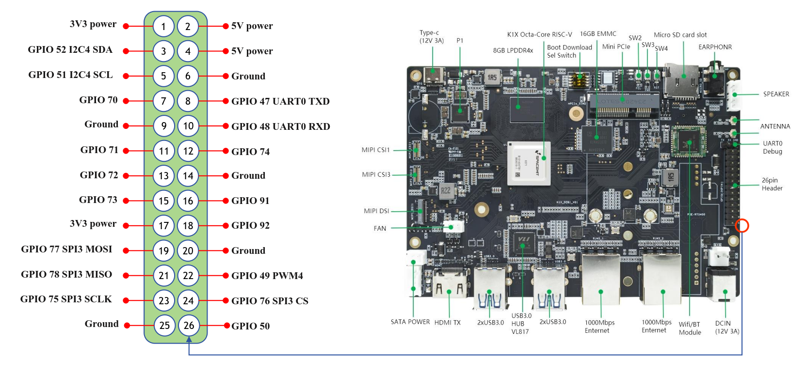

#### MUSE BOOK

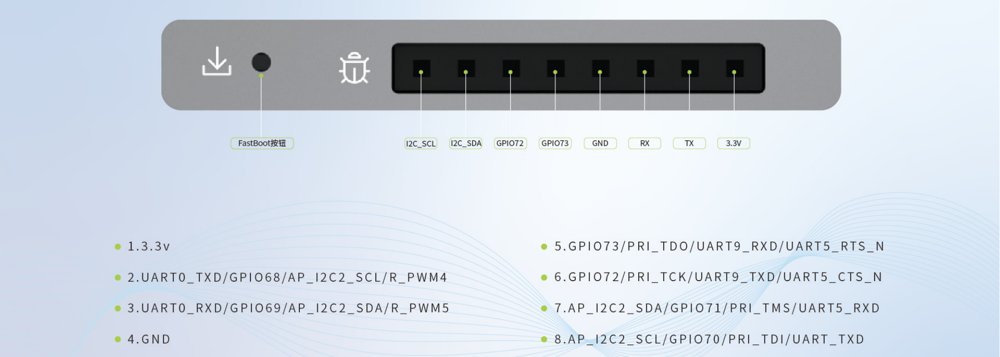

#### MUSE Card

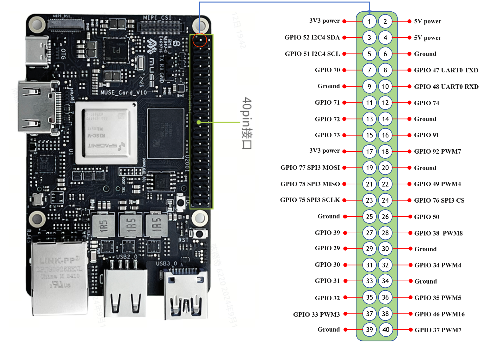

#### MUSE Pi Pro

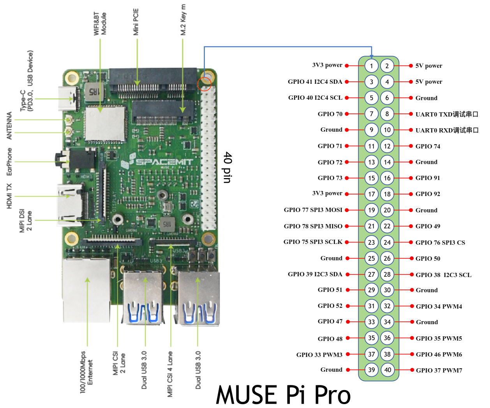

#### RV4B

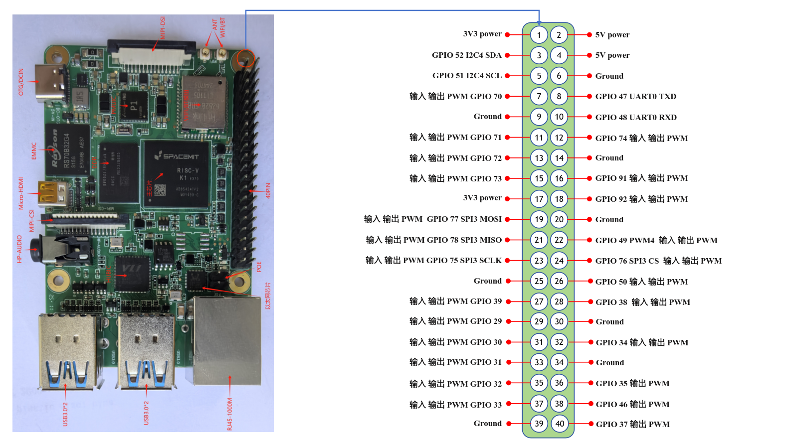

输入表示引脚可以识别电平变化，常用于 gpiozero 读取按钮状态

输出表示引脚可以控制输出电平为0v或者3.3v，常用于gpiozero LED灯的控制

PWM表示引脚可以输出PWM波，可以用于 gpiozero 实现呼吸灯以及控制舵机等

### 安装并配置环境

执行以下命令安装库

主环境：

```shell
sudo apt install python3-gpiozero
```

虚拟环境：

```
pip install --index-url https://git.spacemit.com/api/v4/projects/33/packages/pypi/simple gpiozero
```

赋予权限：

```shell
sudo chmod a+rw /dev/gpiochip0
```

命令行执行 pinout ，您应该可以看到如下输出：

```shell
➜  pinout
Description        : spacemit k1-x MUSE-Pi board
Revision           : deb002
SoC                : M1-8571
RAM                : 7GB
Storage            : MicroSD/SSD
USB ports          : 2 (of which 2 USB3)
Ethernet ports     : 2 (1000Mbps max. speed)
Wi-fi              : True
Bluetooth          : True
Camera ports (CSI) : 1
Display ports (DSI): 1

,---------------------------------------------------------------.
| ooooooooooooo                                  J24  :
| 1oooooooooooo                                       : |Ethernet1
|     MUSE Pi                                      : |Ethernet2
,--------------------------------------------------------------.

MUSE_Pi:
   3V3  (1) (2)  5V
GPIO52  (3) (4)  5V
GPIO51  (5) (6)  GND
GPIO70  (7) (8)  GPIO47
   GND  (9) (10) GPIO48
GPIO71 (11) (12) GPIO74
GPIO72 (13) (14) GND
GPIO73 (15) (16) GPIO91
   3V3 (17) (18) GPIO92
GPIO77 (19) (20) GND
GPIO78 (21) (22) GPIO49
GPIO75 (23) (24) GPIO76
   GND (25) (26) GPIO50


```

### LED控制

以下示例代码控制连接到 GPIO70 的 LED：

```python
from gpiozero.pins.lgpio import LGPIOFactory
from gpiozero import Device
Device.pin_factory = LGPIOFactory(chip=0)

from gpiozero import LED
import time

pin_number = 70

led1 = LED(pin_number)

try:
    while True:
        # 设置 GPIO 70 为高电平
        led1.on()
        print(f"GPIO {pin_number} ON")
        time.sleep(1)  # 等待 1 秒

        # 设置 GPIO 70 为低电平
        led1.off()
        print(f"GPIO {pin_number} OFF")
        time.sleep(1)  # 等待 1 秒

except KeyboardInterrupt:
    # 捕捉 Ctrl+C 并退出
    print("Exiting")

led1.close()
```

在像 Thonny 这样的 IDE 中运行它，LED 将反复闪烁。

LED 方法包括on() 、 off() 、 toggle()和blink()。

**提示**

> 开发板上的GPIO的驱动能力通常较弱，因此不建议将LED等功率器件直接接在引脚上。建议您给GPIO引脚加上一个大于10千欧的上拉电阻，然后使用三极管或者MOS管控制LED等设备的通断。

### 代码解释

当您在SpacemiT的开发板上使用gpiozero库时，建议在程序的开头加上以下代码：

```python
from gpiozero.pins.lgpio import LGPIOFactory
from gpiozero import Device
Device.pin_factory = LGPIOFactory(chip=0) # 显式指定/dev/gpiochip0
```

这段代码显式地指定了gpiozero库使用lgpio库作为底层的引脚工厂，lgpio是针对linux更底层的GPIO控制库，虽然gpiozero默认使用lgpio，但为了保证gpiozero在SpacemiT开发板上的正常工作，建议显示地指定引脚工厂。

当您尝试移植树莓派官方例程时，建议您在其示例代码的开头加上上述三行代码，同时注意引脚编号的差异。

您也可以使用Python lgpio库来控制GPIO设备，请参考：[lgpio教程](http://abyz.me.uk/lg/py_lgpio.html)

安装Python lgpio:

```shell
sudo apt install python3-lgpio
```

### PWMLED

以下示例代码控制连接到GPIO73的LED，并输出PWM实现一个呼吸灯：

```python
from gpiozero.pins.lgpio import LGPIOFactory
from gpiozero import Device
Device.pin_factory = LGPIOFactory(chip=0)
from gpiozero import PWMLED
from signal import pause

pin_number = 73

print(f"PWM {pin_number}")
led = PWMLED(pin_number)

led.pulse()

pause()
```

通过IDE或者终端执行上述python脚本， 您应该可以看到LED灯逐渐由亮变暗然后由暗变亮。

### 读取按钮状态

以下示例代码读取连接到 GPIO77 的按钮的状态：

```python
from gpiozero.pins.lgpio import LGPIOFactory
from gpiozero import Device
Device.pin_factory = LGPIOFactory(chip=0)

from gpiozero import Button
from signal import pause

pin_number = 77

print(f"Button {pin_number}")

def say_hello():
    print("Hello! Pressed")

def say_goodbye():
    print("Goodbye! Released")

button = Button(pin_number)

button.when_pressed = say_hello
button.when_released = say_goodbye

pause()
```

通过IDE或者终端执行上述python脚本，反复按下按键，您应该可以看到如下输出：

```shell
➜  testmy python3 testbutton.py
Button 77
Hello! Pressed
Goodbye! Released
Hello! Pressed
Goodbye! Released
```
