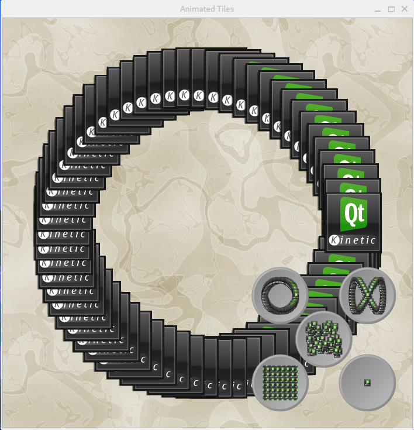

# Qt 使用指南

## 简介

**Qt** 是一个跨平台的 C++ 框架（C++ 库），主要用来开发图形用户界面（Graphical User Interface，GUI）程序，也可以开发不带界面的命令行（Command User Interface，CUI）程序。
**OpenGL ES**（OpenGL for Embedded Systems） 是一种跨平台2D/3D图形 API接口，适用于在低功耗设备上渲染高效的 2D 和 3D 图形，其由 OpenGL（Open Graphics Library）针对嵌入式设备裁剪而来。
本指南旨在指导用户在 SpacemiT Soc平台适配 Qt5 的 OpenGL ES 硬件加速。

## 安装 Qt5 开发环境

### 安装 C/C++ 编译环境

```shell
sudo apt-get update
sudo apt-get install build-essential
```

### 安装 Qt5 开发工具

```shell
sudo apt-get install qtbase5-gles-dev qtchooser qt5-qmake qtbase5-dev-tools
```

检测安装 Qt 版本。

```shell
$ qmake -v
QMake version 3.1
Using Qt version 5.15.13 in /usr/lib/riscv64-linux-gnu
```

### 安装 Qt5 wayland 插件

```shell
sudo apt-get install qtwayland5
```

### 配置 Qt5 后端显示服务

```shell
export QT_QPA_PLATFORM=wayland
```

## 编译并运行 Qt5 程序

### 下载 `qtbase-opensource-src-gles`

```shell
$ apt-get source qtbase-opensource-src-gles
$  tree qtbase-opensource-src-gles-5.15.13+dfsg -L 1
qtbase-opensource-src-gles-5.15.13+dfsg
├── bin
├── config_help.txt
├── config.tests
├── configure
├── configure.bat
├── configure.json
├── configure.pri
├── debian
├── dist
├── doc
├── examples
├── include
├── INSTALL
├── lib
├── LICENSE.FDL
├── LICENSE.GPL2
├── LICENSE.GPL3
├── LICENSE.GPL3-EXCEPT
├── LICENSE.LGPL3
├── LICENSE.LGPLv3
├── LICENSE.QT-LICENSE-AGREEMENT
├── mkspecs
├── qmake
├── qtbase.pro
├── src
├── sync.profile
├── tests
└── util
```

### 编译 `qtbase-opensource-src-gles`

#### 安装依赖

```shell
sudo apt-get build-dep qtbase-opensource-src-gles
```

#### 编译

```shell
dpkg-buildpackage -us -uc -nc -b -j4
```

### 编译 examples

#### 使用 qmake 生成 Makefile

```shell
cd qtbase-opensource-src-gles-5.15.13+dfsg/examples/widgets/animation/animatedtiles
qmake
```

#### 使用 make 生成可执行文件

```shell
make
```

### 运行 examples

```shell
./animatedtiles
```


