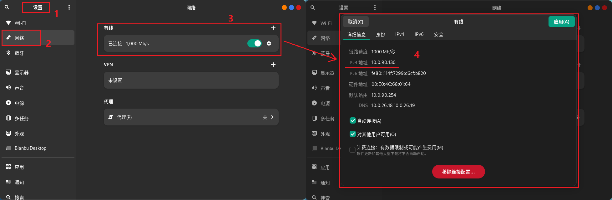
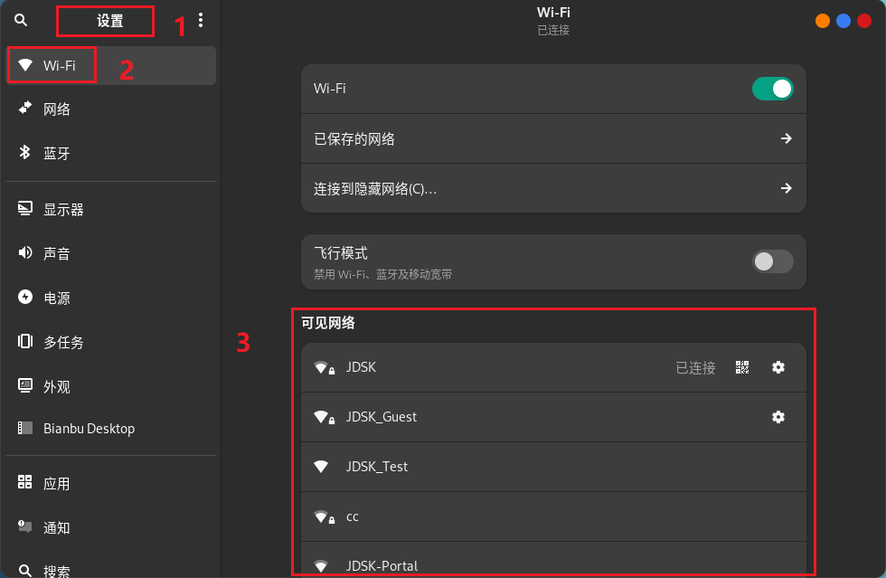

# 联网

本节以 **Bianbu GNOME桌面** 系统为例，介绍如何连接 **有线** 和 **无线** 网络。

## 连接有线网络

将网线插入设备后，系统会自动通过 DHCP 获取 IP 地址。若网络配置和设备正常，系统应能成功建立局域网连接。

您可以通过以下方式确认网络是否已连接并正常工作：

### 方法一：通过图形界面查看 IP 地址

1. 打开 **设置**；
2. 打开 **网络** 菜单；
3. 找到已连接的有线网卡，点击其 **设置** 按钮；
4. 弹出对话框即可查看 IP 地址。



### 方法二：终端命令

在 **Bianbu GNOMOE桌面系统** 中打开终端，执行以下命令：

```bash
ifconfig
```

在输出内容中查找 `inet` 字段，对应的即为 IPv4 地址。


## 连接无线网

1. 打开 **设置**；
2. 打开 **Wi-Fi** 菜单；
3. 点击您要用的网络名称；

4. 如果网络受到密码保护，请在出现提示时输入密码并单击连接；
5. 当计算机连接到网络过程中，网络图标会发生变化；
6. 如果连接成功，图标会变成一个圆点加上弧状条纹。条纹越多表示网络连接越强。越少表示连接越弱而且可能不太稳定。
