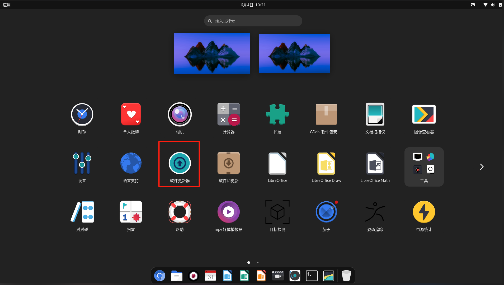
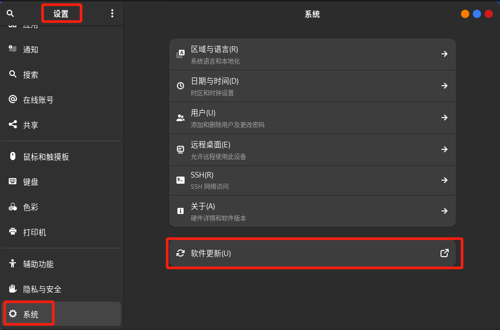

# 系统升级

**Bianbu GNOME桌面版本** 和 **Bianbu NAS** 支持在线升级。

## 选择订阅的版本

**注意：** 若需从 Bianbu 1.0.x 升级至 2.0，必须先升级至 **1.0.15 及以上版本**，然后订阅 Bianbu 2.0 并继续升级。

1. 打开 **软件和更新** 应用

   如无法打开，请确认已升级到1.0.15或更高版本。


2. **配置版本订阅通道**
   - 切换至 **更新** 标签页
   - 在 **订阅** 下拉菜单中选择目标版本（如 Bianbu 2.0）
   - 点击 **关闭** 按钮, 关闭应用保存配置


## 升级

> **升级须知**  
> 跨大版本升级（如 1.0.15 → 2.0.x）预计耗时约 2 小时：  
>
> - 最终配置阶段（约30分钟）需多次交互确认  
> - 建议操作：  
>   • 未知配置项选择 **Next** 或保留默认设置  
>   • 出现 **删除陈旧软件包** 提示时选择 **删除**  
>
> 注意：
>
> - 升级过程中 **不建议强行中断或暂停软件更新**，否则可能导致系统状态异常或软件包损坏。
> - 升级异常处理请参阅 [FAQ](../../faqs.md#更新)

### 方式一：命令行启动图形化升级（推荐）

**仅限 Bianbu GNOME桌面版本**

请运行以下命令，使用图形界面辅助完成升级：

```bash
do-release-upgrade -f DistUpgradeViewGtk3
```

根据界面提示逐步完成升级，完成后重启系统。

### 方式二：完全通过命令行纯命令行升级

适用于所有 Bianbu 系统。

如果你偏好命令行操作，可使用以下命令：

```bash
do-release-upgrade
```

根据终端提示完成所有升级步骤，完成后重启系统。

### 方式三：软件更新器升级

**仅限 Bianbu GNOME桌面版本**

1. 确保设备联网
2. 启动 **软件更新器** 应用

或者，也可以通过 **设置** → **系统** → **软件更新** 启动 **软件更新器** 应用。

3. 等待检查更新完成
4. 如果检测到新版本，可点击 **升级...** 按钮

   > 如果不希望升级，可以点击 **确认(O)** 按钮
5. 按向导提示完成升级流程
6. 执行系统重启
