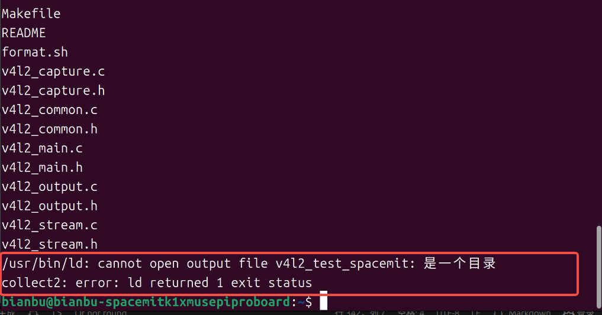
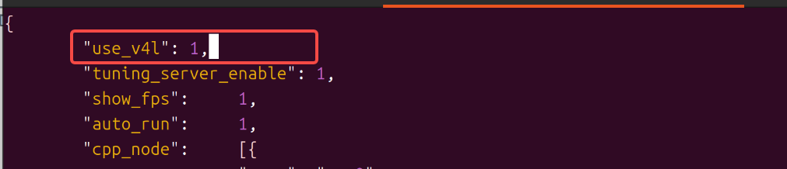

# MIPI 相机使用及常见问题

本文档介绍 MUSE Pi Pro 开发板接入 MIPI 相机（如 IMX219、OV5647）的完整使用流程，并汇总接入过程中常见的问题及解决方法，涵盖硬件连接、摄像头自动识别、Virtual Camera 配置、V4L2 出图测试、JDK Camera SDK 集成等场景。

---

## 使用指南

### 硬件连接

将 MIPI 摄像头模组接入开发板对应的 MIPI CSI 接口（板上一般提供多个 CSI 插槽，具体位置和排线方向请对照开发板丝印和用户手册确认）。同时用一根 HDMI 线把开发板和显示器连接起来，用于后续查看采集到的画面( IMX219 为图片白色排线连接方式，OV5647 为图片铜色排线（红色箭头）连接方式)。


> 排线插拔、方向核对等注意事项，请参见下文"常见问题"中关于排线接反、排线弯折的说明。

### 确认摄像头接入的 CSI 通道并自动识别

板子提供了 `cam-test` 工具，可以对指定 CSI 通道做自动探测。先确认摄像头实际插在哪个 CSI 接口上，再执行对应编号的探测脚本，例如摄像头接在 CSI3 上（以下指令都在终端运行）：

```bash
cam-test /usr/share/camera_json/csi3_camera_detect.json
```

如果这颗摄像头型号在驱动里已经适配过，探测会成功，终端会打印类似下面的信息（这里以 CSI3 通道识别到 `imx219_spm` 为例）：

```bash
I: ./sensors/cam_sensors_module.c(239): "detect imx219_spm sensors in csi3: success, set 1920x1080 to 1920x1080"
I: auto_detect_camera(1430): "auto detect sensor ===================== finish "
I: update_json_file(723): "save json to /tmp/csi3_camera_auto.json success"
```

探测成功后，工具会在 `/tmp/` 目录下自动生成一份对应这颗摄像头的可用配置文件（文件名类似 `csiN_camera_auto.json`），后续步骤会用到它。

> 关于 `csiN_camera_detect.json` 里的编号 N 和物理 CSI 接口编号的对应关系，不同批次的板子/驱动可能不完全一致，如果不确定具体对应哪个物理接口，可以把 CSI1~CSI3 对应的探测脚本都跑一遍来确认。如果全部尝试后仍无法识别，可能是排线松动、接触不良，也可能是这颗摄像头型号尚未适配驱动，遇到未适配型号的情况建议参考官方的摄像头驱动适配相关文档进行处理。

### 配置 Virtual Camera 模式

把上一步自动生成的配置文件，复制到系统读取虚拟摄像头配置的固定路径下，并重命名为 `svivi_cam1.json`：

```bash
sudo cp /tmp/csi3_camera_auto.json /root/svivi_cam1.json
```
> csi3_camera_auto.json当中csi3需要改为上一步填写的实际有效编号

然后执行下方指令：

```bash
sudo grep -q '"use_v4l"' /root/svivi_cam1.json || sudo sed -i '1a\    "use_v4l": 1,' /root/svivi_cam1.json
```

### 用 V4L2 工具做出图验证

`v4l2_test_spacemit` 是一个基于标准 V4L2 接口的采图测试工具，用来验证摄像头链路是否真的能正常出图。

先下载源码并编译（**注意**：一定要先 `cd` 进新建的目录，再执行下载和编译，否则会因为目录和可执行文件同名冲突而报错，具体可参见下文对应的常见问题条目）：

```bash
mkdir v4l2_test_spacemit
cd v4l2_test_spacemit
wget https://archive.spacemit.com/ros2/code/v4l2_test_spacemit.tar.gz
tar xvzf v4l2_test_spacemit.tar.gz
gcc v4l2_capture.c v4l2_main.c v4l2_output.c v4l2_stream.c v4l2_common.c -o v4l2_test_spacemit --static
```

编译完成后执行采图测试：

```bash
./v4l2_test_spacemit \
  --device /dev/video50 \
  --set-fmt-video width=1920,height=1080,pixelformat=NV12 \
  --verbose \
  --stream-dmabuf \
  --stream-loop \
  --stream-save 10 \
  --stream-to=test.yuv
```

如果链路正常，终端会持续滚动输出类似下面的采图日志：

```bash
VIDIOC_DQBUF: ok, type:9
VIDIOC_QBUF: ok, type:9
do_handle_cap:723 [INFO]m2m capture dequeue----------------: 15
```

采集过程中可以用 `Ctrl+C` 随时中断。

> **限制说明**
>
> - 目前最大支持分辨率为 1920×1080。
> - 图像格式仅支持 NV12。
> - 缓冲区内存类型要求使用 dmabuf。

能正常跑出上面这种持续的采图日志，就说明这颗摄像头从硬件到 V4L2 这一层是完全打通的，可以继续做后面更高级的开发。

### 高级开发：C++ SDK 使用示例

使用JDK 提供的 SDK 实例更高级别控制和图像处理功能：

##### C++样例代码

```cpp
auto camera = JdkCamera::create("/dev/video50", 1920, 1080, V4L2_PIX_FMT_NV12);
auto jdkvo = std::make_shared<JdkVo>(1920, 1080, PIXEL_FORMAT_NV12);
auto frame = camera->getFrame();
auto ret = jdkvo->sendFrame(frame);
```

### 快速集成：JDK 摄像头采集 SDK：

#### JDK SDK 下载与安装

```bash
wget https://archive.spacemit.com/ros2/code/jdk_sdk.tar.gz
sudo tar xvf jdk_sdk.tar.gz -C /opt/
sudo mv /opt/jdk_sdk /opt/jdk
```

安装完成后目录结构如下：


#### 下载与解压 jdk_cam

```bash
wget https://archive.spacemit.com/ros2/code/jdk_cam.tar
tar xvf jdk_cam.tar
```

#### 编译并运行：

```bash
cd jdk_cam
make all
sudo insmod /opt/jdk/ko/jdk_dma.ko
./workspace/jdk_cam /dev/video50
```

如果一切正常，启动过程中能看到类似下面的日志，说明采图流程和 VO（视频输出）模块都初始化成功：

```text
start buffer preprocessing
start buffer queue
VIDIOC_STREAMON succeeded
[MPP-DEBUG] 10419:VO_CreateChannel:43 create VO Channel success!
[MPP-DEBUG] 10419:module_init:159 +++++++++++++++ module init, module type = 101
[MPP-DEBUG] 10419:check_vo_sdl2:121 yeah! have vo_sdl2---------------
[MPP-DEBUG] 10419:find_vo_sdl2_plugin:86 yeah! we have vo_sdl2_plugin plugin---------------
[MPP-DEBUG] 10419:module_init:207 ++++++++++ VO_SDL2 (/usr/lib/libvo_sdl2_plugin.so)
[MPP-DEBUG] 10419:module_init:207 ++++++++++ open (/usr/lib/libvo_sdl2_plugin.so) success !
[MPP-ERROR] 10419:al_vo_init:93 SDL could not initialize! SDL_Error: wayland not available
[MPP-ERROR] 10419:al_vo_init:128 k1 vo_sdl2 init fail
[MPP-DEBUG] 10419:VO_Init:66 init VO Channel, ret = -400
[MPP-ERROR] 10419:JdkVo:32 VO_init failed, please check!
[MPP-DEBUG] 10419:VO_Process:82 vo one packet, ret = 0
index:0,dma_fd:12 width:1920,height:1080,size:3110400
```

跑起来之后，摄像头采集到的画面会实时显示在连接的显示器上。


> 如果日志里出现 `SDL_Error: wayland not available`、`VO_Init ... ret = -400` 这类报错，说明画面没能正常显示出来，通常和执行环境有关（比如通过 SSH 远程终端而非本地桌面终端运行），具体原因和解决方法请见下文常见问题。

---

## 常见问题

### Q：配置 Virtual Camera 模型时，打开生成的 json 文件内容为空，怎么办？

如下图，直接打开该文件查看时内容显示为空：


**原因**

该文件位于 root 用户目录下（`/root/svivi_cam1.json`），以普通用户权限打开时没有读取权限，因此看不到实际内容。

**解决方法**

使用 sudo 权限打开该文件：

```bash
sudo vim /root/svivi_cam1.json
```

---

### Q：按照文档编译 v4l2_test_spacemit 时报错，怎么办？

如下图，复制文档指令依次执行后编译失败：



**原因**

执行 `mkdir v4l2_test_spacemit` 创建目录后，没有先进入该目录就直接执行了下载、解压、编译命令，导致编译器生成的可执行文件 `v4l2_test_spacemit` 与刚创建的同名空目录冲突，因而报错。

**解决方法**

创建目录后先进入该目录，再执行后续下载、解压、编译命令：

```bash
mkdir v4l2_test_spacemit
cd v4l2_test_spacemit
```

---

### Q：执行采图命令后没有正常输出图像数据，而是报错，怎么办？

如下图：


**原因**

生成的 json 配置文件中，字段结尾缺少英文逗号 `,` 分隔，例如：


正确写法应为：



```json
"use_v4l": 1,
```

**解决方法**

检查 json 文件中每个字段末尾（除最后一个字段外）是否都以英文逗号 `,` 结尾，修正后保存重试。也可用以下命令校验 json 格式是否合法：

```bash
sudo python3 -m json.tool /root/svivi_cam1.json
```

若能正常输出完整 json 内容，说明格式已修正无误。

---

### Q：按照文档操作 /opt 目录下文件时提示权限不足，怎么办？

执行以下指令时报错：

```bash
mv /opt/jdk_sdk /opt/jdk
insmod /opt/jdk/ko/jdk_dma.ko
```

**原因**

`/opt` 属于系统级目录，`insmod` 加载内核模块也需要管理员权限，普通用户权限无法执行这些操作。

**解决方法**

在指令前加上 `sudo`：

```bash
sudo mv /opt/jdk_sdk /opt/jdk
sudo insmod /opt/jdk/ko/jdk_dma.ko
```

---

### Q：执行最后一步启动命令后，日志显示正常，但屏幕没有画面，怎么办？

执行以下命令后终端日志无异常，但 HDMI/屏幕上看不到摄像头画面：

```bash
./workspace/jdk_cam /dev/video50
```

**原因**

该命令依赖桌面环境的 Wayland 显示服务才能弹出预览窗口。如果通过 SSH 等远程终端连接执行该命令，远程终端不会携带桌面会话的显示环境变量（如 `WAYLAND_DISPLAY`），因此画面无法输出到屏幕上，但采图和日志流程本身不受影响。

**解决方法**

直接在开发板本地连接的显示器和键鼠、使用桌面自带的终端执行该命令，而不是通过 SSH 远程终端执行。

---

### Q：摄像头排线接反了会有什么后果？会不会损坏硬件？

**可能后果**

MIPI 相机排线中同时包含电源、地线、I2C 控制线（SCL/SDA）和 MIPI 差分信号线（时钟对/数据对）。排线一旦接反，各引脚的实际连接关系会整体错位，可能出现：

- 摄像头完全无法被系统识别（I2C 通信异常）。
- 画面花屏、出现噪点，无法正常出图。
- 画面出现明显偏色（如偏紫、偏绿）。
- **较严重时可能对摄像头模组或开发板接收电路造成永久性损坏**：当电源引脚被错接到本不应带电的信号引脚（如 I2C 控制线、MIPI 数据线）上时，可能超出这些引脚的正常工作电压范围，烧毁对应电路。

> **注意**
>
> 排线反接可能造成的硬件损坏通常不可逆，请务必在通电前确认接线方向。

**解决方法**

- 接线前仔细核对排线插入方向，对照排线金手指面朝向、防呆缺口与连接器丝印标识确认后再插入。
- 首次通电前再次确认排线两端插入到位、方向正确。
- 如怀疑此前已接反并通电，请先断电检查摄像头模组和板端接口有无明显发烫、烧焦痕迹；重新正确接线测试后，若出现原本正常的功能失效等新异常，建议联系售后确认硬件是否受损。

---

### Q：摄像头排线弯折/折叠后，出现识别异常或时有时无，是什么原因？

**原因**

MIPI CSI 排线内部的差分信号线（时钟对、数据对）对物理形变比较敏感。排线被过度弯折、对折或长期处于死折状态时，可能导致：

- 排线内部导线断裂或产生虚接，造成信号时有时无、间歇性识别失败。
- 差分线对的阻抗匹配被破坏，高速信号衰减或干扰增大，表现为花屏、丢帧、识别不稳定。
- 长期在同一位置反复弯折会加速导线疲劳断裂，问题会从"偶尔异常"逐渐发展为"完全无法识别"。

**解决方法**

- 走线时保持排线自然舒展，弯曲半径不宜过小，避免死折、对折。
- 避免在同一位置反复弯折排线。
- 如怀疑排线已因弯折受损，可更换一根排线测试，排除排线本身故障后再继续排查其他环节。

---
