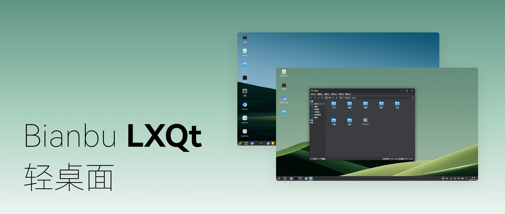

# 简介

```
最新版本：2025/12/15
```

Bianbu LXQt 桌面是基于Labwc合成器及QT开发的桌面环境。致力于将简洁的视觉体验与直观高效的交互逻辑融为一体，为用户提供全新的轻量桌面环境。



## 产品概述

深度融合LXQt桌面环境与Labwc窗口合成器的轻量级桌面，以Labwc面向Wayland的高效合成能力为核心，重构底层体验，在Bianbu系统上，它交付了一个极致流畅、视觉统一且资源克制的现代操作环境，实现简洁设计与高效交互的本质统一。

## 产品特点

- **交互简洁**：现代化视觉设计，交互逻辑贴合直觉，上手即用；
- **轻量高效**：轻量化设计带来系统与应用启动速度、桌面流畅性的大幅提升，秒级响应；
- **开箱即用**：原生集成开发、办公、学习及AI全栈工具链件，即刻创造；
- **硬核加速**：充分利用芯片硬件加速能力，并对RISC-V架构原生优化；

## 产品愿景

成为RISC-V 平台上最流畅好用的桌面环境系统；

## 目标用户场景

- 开发者/极客：需要纯净、高性能、低干扰的开发环境。
- 教育/学习：适用于计算机教室与教育硬件，“零学习成本”与“开箱即用”降低教学门槛。
- AI推理终端/云笔电：轻量系统桌面为AI算力与云流媒体释放最大系统资源。
- 机器人/工业计算：为机器人、SBC、工业面板等提供稳定、高效的专用交互界面。

## 性能参数对比

**Bianbu LXQt 2.3.0 与 Bianbu GNOME 2.2 性能对比 (基于 K1 MUSE Book)**

| 测试类别     | 测试项                         | Bianbu GNOME V2.2 | Bianbu LXQt V2.3.0 | 性能提升倍数 |
| :----------- | :----------------------------- | :--------------------------- | :--------------------------- | :------- |
| **系统启动** | 开机速度（开机到登录界面）     | 24s                          | 16s                       | 1.5x     |
| ^            | 登录速度（输入密码到桌面加载完成） | 17.5s                        | 7.91s                         | 2.21x     |
| ^            | 锁屏解锁（输入密码到桌面加载完成） | 10s                          | 1s                            | 10x       |
| **应用启动** | 设置启动                          | 3.36s                        | 0.93s                        | 3.61x |
| ^            | MPV启动                              | 1.74s                        | 0.96s                        | 1.81x     |
| ^            | 终端启动                             | 3.3s                        | 0.37s                        | 8.92x     |
| ^            | 图像查看器启动                         | 1.76s                          | 0.21s                          | 8.38x     |
| ^            | 文件管理器启动                      | 1.5s                        | 0.43s                        | 3.49x     |
| **唤醒速度** | 系统挂起后唤醒时间             | 2.3s                         | 1.2s                        | 1.91x     |
| **显示帧率** | 文件管理器文件目录（上下滑动） | 45 FPS                       | 85 FPS                       | 1.88x     |

