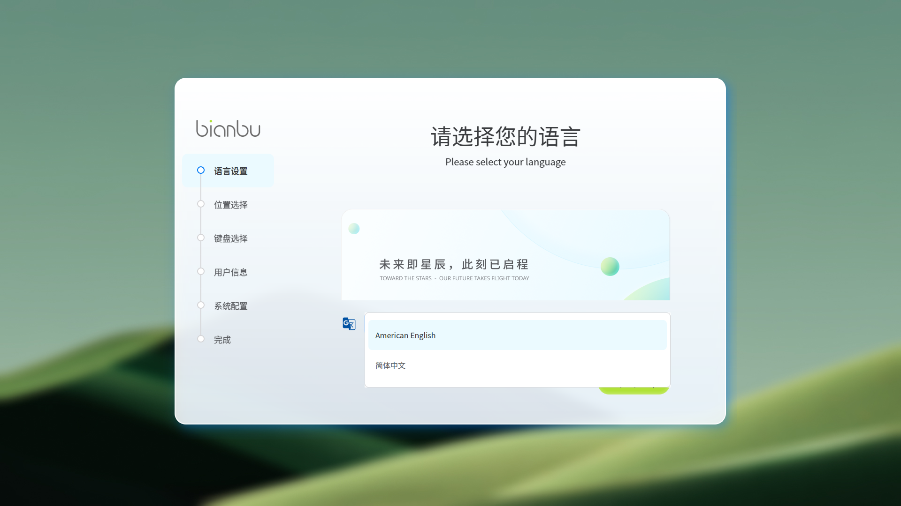
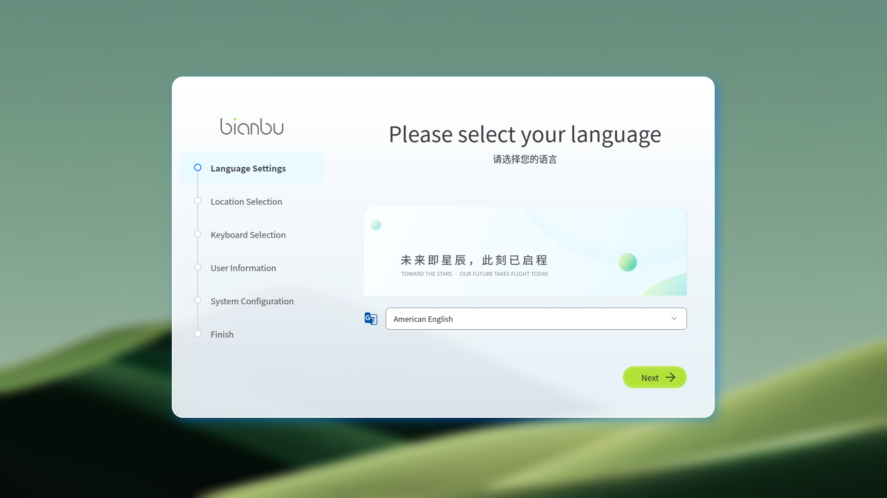
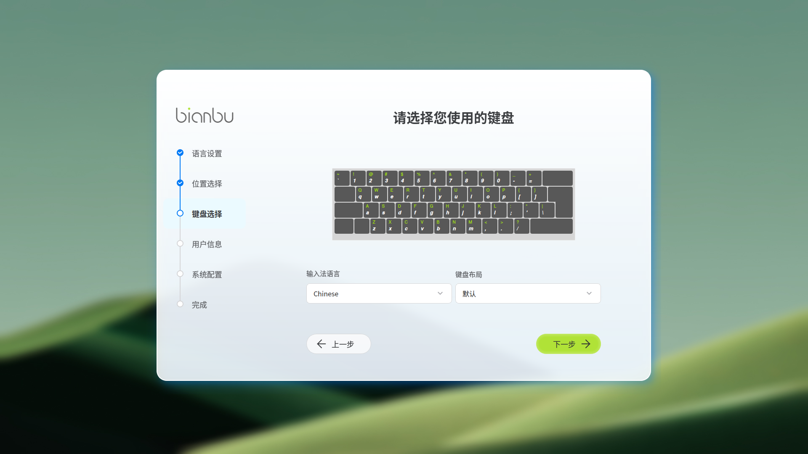
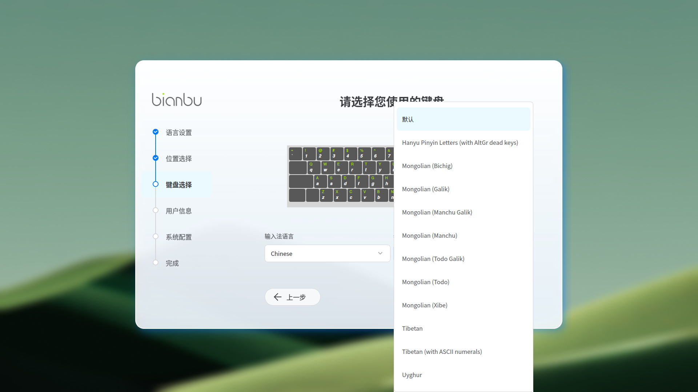
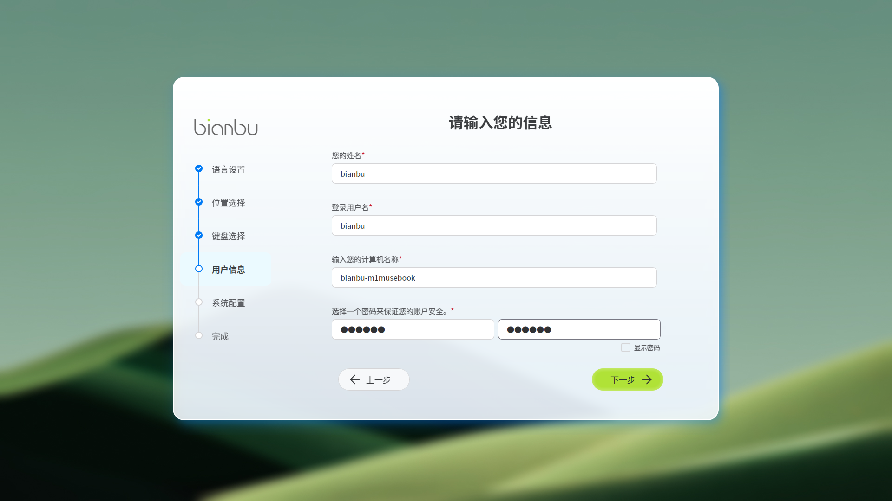
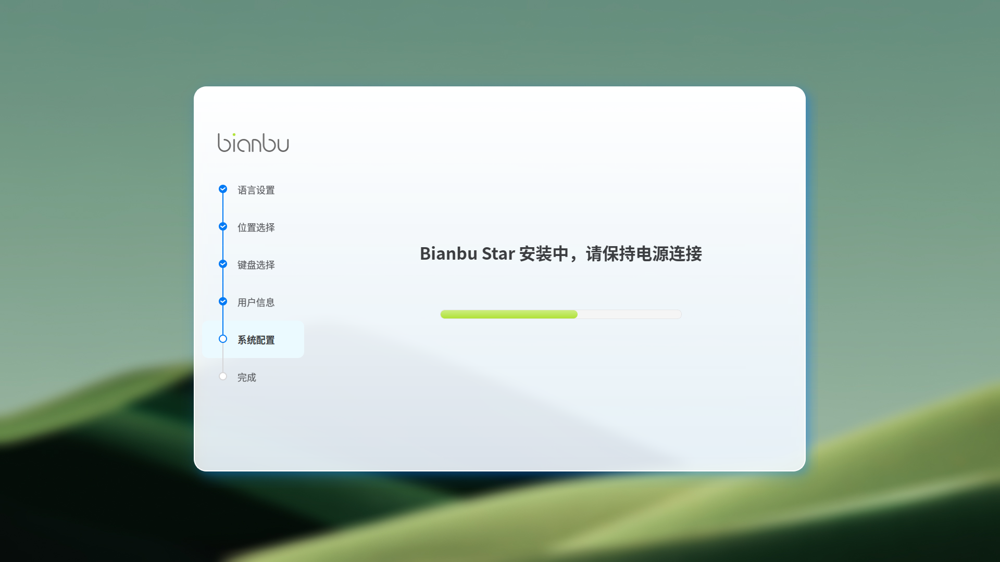

# 首次启动与会话

本章节介绍系统首次启动后的基本引导与会话选择。在开机引导阶段完成语言、位置、键盘和用户设置，完成开机引导后即可重启进入登录界面。

## 开机引导（初始化设置）

### 语言设置

开机引导应用默认以简体中文显示，可以在 **语言设置** 页面切换语言。打开 **语言列表**，可以看到当前可供选择的语言（目前仅支持 **简体中文** 和 **American English**）。

选择语言后开机引导应用会重新加载页面，并使用相应的语言。此外，在 **欢迎** 页面选择的语言后续会应用到系统语言中。

### 位置选择

在 **位置选择** 页面选择你所在的地区与城市，系统会根据当前网络所在地自动匹配本地时区（如果未连接网络则地区默认为 **Asia/Shanghai** ），并影响时间/数字/货币等区域格式。确认选择无误后继续。

除了在 **区域列表** 中选择所在地区外，还可以在 **时区地图** 中选择当前所在地区。

### 键盘选择

在 **键盘选择** 页面选择与物理键盘一致的布局，默认会使用当前所选语言的默认键盘。若需要布局变体可以展开键盘列表来选择。

### 用户信息

在 **用户信息** 页面填写 **姓名/用户名/计算机名称/密码** 时，请注意核对信息是否正确。

用户名建议仅用小写字母与数字，密码应具备足够强度（至少满足长度≥6）当用户信息填写完毕且符合规范时，才能进行下一步。

可临时 **显示密码** 以确认输入无误。

### 将配置写入系统

完善 **用户信息** 后的下一步就会对系统配置进行读写且无法中断，请慎重选择是否继续。

系统开始写入配置与准备环境，请保持电源连接，避免中断导致配置不完整。

## 完成开机引导

配置完成后，可选择 **重启系统** ，到这里就完成了以下关键配置，重启后将按所选项生效：

- 语言设置：确定系统界面语言（如 **简体中文** 或 **American English** ），影响系统与应用默认语言。
- 位置/时区：选择地区与城市，**自动匹配** 本地时区，影响 **时间/数字/货币** 格式。
- 键盘布局：选择与物理键盘一致的布局/变体，确保后续输入映射正确。
- 用户信息：创建用户名、计算机名称与密码，并通过规范校验后继续下一步。
- 写入确认：通过确认弹窗核对设置后开始 **写入** ，完成后进入结束页提示重启。

# 用户会话

重启后系统将进入登录界面。根据刚才创建的用户名及密码登录桌面。每个用户在首次登录成功后都会需要短暂的时间来加载系统设置，请耐心等待。

此外，登录界面还包含以下功能：**休眠、重启、关机和登录指定用户**。其中，休眠、重启和关机通过点击对应按钮即可完成。

## 登录指定用户

如果当前系统中存在多个可登录账户，则会在屏幕中间显示多个用户头像，点击不同的 **头像** 会切换到对应的用户，可以通过用户名加以区分。利用头像切换到指定用户，输入该用户的密码即可登录。

除了使用头像切换用户，系统也支持直接 **指定用户名** 进行登录，点击切换用户按钮后会进入指定用户名登录页面。在相应输入框中输入正确的用户名和密码即可登录。
